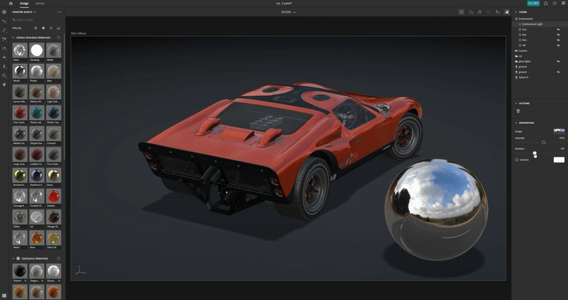
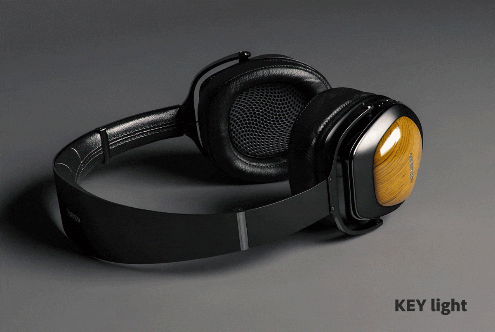

# Tipps und Techniken für das Mastering von 3D-Beleuchtung in CGI

Erfahren Sie mehr über 3D-Beleuchtung und wie Sie verschiedene Lichtbedingungen erstellen, die eine computergenerierte Szene vollständig verändern können, sowie darüber, wie Objekte darin aussehen.

Wir nehmen die Welt um uns herum mit unseren Sinnen wahr: wir hören, wir fühlen, wir riechen, wir sehen. Wir können sehen, weil unsere Augen Informationen aufnehmen, die uns durch Elementarteilchen, die Fotonen genannt werden, gebracht werden. Diese Information wird von unserem Gehirn verarbeitet, um ein Bild zu erzeugen. Was wir als Objektfarbe, Glanz, Lichtdurchlässigkeit oder metallische Eigenschaften interpretieren, sind alle Produkte der Wechselwirkung zwischen den Fotonen und der Oberfläche des Objekts.

Die Lichtmechanik in einer computergenerierten 3D-Szene folgt dem gleichen natürlichen Prinzip der Fotonenstreuung, das auch als Raytracing bezeichnet wird. Strahlen springen von Formen ab und interagieren mit ihren Materialien. So wird effektiv definiert, wie Objekte im endgültigen Bild erscheinen. Beleuchtung macht die Dimensionalität aller Elemente einer 3D-Szene sichtbar.

Einige Materialien sind lichtempfindlicher als andere. Nehmen wir zum Beispiel Metalle: Ein Chromobjekt spiegelt im Grunde alles um es herum wider. Wenn ein Licht bewegt wird, heller oder größer wird, sind alle diese Informationen direkt auf der Chromoberfläche in nahezu spiegelähnlichen Details sichtbar, sodass sie von einem Lichtzustand zum anderen völlig unterschiedlich erscheinen können.

## 3D-Lichter für effektives 3D-Rendering verwenden

Der Prozess der Erstellung eines 3D-Renderings ist nie ganz derselbe, aber dies sind die häufigsten Schritte:

1. Erstellen oder Erfassen von Objekten
1. Szenenbaugruppe
1. Einrahmen der Szene
1. **Beleuchtung**
1. Materialerstellung oder -zuordnung
1. Rendern

Wenn du in die Beleuchtungsphase kommst, ist es ideal, deine Lichter einzurichten, bevor du an den Materialien arbeitest. Dazu können Sie der gesamten Szene ein neutrales graues, mattes Material zuweisen. Auf diese Weise kannst du besser sehen und verstehen, wie sich die Lichter auf die Silhouetten des Objekts in der Szene auswirken. Wenn die Materialien fertig sind, muss die Beleuchtung möglicherweise weiter verfeinert werden.

Es ist am besten, nacheinander an den Lichtern zu arbeiten. Das aktive Licht sollte das einzige in der Szene sichtbare sein, während alle anderen Lichter vorübergehend ausgeschaltet sein sollten. Auf diese Weise kannst du sehen, wie sich ein bestimmtes Licht auf die Szene auswirkt. Du kannst das ändern, indem du an den Eigenschaften der Szene arbeitest, z. B. Position, Richtung, Intensität.

Ein weiterer nützlicher Trick ist es, eine Kugel mit einem glänzenden Metallmaterial (einem Chrom oder einem Spiegel) zu erstellen. Dieser &quot;Spiegelball&quot; spiegelt die gesamte Szene um sich herum wider, sodass du die Position, die Richtung oder die Größe des Lichts leicht bestimmen kannst. Bei Umgebungslichtern können Sie ihre Reflexion in der Spiegelkugel sehen, was dazu beiträgt, ihre Ausrichtung im Raum festzulegen.

## Lichtarten in der Adobe [!DNL Dimension]

### Umgebungslichter

Umgebungslichter sind äquirektanguläre (kugelförmige) Bilder, die um die gesamte Szene herum angeordnet sind. Wie der Name schon sagt, dienen diese Lichter dazu, die gesamte Umgebung zu emulieren, einschließlich der Lichtquellen, die in ihnen gespeichert sind.

Wenn Sie in [[!DNL Dimension]](https://www.adobe.com/products/dimension.html), wird eine Standard-Umgebungsbeleuchtung für Sie erstellt. Das ist der Grund, warum man sofort alles in der Szene sehen kann. Adobe [!DNL Dimension] Starter-Assets enthalten eine bestimmte Anzahl von Umgebungslichtern, die Sie sofort ausprobieren können. Darüber hinaus [Adobe [!DNL Stock]](https://stock.adobe.com/search?filters[content_type:3d]=1&amp;filters[3d_type_id][0]=2&amp;load_type=3d+lp) bietet eine große, kuratierte Auswahl an Umgebungslichtern.

Umgebungslichter liefern äußerst realistische Ergebnisse und sparen viel Zeit. Um etwas Ähnliches manuell zu erreichen, müssten Sie tatsächlich die gesamte Umgebung in 3D (einschließlich verschiedener Lichtquellen) erstellen, was ein erheblicher Arbeitsaufwand ist.

Es gibt viele Möglichkeiten, Umgebungslichter zu erstellen. Du kannst z. B. eine Aufnahme aus einer 3D-Szene, ein Foto oder parametrische Systeme verwenden. Wenn das Umgebungslicht aus einer 3D-Szene besteht, ist der Prozess einfach. Das Ausgabebild muss 32 Bit groß sein, damit die Lichtinformationen aller Lichter in der Szene erfasst werden. Die 3D-Kamera muss die äquirektanguläre Projektion verwenden (um ein kugelförmiges Bild auszugeben).

Du kannst auch Umgebungslichter erstellen, indem du Fotos der realen Welt aufnimmst. Für diesen Arbeitsablauf wird eine 360-Grad-Kamera benötigt (z. B. [Ricoh Theta Z1](https://theta360.com/en/about/theta/z1.html)). Die Kamera wird dann für Belichtungsreihen verwendet oder für mehrere Aufnahmen derselben Umgebung, die mit verschiedenen Belichtungswerten (von unterbelichtet bis überbelichtet) aufgenommen werden. Diese Aufnahmen werden dann verwendet, um 32-Bit-Bilder zu erstellen, die oft als HDRs bezeichnet werden (kurz für einen High Dynamic Range). Mit der Funktion &quot;Zu HDR zusammenfügen&quot; in Photoshop lassen sich Aufnahmen dieser Art kombinieren. Der eingebettete Belichtungsbereich wird zur Intensitätseigenschaft.

In beiden Fällen werden die Lichtquellen (und ihre Intensitäten) in diese Bilder &quot;eingebrannt&quot; und emittieren das Licht, sobald sie in [!DNL Dimension].

Mit diesen Methoden hast du die gesamte Beleuchtung, Reflexionen und Details erfasst, aber mit 3D-Apps kannst du sie im 3D-Raum weiter bearbeiten, sodass du die Drehung der Beleuchtung anpassen und die Gesamtintensität und -farbe ändern kannst.

### Richtungsleuchten

Neben Umgebungslichtern, die Licht von 360 Grad ausstrahlen, gibt es auch Richtungslichter, die Licht nur aus einer Richtung ausstrahlen. Sie werden verwendet, um Taschenlampen und andere Arten von Lichtern zu emulieren, die von einem gut definierten Emitter kommen, und sie können als Kreis oder als Quadrat geformt werden.

Die Verwendung von Richtlichtern bietet vollständige Kontrolle über die Beleuchtungskonfiguration. Die Beleuchtung der Szene erfolgt mit diesen Lichtern auf die gleiche Weise wie bei der traditionellen Fotografie, bei der jedes Licht unabhängig gesteuert werden kann, sodass du deine eigene virtuelle fotografische Beleuchtung aufbauen kannst. Eine der am häufigsten verwendeten Beleuchtungskonfigurationen ist das 3-Punkt-Lichtsystem.

[!DNL Dimension] hat eine praktische Aktion, &quot;Licht auf Punkt ausrichten&quot;, mit der Sie die Drehung und Höhe steuern können, indem Sie einfach auf ein 3D-Objekt klicken und es über dieses ziehen. Auf diese Weise können Sie die Lichtstrahlen dynamisch lenken. Diese Parameter können auch manuell eingestellt werden.

Sie können die Farbe und die Intensität der Richtungslichter ändern und die Form der Lichtquelle anpassen - sie kreisförmig oder rechteckig machen, sie dehnen oder vergrößern. Zum Schluss kannst du die Kanten der Lichtquelle weichzeichnen.

![Ändern der Form eines Richtungslichts in einer Adobe [!DNL Dimension]](assets/Mastering3dlighting_12.gif)

Wenn du die Lichtquelle kleiner machst als das Objekt, werden die Schatten schärfer, mit einem schärferen Umriss, weil die Strahlen nicht an dem beleuchteten Objekt vorbeikommen können. Größere Lichtquellen erzeugen weichere Schatten, da die Strahlen in diesem Fall von allen Seiten des Objekts kommen (in der Abbildung unten rot markiert), was eine Reihe von Schatten erzeugt. Diese Schatten werden durch die Strahlen, die aus der entgegengesetzten Richtung kommen, weicher.

### Sonne und Himmel

Sonnenlicht ist eine spezielle Art von gerichtetem Licht. Der Einrichtungsvorgang ähnelt sehr stark dem eines normalen Licht, aber dieses Licht ändert automatisch die Farbe mit der Höhe. Wenn es sich in der Nähe des Horizonts befindet (niedrige Höhenwinkelwerte), wird es allmählich wärmer, um den Sonnenuntergang zu simulieren. Die Farbe kann auch mithilfe von Vorgaben geändert werden. In der Zwischenzeit wird der Schatten durch Wolken weicher.

![Bearbeiten der Beleuchtungseigenschaften für die Sonnenlichtbeleuchtung eines 3D-Automodells in Adobe [!DNL Dimension]](assets/Mastering3dlighting_15.gif)

Wir sind in der Lage, den Himmel mit Umgebungslichtern nachzuahmen, und jedes Umgebungslicht, das den Himmel zeigt, kann verwendet werden. Jetzt müssen wir das Sonnenlicht ausrichten (in [!DNL Dimension]) mit der Sonne, erfasst im Umgebungslicht. Eine schnelle Möglichkeit ist, eine Kugel zu erstellen und ihr ein Metallmaterial zuzuweisen. Dadurch erhalten wir Echtzeit-Reflexionen der Umgebung, sodass wir Ziellicht an einem Punkt verwenden können, um das Sonnenlicht an der Sonne auszurichten.

Bei bewölktem Himmel kann die Eigenschaft &quot;Bewölkung&quot; verwendet werden, um diesen Bedingungen besser zu entsprechen.

![Bearbeiten von Wolkeneigenschaften für die Beleuchtung der Himmelsumgebung auf einem 3D-Automodell in Adobe [!DNL Dimension]](assets/Mastering3dlighting_17.gif)

Sobald das Sonnenlicht und das Umgebungslicht für den Himmel gepaart sind, können Sie sie zusammen drehen, indem Sie die Eigenschaft Globale Drehung verwenden.

### Objektbasierte Lichter

Objekte können in Lichtquellen umgewandelt werden, indem die Eigenschaft &quot;Glühen&quot; für die Materialien aktiviert wird. Auf diese Weise ist es möglich, Objekte wie Glühbirnen, Neonleuchten, Softboxen und alle Arten von Bildschirmen und Displays zu erstellen.

Der Hauptvorteil dieser Art der Beleuchtung ist der Intensitätsabfall, der zu sehr natürlichen Ergebnissen führt. Das ist sehr nützlich für die Produktvisualisierung oder andere studiobasierte Szenen.

Sie können die Weichheit der Schatten steuern, indem Sie das leuchtende Objekt mit dem Transformationswerkzeug nach oben oder unten skalieren. Wenn du den Regler vergrößerst, wird auch die Lichtintensität erhöht.

Anders als bei den früheren Typen von Lichtern, die wir abgedeckt haben, können diese Lichter zusätzlich zu den Standardfarben auch Texturen verwenden. Die Texturen können der Grundfarbe ihrer Materialien zugeordnet werden, und die Lichtintensität wird über einen Glühregler gesteuert.

## Beispiele für effektive 3D-Beleuchtung

### Produktbeleuchtung

Es gibt viele fotografische Techniken, um das Licht für eine Produktaufnahme einzurichten. Wir werden eine der am häufigsten verwendeten Einstellungen verwenden, nämlich das 3-Punkt-Lichtsystem.

Diese Einrichtung besteht aus drei Lichtern:

1. **Schlüsselbeleuchtung:** als primäre Quelle verwendet wird, scheint dies ungefähr von der Kamerarichtung

   

1. **Felgenleuchte:** auf der gegenüberliegenden Seite der Taste ausgerichtet, wird dies verwendet, um die Silhouette des Motivs zu belichten.

   

1. **Aufhelllicht:** weniger intensiv sind und dunklere Bereiche ausfüllen, wird dies für Bereiche verwendet, die die beiden vorherigen Lichter nicht erreichen.

   

Es gibt zwei Möglichkeiten, die 3-Punkt-Beleuchtung in [!DNL Dimension] - mit Richtungslichtern (einzeln zur Szene hinzufügen oder mit einer Vorgabe für 3-Punkt-Licht) oder über leuchtende Objekte.

### Kreative Beleuchtung

Kreative Beleuchtung kommt zum Einsatz, wenn die physische Präzision nicht das Hauptziel ist. Dies umfasst abstrakte und surreale Szenen aller Art, sodass es keine wirklichen Grenzen gibt, wohin uns unsere Fantasie führen kann.

Im obigen Beispiel sollte eine traumhafte Umgebung abgebildet werden: Bonbons, Pastellfarben und glatte Oberflächen. Das Beleuchtungssystem besteht aus drei glühenden Platten (zwei auf der Seite und die Hauptleuchtplatte von unten). Alle leuchtenden Platten sind unrealistisch groß, was sehr glatte Schatten und Glanzlichter erzeugt. Die Lichtquellen werden eingefärbt und diese Farbe wird in das den Objekten in der Szene zugeordnete Material übertragen.

Das Motiv der Szene (Rohre) ist vollständig von der Wandgeometrie umgeben. Das führt dazu, dass die Lichtstrahlen hin und her reflektiert werden und sich auf interessante Weise vermischen. Das Spielen mit kalten VS-Warmtönen erzeugt oft einen schönen Kontrast (diese Technik wird manchmal in der Porträtfotografie verwendet).

### Visualisierung des Innenraums

Die Visualisierung eines 3D-Innenraums folgt bestimmten Regeln, die fast immer gute Ergebnisse garantieren. Für diesen Anwendungsfall berücksichtigen wir nur natürliches Licht (keine künstlichen Quellen, wie Lampen).

In erster Linie muss sich eine Szene wie diese in einer geschlossenen Umgebung befinden. Wie im echten Leben braucht der Innenraum Wände, Boden, Decke und Fenster. Dadurch wird sichergestellt, dass das Licht durch die Fenster einfällt und dann reflektiert wird (durch einen Prozess namens Raytracing). Dieses Verhalten erzeugt eine sehr natürliche Beleuchtung (zum Beispiel sind die verdeckten Bereiche, wie Ecken, dunkler).

Da die Szene fast vollständig von architektonischer Geometrie umgeben ist, werden wir sehr wenig Beleuchtung und fast keine Reflexionen vom Umgebungslicht sehen. Aber in diesem Fall bauen wir tatsächlich unsere eigene Umwelt auf, nämlich den Innenraum selbst. Das Licht reagiert auf die Objekte in der Szene, indem es von ihnen und den umgebenden Wänden reflektiert wird. Die Objekte reflektieren nur einander und die Wände um sie herum. Trotzdem ist es eine gute Idee, ein Umgebungslicht mit dem Himmel hinzuzufügen. Dadurch entsteht eine diffuse blaue Füllung.

Die einfachste Möglichkeit, dieses Licht einzustellen, besteht darin, Ebenen mit leuchtenden Materialien zu verwenden. In diesem Anwendungsfall haben wir drei Ebenen, die alle Öffnungen im Inneren abdecken.

Die Intensität des Lichts wird durch die Eigenschaft &quot;Glühen&quot; in den Materialien der Ebenen gesteuert. Du kannst eine Farbe oder sogar eine Struktur hinzufügen, die verwendet werden kann, um interessante Schatten zu werfen. Die Verwendung von Glühmaterialien sorgt auch für den Abfall der Lichtintensität, der für die Innenbeleuchtung sehr wichtig ist.

### Außenbeleuchtung

Das Erstellen von Außenbeleuchtung ist ziemlich einfach und es kommt auf die Verwendung eines Sun- und Sky-Lichtsystems (siehe oben). Es ist wichtig, das Sonnenlicht korrekt an das himmelbasierte Umgebungslicht anzupassen - und dabei sowohl die Ausrichtung als auch den Bewölkungsgrad zu beachten.

Die Szene selbst spielt dabei eine große Rolle. Verwende Objekte in deiner Szene als Katalysatoren, die mit dem Licht interagieren, um überzeugende Ergebnisse zu erzielen. Beim oben gezeigten Waldrendering werden die Objekte (verschiedene Pflanzen, Stämme und Bäume) dicht beieinander platziert.

Das bedeutet, dass es eine Menge komplexer Interaktionen mit dem Raytracing geben wird, da das Licht zwischen den Objekten reflektiert wird. Schattierte Flecken erscheinen (wie erwartet) dunkel, während exponierte Bereiche hell bleiben.

![Globale Drehung in der Adobe verwenden [!DNL Dimension] die Sonne und das Sky-Lichtsystem in einer 3D-Szene neu ausrichten](assets/Mastering3dlighting_34.gif)

Ich hoffe, dieser Überblick zeigt, wie wichtig es ist, 3D-Lichter in verschiedenen Situationen zu beherrschen. Du solltest anfangen, überzeugendere Ergebnisse zu erzielen.

Alles Gute zur Beleuchtung! Laden Sie die [neueste Version](https://creativecloud.adobe.com/apps/download/Dimension) der Dimension heute.
