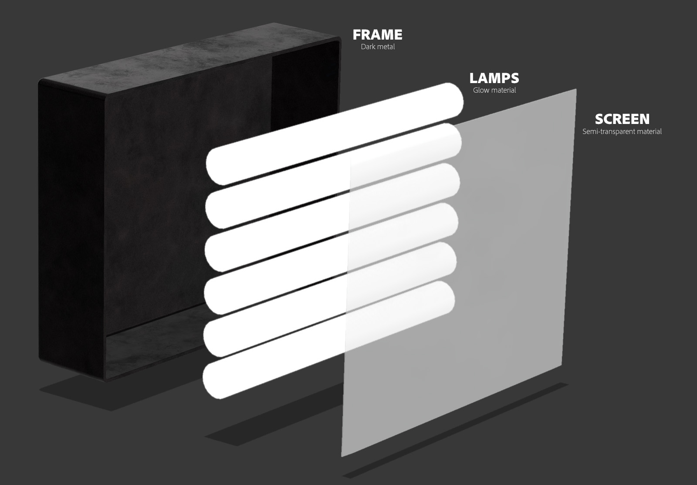

# Tipps und Techniken für das Mastering von 3D-Beleuchtung in CGI

Erfahren Sie mehr über 3D-Beleuchtung und wie Sie verschiedene Lichtverhältnisse erstellen, die eine computergenerierte Szene komplett verändern können, und wie Objekte in der Szene aussehen.

Wir nehmen die Welt um uns herum mithilfe unserer Sinne wahr: Wir hören, wir fühlen, riechen, wir sehen. Wir können sehen, weil unsere Augen Informationen sammeln, die uns von Elementarteilchen, so genannten Fotonen, gebracht werden. Diese Informationen werden von unserem Gehirn verarbeitet, um ein Bild zu erzeugen. Was wir als Objektfarbe, Glanz, Lichtdurchlässigkeit oder metallische Eigenschaften interpretieren, sind alles Produkte der Interaktion zwischen den Fotonen und der Objektoberfläche.

Die Lichtmechanik in einer computergenerierten 3D-Szene folgt dem gleichen natürlichen Prinzip der Fotonenstreuung durch einen Prozess namens [Raytracing](https://en.wikipedia.org/wiki/Ray_tracing_(graphics)). Rays reflektieren Formen und interagieren mit ihren Materialien. So definieren Sie effektiv, wie Objekte im endgültigen Bild angezeigt werden. Licht zeigt die Dimensionalität aller Elemente an, die in einer 3D-Szene vorhanden sind.

Einige Materialien reagieren empfindlicher auf Lichtverhältnisse als andere. Nehmen Sie beispielsweise Metalle: Ein Chrome-Objekt spiegelt im Grunde alles um es herum wider. Wenn ein Licht bewegt wird, heller oder größer wird, sind alle diese Informationen direkt auf der Chromeoberfläche in fast spiegelähnlichen Details sichtbar, sodass sie von einer Lichtbedingung zur anderen völlig unterschiedlich aussehen können.

 ausgeht.

## Mit 3D-Lichtern effektives 3D-Rendering erstellen

Der Vorgang zum Erstellen eines 3D-Renderings ist nie ganz gleich, aber dies sind die gängigsten Schritte:

1. Objekterstellung oder -aufnahme
1. Szenenassembly
1. Rahmen für die Szene
1. **Beleuchtung**
1. Materialerstellung oder -zuweisung
1. Rendern

Wenn Sie in die Beleuchtungsphase kommen, ist es ideal, Ihre Lichter einzurichten, bevor Sie an den Materialien arbeiten. Dazu können Sie der gesamten Szene ein neutrales graues, mattes Material zuweisen. Auf diese Weise können Sie besser erkennen und verstehen, wie sich die Lichter auf das Objekt silhouettes in der Szene auswirken. Nach Fertigstellung der Materialien muss die Beleuchtung möglicherweise weiter verbessert werden.

Es ist am besten, einzeln an den Lichtern zu arbeiten. Das aktive Licht sollte das einzige in der Szene sichtbare sein, während alle anderen Lichter vorübergehend deaktiviert werden sollten. Auf diese Weise können Sie sehen, wie ein bestimmtes Licht die Szene beeinflusst, und das ändern, indem Sie an den Eigenschaften wie Position, Richtung, Intensität usw. arbeiten.

Ein weiterer nützlicher Trick ist, eine Kugel mit einem glänzenden Metall (Chrome oder Spiegel) zu erstellen. Dieser &quot;Spiegelball&quot;spiegelt effektiv die gesamte Szene um ihn herum wider, sodass Sie ganz einfach die Position, Richtung oder Größe des Lichts bestimmen können. Bei Umgebungslichtern können Sie die Spiegelung im Spiegelball sehen, was dazu beiträgt, die Ausrichtung im Raum festzulegen.

## Lichtarten in der Adobe [!DNL Dimension]

### Umgebungslicht

Umgebungslichter sind äquirektanguläre (kugelförmige) Bilder, die um die gesamte Szene umbrochen werden. Wie der Name schon sagt, dienen diese Lichter dazu, die gesamte Umgebung zu emulieren, einschließlich der darin gespeicherten Lichtquellen.

Wenn Sie eine neue Szene in [[!DNL Dimension]](https://www.adobe.com/products/dimension.html) erstellen, wird ein Standard-Umgebungslicht für Sie erstellt. Aus diesem Grund können Sie sofort etwas in der Szene sehen. Adobe [!DNL Dimension] Starter-Elemente enthalten eine bestimmte Anzahl von Umgebungslichtern, die Sie sofort ausprobieren können. Außerdem bietet [Adobe [!DNL Stock]](https://stock.adobe.com/search?filters[content_type:3d]=1&amp;filters[3d_type_id][0]=2&amp;load_type=3d+lp) eine riesige, kuratierte Auswahl an Umgebungslichtern.

Umgebungslichter erzeugen sehr realistische Ergebnisse und können viel Zeit sparen. Um etwas Ähnliches manuell zu erreichen, müssten Sie tatsächlich die gesamte Umgebung in 3D (einschließlich verschiedener Lichtquellen) erstellen, was eine beträchtliche Menge an Arbeit ist.

Es gibt viele Möglichkeiten, Umgebungslichter zu erstellen, darunter die Aufnahme von einer 3D-Szene, von einem Foto und die Verwendung parametrischer Systeme. Wenn das Umgebungslicht aus einer 3D-Szene besteht, ist der Vorgang einfach. Das Ausgabebild muss 32 Bit sein, um die Lichtinformationen aller Lichter in der Szene zu erfassen. Die 3D-Kamera muss die äquirektanguläre Projektion verwenden (um ein kugelförmiges Bild auszugeben).

Sie können Umgebungslichter auch erstellen, indem Sie Fotos der realen Welt aufnehmen. Für diesen Arbeitsablauf ist eine 360-Grad-Kamera erforderlich (z. B. [Ricoh Theta Z1](https://theta360.com/en/about/theta/z1.html)). Die Kamera wird dann für Belichtungsreihen oder für mehrere Aufnahmen derselben Umgebung verwendet, die mit einer Reihe unterschiedlicher Belichtungswerte aufgenommen wurden (von unterbelichteten zu überbelichteten Bildern). Diese Aufnahmen werden dann zum Erstellen von 32-Bit-Bildern verwendet, die häufig als HDRs bezeichnet werden (kurz für einen High Dynamic Range). Eine Möglichkeit, ein solches Bild zusammenzufügen, ist die Funktion Zu HDR zusammenfügen in Photoshop. Der eingebettete Belichtungsbereich wird zur Intensitätseigenschaft.

In beiden Fällen werden die Lichtquellen (und ihre Intensitäten) in diese Bilder &quot;gebacken&quot;und geben das Licht aus, sobald sie in [!DNL Dimension] verwendet werden.

Bei diesen Methoden haben Sie alle benötigten Beleuchtung, Reflexionen und Details erfasst, aber mit 3D-Apps können Sie diese weiter im 3D-Raum bearbeiten, sodass Sie die Lichtrotation anpassen und die allgemeine Intensität und Farbe ändern können.

### Richtlichter

Zusätzlich zu Umgebungslichtern, die Licht von 360 Grad emittieren, gibt es auch Richtlichter, die Licht nur aus einer Richtung ausstrahlen. Sie werden verwendet, um Taschenlampen und andere Arten von Lichtern zu emulieren, die von einem genau definierten Emitter kommen, und sie können als Kreis oder Quadrat geformt werden.

Die Verwendung von Richtungsanzeigern bietet volle Kontrolle über die Lichteinrichtung. Das Aufhellen der Szene mit diesen Lichtern erfolgt auf die gleiche Weise wie in der traditionellen Fotografie, wo jedes Licht unabhängig gesteuert werden kann, sodass Sie Ihre eigene virtuelle Fotobeleuchtung. Eine der am häufigsten verwendeten Beleuchtungseinrichtungen ist das 3-Punkt-Lichtsystem.

[!DNL Dimension] hat eine praktische Aktion, Aim Light at Point, mit der Sie die Drehung und Höhe steuern können, indem Sie einfach klicken und über ein 3D-Objekt ziehen. Auf diese Weise können Sie die Lichtstrahlen dynamisch steuern. Diese Parameter können auch manuell angepasst werden.

Sie können die Farbe und Intensität der Richtungslichter ändern und die Form der Lichtquelle anpassen - kreisförmig oder rechteckig machen, dehnen oder vergrößern. Schließlich können Sie die Kanten der Lichtquelle weichzeichnen.

![Ändern der Form eines Richtlichts in der Adobe  [!DNL Dimension]](assets/Mastering3dlighting_12.gif)

Wenn Sie die Lichtquelle kleiner als das Objekt machen, werden die Schatten schärfer und mit einer klareren Kontur, da die Strahlen nicht über das beleuchtete Objekt hinausgehen können. Größere Lichtquellen erzeugen weichere Schatten, da in diesem Fall die Strahlen von allen Seiten des Objekts kommen (in der Abbildung unten rot markiert), wodurch eine Reihe von Schatten entsteht. Diese Schatten werden durch die Strahlen aus der anderen Richtung weicher.

### Sonne und Himmel

Sonnenlicht ist eine spezielle Art von Richtungslicht. Das Einrichten ähnelt einem normalen Richtungslicht, das Licht ändert jedoch automatisch die Farbe mit der Höhe. wenn er sich nahe am Horizont befindet (niedrige Höhenwinkelwerte), wird er allmählich wärmer, um den Sonnenuntergang zu simulieren. Die Farbe kann auch mithilfe von Vorgaben geändert werden. In der Zwischenzeit wirkt sich die Trübung auf die Schattenweichheit aus.

![Anpassen der Beleuchtungseigenschaften für Sonnenlicht an einem 3D-Fahrzeugmodell in der Adobe  [!DNL Dimension]](assets/Mastering3dlighting_15.gif)

Wir sind in der Lage, den Himmel mit Umgebungslichtern zu emulieren, und jedes Umgebungslicht mit dem Himmel kann genutzt werden. Jetzt müssen wir das Sonnenlicht (hergestellt in [!DNL Dimension]) an der Sonne ausrichten, die im Umgebungslicht aufgenommen wurde. Eine schnelle Methode hierfür besteht darin, eine Kugel zu erstellen und ihr ein Metallmaterial zuzuweisen. Dies wird uns mit Echtzeit-Reflexionen der Umwelt, sodass wir Aim Licht an der Stelle, um das Sonnenlicht mit der Sonne ausrichten können.

Wenn das Umgebungslicht einen bedeckten Himmel aufweist, kann die Eigenschaft &quot;Bewölkung&quot;verwendet werden, um diese Bedingungen besser abzugleichen.

![Anpassen der Trübungseigenschaften für die Beleuchtung der HimUmgebungsbeleuchtung eines 3D-Fahrzeugmodells in der Adobe  [!DNL Dimension]](assets/Mastering3dlighting_17.gif)

Sobald das Sonnenlicht und das Umgebungslicht des Himmels verknüpft sind, können Sie sie mithilfe der Eigenschaft &quot;Globale Drehung&quot;zusammen drehen.

### Objektbasierte Lichter

Objekte können in Lichtquellen umgewandelt werden, indem die Eigenschaft &quot;Leuchten&quot;für ihre Materialien aktiviert wird. Auf diese Weise lassen sich Objekte wie Glühbirnen, Neonlichter, Softboxen und Bildschirme aller Art erstellen.

Der Hauptvorteil dieser Beleuchtungsart ist der Lichtabfall, der sehr natürliche Ergebnisse hervorbringt. Dies ist sehr nützlich für die Produktvisualisierung oder andere Studio-basierte Szenen.

Sie können die Weichheit der Schatten steuern, indem Sie das leuchtende Objekt mit dem Transformationswerkzeug nach oben oder unten skalieren. Größer zu machen, erhöht auch die Lichtintensität.

Im Gegensatz zu den bisherigen Lichtarten können diese Lichter neben den einfarbigen Farben auch Texturen verwenden. Die Texturen können an die Grundfarbe ihrer Materialien angehängt werden, und die Lichtintensität wird über einen Schein-Schieberegler gesteuert.

## Beispiele für effektive 3D-Beleuchtung

### Produktbeleuchtung

Es gibt viele Fototechniken, um das Licht für eine Produktaufnahme zu schaffen. Wir werden eine der am häufigsten verwendeten Einstellungen verwenden, das 3-Punkt-Lichtsystem.

Dieses Setup besteht aus drei Lichtquellen:

1. **Schlüssellicht:** Wird als Primärquelle verwendet und scheint ungefähr von der Kamerarichtung aus

   

1. **Rimlicht:** auf der gegenüberliegenden Seite von der Taste, wird verwendet, um die Silhouette des Motivs.

   

1. **Fülllicht:** weniger intensiv und für die Füllung dunklerer Bereiche verwendet, wird dies für Bereiche verwendet, die die beiden vorherigen Lichtquellen nicht erreichen.

   

Es gibt zwei Möglichkeiten, um die 3-Punkt-Beleuchtung in [!DNL Dimension] zu erstellen - mithilfe von Richtungslichtern (einzeln zur Szene hinzufügen oder mit einer 3-Punkt-Lichtvorgabe) oder über leuchtende Objekte.

### Kreative Beleuchtung

Kreative Beleuchtung wird verwendet, wenn physikalische Genauigkeit nicht das Hauptziel ist. Dazu gehören abstrakte und surreale Szenen aller Art, sodass es keine wirklichen Grenzen gibt, an die unsere Fantasie uns führen kann.

Im obigen Beispiel ging es darum, eine traumähnliche Umgebung darzustellen: Süßigkeiten, Pastellfarben und glatte Oberflächen. Das Beleuchtungssystem besteht aus drei Leuchtetiketten (zwei auf der Seite und die Hauptplatte leuchten von unten). Alle leuchtenden Platten sind unrealistisch groß, wodurch sehr weiche Schatten und Glanzlichter entstehen. Die Lichtquellen sind farbig und diese Farbe wird in das Material übertragen, das den Objekten in der Szene zugewiesen ist.

Das Motiv der Szene (Rohre) ist vollständig von den Wänden Geometrie umgeben. Dies wird dazu führen, dass Lichtstrahlen vor- und zurückspringen und sich auf interessante Weise vermischen. Das Abspielen mit kalten VS-Farbtönen erzeugt oft einen schönen Kontrast (diese Technik wird manchmal bei Porträtfotografie verwendet).

### Innenvisualisierung

Die Visualisierung eines 3D-Interieurs folgt bestimmten Regeln, die fast immer gute Ergebnisse garantieren. Für diesen Anwendungsfall werden wir nur natürliches Licht (keine künstlichen Quellen, wie Lampen).

Zuallererst muss eine Szene wie diese in einer geschlossenen Umgebung sein. Wie im wirklichen Leben braucht das Innere Wände, Boden, Decke und Fenster. Dadurch wird sichergestellt, dass das Licht durch die Fenster kommt und dann herumspringt (über einen Prozess namens Raytracing). Dieses Verhalten erzeugt sehr natürliches Licht (z. B. werden die verdeckten Bereiche wie Ecken dunkler).

Da die Szene fast vollständig von architektonischer Geometrie umgeben ist, werden wir sehr wenig Beleuchtung und fast keine Reflexionen aus dem Umgebungslicht sehen. Aber in diesem Fall bauen wir tatsächlich unsere eigene Umwelt auf, die das Innere selbst ist. Das Licht reagiert also mit den Objekten in der Szene, indem es von ihnen und den umgebenden Wänden abprallt. Die Objekte spiegeln nur einander und die Wände um sie herum wider. Es empfiehlt sich jedoch, ein Umgebungslicht mit dem Himmel hinzuzufügen. Dadurch wird eine diffuse blaue Füllung hinzugefügt.

Am einfachsten lässt sich dieses Licht durch die Verwendung von Flugzeugen mit leuchtenden Materialien einstellen. In diesem Anwendungsfall haben wir drei Ebenen, die alle Öffnungen im Inneren abdecken.

Die Lichtintensität wird durch die Glüheigenschaft auf den Werkstoffen der Ebenen gesteuert. Sie können eine Farbe oder sogar eine Struktur hinzufügen, um interessante Schatten zu werfen. Die Verwendung von Leuchten liefert auch die Lichtintensitätsabfall, was für die Innenbeleuchtung sehr wichtig ist.

### Außenbeleuchtung

Die Beleuchtung im Freien ist recht einfach, und es kommt auf die Verwendung eines Sun- und Sky-Lichtsystems an (siehe oben). Es ist wichtig, das Sonnenlicht korrekt an das Himmelslicht anzupassen, wobei sowohl die Ausrichtung als auch der Trübungswert zu beachten sind.

Dabei spielt die Szene selbst eine große Rolle. Um überzeugende Ergebnisse zu erzielen, verwenden Sie Objekte in Ihrer Szene als Katalysatoren, die mit dem Licht interagieren. In der oben gezeigten Waldrenderung werden die Objekte (verschiedene Pflanzen, Stämme und Bäume) nahe beieinander platziert.

Das bedeutet, dass es eine Menge komplexer Raytracing-Interaktion geben wird, da das Licht zwischen den Objekten reflektiert wird. Schattierte Flecken werden wie erwartet dunkel angezeigt, während belichtete Bereiche weiterhin hell sind.

![Verwenden der globalen Drehung in der Adobe  [!DNL Dimension] zur Neuausrichtung des Sun- und Sky-Lichtsystems in einer 3D-Szene](assets/Mastering3dlighting_34.gif)

Ich hoffe, dass diese Übersicht zeigt, wie wichtig es ist, 3D-Lichter in verschiedenen Situationen zu meistern. Sie sollten bereit sein, überzeugendere Ergebnisse zu erzielen.

Gute Beleuchtung! Laden Sie heute die [neueste Version](https://creativecloud.adobe.com/apps/download/[!DNL Dimension]) der Dimension herunter.
