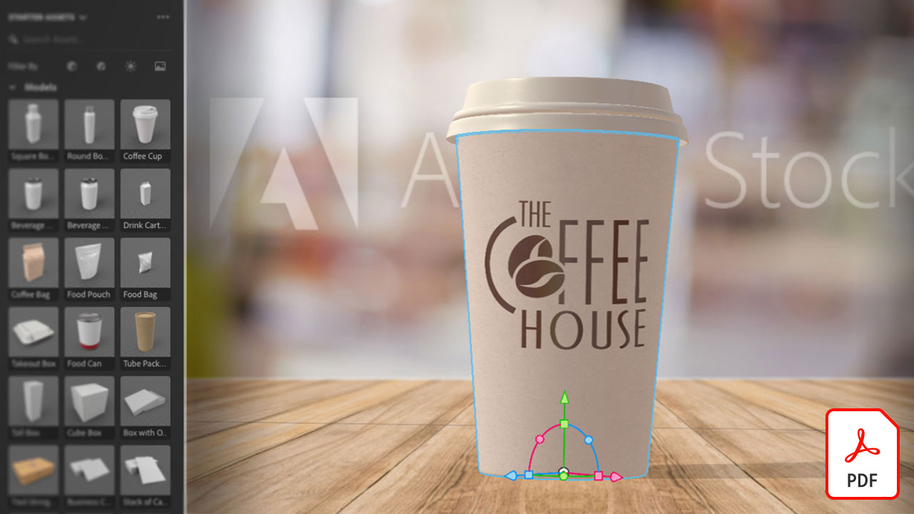
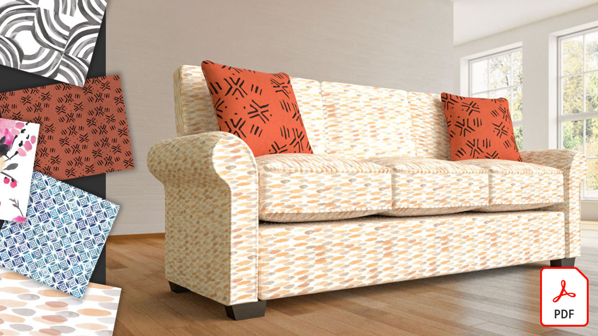

# Adobe 3D- und VR-Tutorials.

Gestalte überzeugenden 3D-Content schneller - mit hochwertigen Modellen, Materialien und Lichteffekten. Mit [!DNL Dimension] ist es ganz einfach, Branding-Visualisierungen, Illustrationen, Produktmodelle, Verpackungs-Designs und andere kreative Arbeiten zu erstellen. Wählen Sie ein Bild aus, um ein Tutorial anzuzeigen.

<table>
<tr>
 <td>
   
    

   <a href="substance-3d-stager.md"><strong>3D-Design und Rendering</strong></a>
    

    <em>Inhalte importieren, Szenen anordnen, Materialien und Strukturen anwenden, bildbasierte und physische Beleuchtung anpassen, Kameras mit unterschiedlichen Auflösungen speichern und fotorealistisches Bildmaterial rendern</em>
     
  </td>
  <td>
   
    

   <a href="assets/CreateRealistic3DMockupswithAdobeStockandDimension.pdf"><strong>Erstellen realistischer 3D-Mockups mit Adobe [!DNL Stock] und [!DNL Dimension] (PDF)</strong></a>
    

    <em>Einfaches Kombinieren eines 2D-Designs mit einem 3D-Modell unter Adobe [!DNL Stock] und Platzieren von Grafiken auf Adobe [!DNL Dimension]</em>
     
  </td>
  <td>
   
    

   <a href="assets/VisualizeTextileDesignsorPatternson3DObjectswithAdobeDimension.pdf"><strong>Textile Designs oder Muster auf 3D-Objekten mit Adobe [!DNL Dimension] (PDF) visualisieren</strong></a>
    

    <em>Erstellen Sie innerhalb weniger Minuten eine ultrarealistische Darstellung Ihres Endprodukts</em>
     
  </td>
  <td>
   
    

   <a href="../cce/assets/VisualizeyourProductinaRealisticEnvironment.pdf"><strong>Produkt in einer realistischen Umgebung visualisieren (PDF)</strong></a>
    

    <em>Wenn Sie sehen möchten, wie Ihre Produkte in der realen Welt aussehen werden, ist Adobe [!DNL Dimension] Ihre bevorzugte App</em>
     
  </td>
</tr>
<tr>
  <td>
   
    

   <a href="mastering3dlighting.md"><strong>Tipps und Techniken für das Mastering von 3D-Beleuchtung in CGI</strong></a>
    

    <em>Erfahren Sie mehr über 3D-Beleuchtung und wie Sie verschiedene Lichtbedingungen erstellen, die eine computergenerierte Szene vollständig verändern können, sowie darüber, wie Objekte darin aussehen</em>
     
  </td>
  <td>
   
    

   <a href="photorealistic.md"><strong>Erstellen fotorealistischer virtueller Fotos mit 3D-Rendering und Compositing</strong></a>
    

    <em>Erfahren Sie, wie Sie mit 3D-Bildkompositionen und -Rendering auf Adobe [!DNL Dimension]</em> eine verblüffend täuschende, fotorealistische virtuelle Fotografie erstellen.
     
  </td>
  <td>
   
    

   <a href="3ddimensionstock.md"><strong>3D-Modell anpassen und mit [!DNL Dimension] und Adobe [!DNL Stock]</strong></a> markieren
    

    <em>Passen Sie ein 3D-Modell in [!DNL Dimension] an und markieren Sie es mit Materialien, Umgebungseigenschaften, Beleuchtung und Fotografie, um fotorealistische Bilder für jedes Design-Projekt zu erstellen</em>
     
  </td>
  <td>
    
    

     
  </td>
</tr>
</table>