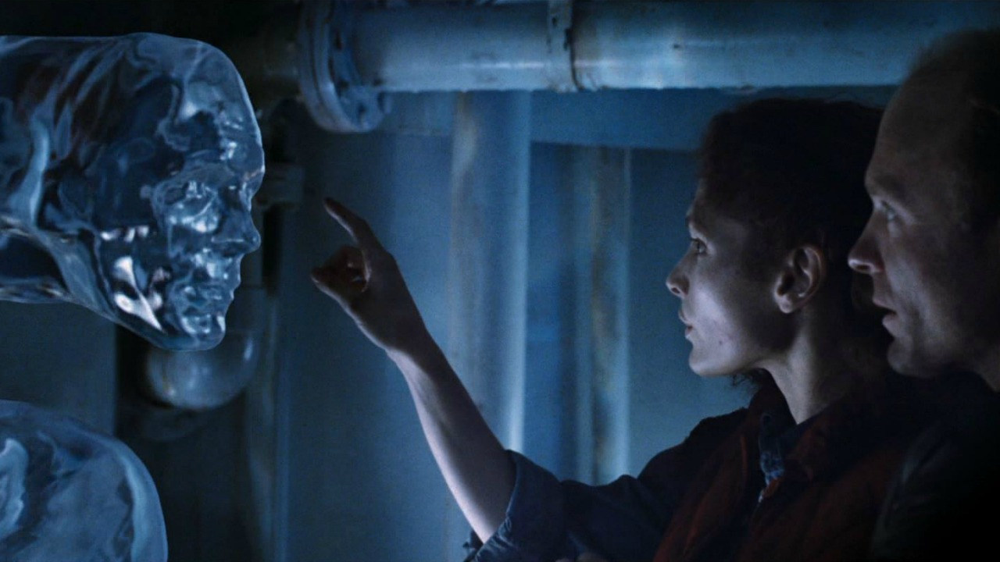

# Fotorealistische virtuelle Fotografie mit 3D-Rendering und -Compositing erstellen

![Eine Beispielsammlung mit fotorealistischen virtuellen Fotos, die mit Adobe entworfen wurden  [!DNL Dimension]](assets/Photorealistic_1.png)

Wenn Sie sich die Bilder oben ansehen, verziehen Sie es, wenn alles, was Sie sehen, echt ist. Mit den technologischen Fortschritten beim Rendern fotorealistischer 3D-Bilder ist es jedoch schwieriger denn je zu bestimmen, was real ist und was virtuell ist. In diesem Fall handelt es sich bei den Bildern um eine Mischung aus echten, fotografischen und gerenderten 3D-Inhalten — und genau in diese Art von 3D-Design investieren Unternehmen.

Diese Technik, das &quot;Compositing&quot;von 3D-Modellen zu einem Bild oder Video, ist nicht neu, und ihre Ursprünge reichen zurück in die frühen Tage der VFX (bis in die 1980er Jahre). Neu und aufregend ist, dass diese Technik zu einem leistungsstarken Tool für [Adobe [!DNL Dimension]](https://www.adobe.com/products/dimension.html)-Anwender und einem faszinierenden neuen Arbeitsablauf für Fotografen geworden ist.

## Die Technologie zum Erstellen von Composite-Bildern in der Adobe [!DNL Dimension]

![Bearbeiten der Ebene eines Metallkugelmodells in einer Adobe- [!DNL Dimension] Komposition](assets/Photorealistic_3.png)

Mit der Adobe [!DNL Dimension] können Benutzer 2D- und 3D-Elemente mithilfe der Adobe Sensei-basierten Abgleichbildfunktion nahtlos direkt in der App kombinieren. Der Hauptvorteil dieses Compositing-Elements liegt darin, dass es den Prozess der Erstellung eines realistischen Bildes durch die Ersetzung einer vollständig realisierten 3D-Szene durch ein Hintergrundbild, das aus der Realität erfasst werden kann, beschleunigt.

![Die Funktion &quot;Bild angleichen&quot;in der Adobe  [!DNL Dimension] analysiert das Hintergrundbild und schätzt die Brennweite und die Position der Kamera, die zur Aufnahme verwendet wurde, ab](assets/Photorealistic_4.gif)

Die Funktion &quot;Bild angleichen&quot;analysiert das Hintergrundbild und schätzt die Brennweite und die Position der Kamera, mit der es aufgenommen wurde. Anschließend wird in der Szene [!DNL Dimension] eine 3D-Kamera erstellt, die zum Rendern von 3D-Elementen in derselben Perspektive wie das Hintergrundbild verwendet werden kann, sodass sie zusammengesetzt werden.

Aber was ist mit allem, was nicht im Rahmen der Kamera aufgenommen wurde?  Die gesamte Umgebung eines Bildes wird in wichtigen Punkten erfasst, da es definiert, wie alles darin aussieht. Ein Objekt in einem Bild spiegelt das Licht der Welt um es herum wider, das auch alles hinter der Kamera beinhaltet. Damit die 3D-Elemente mit Ebenen wirklich mit dem Hintergrund Ihres Bildes harmonieren, müssen sie die Beleuchtung in der Umgebung, in der das Bild aufgenommen wurde, vollständig widerspiegeln.

Mit &quot;Bild angleichen&quot;wird versucht, die Beleuchtungsumgebung, in der ein Hintergrundbild aufgenommen wurde, zu &quot;halluzinieren&quot;. Es leistet eine beeindruckende Arbeit, die in kurzer Zeit hervorragende Ergebnisse erzielen wird, aber die Aufnahme der Umgebung zusammen mit dem Hintergrundbild führt zu noch realistischeren Ergebnissen. Dies ist sogar die Methode, die verwendet wird, um die Adobe Sensei-Funktion für sich zu schulen.

Erleben Sie die Welt der 360° HDR-Panoramabilder. Diese Bilder werden seit langem in 3D-Grafiken verwendet, um die Beleuchtungseffekte einer globalen Beleuchtungsumgebung zu beschleunigen. Der Prozess für ihre Aufnahme in der Vergangenheit war aufgrund des hohen Kenntnisstandes und der speziellen Ausrüstung, die für ihre Herstellung erforderlich sind, ziemlich komplex. Mit der Einführung von 360°-Kameras ist die Erstellung dieser Bilder jetzt einfacher denn je.

Kameras wie die Ricoh Theta, Gopro MAX und Insta 360 können 360 Panoramen aufnehmen. Die Ricoh Theta verfügt über eine automatische Belichtungsreihe, die ein zentraler Bestandteil des Aufnahmeprozesses ist. Dadurch werden Zeit und Aufwand für die Aufnahme von HDR-Bildern reduziert und die Bedienung für Fotografen einfacher.

## Das Verfahren zum Erstellen fotorealistischer Composite-Bilder

### [!DNL Capture]

Um mit der Erfassung von Umgebungen für Compositing zu beginnen, benötigen Sie zwei Hauptelemente: ein Hintergrundbild oder Bilder mit hoher Qualität und ein 360°-HDR-Panorama der Umgebung, in der es aufgenommen wurde.

Einer der wichtigsten Aspekte bei der effektiven Erfassung dieser Art von Inhalten ist die Nutzung der vorhandenen Fähigkeiten und Werkzeuge eines Fotografen. Das Erstellen eines schönen Hintergrundbilds erfordert ein Auge für die Komposition und Aufmerksamkeit für Details. Die Hintergrundbilder erfordern auch eine besondere Einstellung, um etwas zu erstellen, das nützlich ist, um 3D-Elemente zusammenzufügen.

### Auswählen eines Speicherorts

Suchen Sie nach Orten, die sowohl für den Kontext als auch für die Beleuchtung interessant sind. Beim Betrachten des Kontexts kann es hilfreich sein, sich den potenziellen Nutzen einer Szene vorzustellen. Beispielsweise könnte eine Ansicht einer leeren Straße für das Hinzufügen in einem 3D-Auto verwendet werden, während eine Ansicht einer Tabelle in einem Café für die [Anzeige der Verpackung](https://www.adobe.com/products/dimension/packaging-design-mockup.html) von Lebensmitteln verwendet werden könnte.

Beim Aufnehmen des Hintergrundbilds ist es wichtig, zu beachten, dass 3D-Elemente darin kombiniert werden. Es sollte einen leeren Fokusbereich geben, um Platz für diese Objekte zu lassen. Der 3D-Inhalt wird oft der Hauptfokus der endgültigen Komposition sein, daher ist es wichtig, dass der Hintergrund nicht von alleine hervortritt.

Gleichermaßen wichtig ist die Beleuchtungssituation im Bild, da dies den zusammengesetzten 3D-Inhalt stark beeinflussen wird. Licht sollte von über der Schulter oder von der Seite in den Schuss kommen — Dies führt zu den besten Ergebnissen, da es als Schlüssellicht fungiert, wenn 3D-Objekte in die Szene platziert werden. Es mag verlockend sein, auf das Licht zu schießen, wenn es kein Element des Fokus in der Ansicht ist, aber denken Sie daran, dass dies zu Inhalten führen wird, die immer hintereinander beleuchtet sind. Das Hinzufügen eines temporären, integrierten Objekts zur Szene kann hilfreich sein, um die Beleuchtung zu komponieren und zu bewerten.

## Aufnehmen des HDR-Panos

### Kameraplatzierung

Platzieren Sie Ihre 360°-Kamera in der Mitte des Bereichs, auf den Sie sich für die Aufnahme des Hintergrunds konzentrieren werden. Es kann ideal sein, wenn die Hintergründe eine breitere Szene zeigen, um die Kamera mit einem Monopod vom Boden zu heben, andernfalls kann die Kamera direkt am Boden eingestellt werden.

### Farbe

Die Beibehaltung der Farbe zwischen der Kamera, die zur Aufnahme der Umgebung verwendet wird, und der Kamera, die zur Aufnahme des Hintergrunds verwendet wird, ist sehr wichtig, da die Bilder zusammen verwendet werden. Hier haben wir die Farbtemperatur der beiden Kameras auf 5000k eingestellt und ein Foto von einer Farbkarte mit beiden Kameras gemacht, um die weitere Ausrichtung in der Post.

### Belichtungswerte für Klammern

Um eine HDR-Umgebung mit der 360°-Kamera zu erstellen, müssen mehrere EVs aufgenommen werden, um im Anschluss zu einem HDR-Bild kombiniert zu werden. Die Menge der EVs ist nicht standardisiert, aber im Allgemeinen soll das obere Ende des Belichtungsbereichs an einen Punkt verschoben werden, an dem keine Informationen mehr in den Tiefen und im unteren Ende des Belichtungsbereichs zu einem Punkt vorhanden sind, an dem keine Informationen mehr in den Lichtern vorhanden sind.

Idealerweise verfügt die 360°-Kamera über eine automatische Belichtungsfunktion, mit der die verschiedenen Belichtungen von der Kamera abgefangen werden können. Ideal ist es, den niedrigsten verfügbaren ISO-Wert zu verwenden, um Rauschen zu vermeiden, und einen hohen Blendenwert für die Schärfe. Die Belichtungswerte können dann mit der Verschlussgeschwindigkeit variiert und durch Unterbrechungen aufgelöst werden. Halbierung oder Verdoppelung der Belichtung.

Im Folgenden finden Sie ein Beispiel für EVs, die für die Aufnahme einer IBL im Freien verwendet werden:

01 - F 5.6, ISO 80, Verschlusszeit 1/25000, WB 5000 K

02 - F 5.6, ISO 80, Verschlusszeit 1/12500, WB 5000 K

03 - F 5.6, ISO 80, Verschlusszeit 1/6400, WB 5000 K

...

16 - F 5.6, ISO 80, Verschlusszeit 1, WB 5000 K

Wenn die verwendeten 360°-Werte RAW-Bilder ausgeben können, können die EVs in 2-4-Stopp-Schritten aufgeteilt werden, da sie mehr Informationen als 8-Bit-Bilder wie JPEG enthalten.

Nachdem Sie Farbkorrekturen an den EVs vorgenommen haben, können sie vorübergehend in einzelne Dateien exportiert werden, um sie dann in Photoshop zusammenzuführen. Der Dateityp sollte von der Quelle abhängen, in keinem Fall jedoch ein komprimiertes Format wie JPEG verwenden. Wählen Sie unter Photoshop &quot;Datei&quot;> &quot;Automatisieren&quot;> &quot;Zu HDR Pro zusammenfügen&quot;. Wählen Sie alle exportierten EVs aus.

Stellen Sie sicher, dass &quot;Modus&quot;auf 32 Bit eingestellt ist. Die Verwendung von &quot;Geisterbilder entfernen&quot;kann dazu beitragen, Details zu entfernen, die sich zwischen den E-Mails geändert haben. Sie sollten sie jedoch nicht verwenden, wenn Sie sie nicht benötigen. Der Schieberegler unter dem Histogramm wirkt sich nur auf die Belichtung der Vorschau aus, sodass sie ignoriert wird. Deaktivieren Sie &quot;Tonung in Adobe Camera Raw abschließen&quot;und klicken Sie auf &quot;OK&quot;.

Das Ergebnis ist ein HDR-Bild, das zur Beleuchtung von Szenen in 3D verwendet werden kann.

Die letzten Schritte sind, Schatten- und Stativbeine zu entfernen, die am Tiefpunkt des Bildes sichtbar sind, und die Standardbelichtung des Bildes anzupassen, um die Szene korrekt zu beleuchten. Das Entfernen von Details kann mit dem Kopierwerkzeug in Photoshop erfolgen. Die Belichtung sollte zusammen mit dem Hintergrund in [!DNL Dimension] angepasst werden, da der Belichtungswert der HDR-IBL die Beleuchtungswerte für die 3D-Objekte ist.

### Hintergründe erfassen

Nachdem Sie die Umgebung aufgenommen haben, können Sie jetzt mit einer Kamera Ihrer Wahl Hintergründe aufnehmen. Je höher die Qualität und desto höher die Auflösung. Dies ist zusammen mit einem Blick auf die Komposition, die Fotografen haben, der Hauptvorteil dieses Prozesses. Die Bilder oben wurden mit einer Canon 5D MK IV aufgenommen.

Es gibt viel Spielraum für Rahmen und Kompositionen mit Hintergründen. Die Kamera kann hohe oder niedrige Blenden für eine unterschiedliche Tiefenschärfe haben, lange oder kurze Brennweiten verwenden und sich nach oben oder unten bewegen. Die Hauptanforderung besteht darin, dass die Kamera auf den Mittelpunkt ausgerichtet ist, an dem die Umgebung mit der 360-Grad-Kamera aufgenommen wurde.

Wenn die Aufnahme abgeschlossen ist, sollten die Bilder nachbearbeitet werden, damit sie der Farbe der Umgebung so nahe wie möglich entsprechen. Farbe und Belichtung sollten so neutral und natürlich wie möglich sein. Alle stilisierten Looks sollten angewendet werden, nachdem 3D-Elemente mit der Adobe [!DNL Dimension] in das Bild eingefügt wurden.

## Zusammenstellen Ihres Kompositionsbilds in [!DNL Dimension]

Nachdem diese Elemente gesammelt und abgeschlossen sind, können sie jetzt in einer Szene in der Adobe [!DNL Dimension] zusammengefügt werden. Sie können den Hintergrund einfach in die Szene ziehen, wo er dann auf den Hintergrund angewendet wird. Fügen Sie dann das HDR-Panorama in den Umgebungslicht-Bildsteckplatz ein.

Ziehen Sie das Hintergrundbild per Drag &amp; Drop in einen leeren Bereich der Arbeitsfläche oder wählen Sie im Szenenfenster die Umgebung aus und fügen Sie das Bild zur Hintergrundeingabe hinzu.

![Das Hintergrundbild für ein virtuelles Foto kann im Menü &quot;Eigenschaften&quot;in der Adobe ausgewählt werden  [!DNL Dimension]](assets/Photorealistic_20.png)

Fügen Sie das HDR-Bedienfeld hinzu, indem Sie das Umgebungslicht auswählen und es zur Bildeingabe hinzufügen.

![Die Umgebungslichtquelle kann dem Hintergrundbild eines virtuellen Fotos über das Szenenmenü in der Adobe hinzugefügt werden  [!DNL Dimension]](assets/Photorealistic_21.png)

Sie können dann &quot;Bild angleichen&quot;auf Ihrem Hintergrund verwenden, um die Auflösung und das Seitenverhältnis sowie die Kameraperspektive abzugleichen. Anstatt die Umgebung aus dem Hintergrundbild zu generieren, wird das aufgenommene HDR-Panoramabild verwendet, um die Szene aufzuhellen, sodass die Option &quot;Lichter erstellen&quot;deaktiviert bleiben kann.

![Verwenden der Funktion &quot;Bild angleichen&quot;in der Adobe  [!DNL Dimension] zum Rendern eines 3D-Metallkugelbilds mit Umgebungslichtern aus einem HDR-Panoramabild](assets/Photorealistic_22.png)

Objekte, die der Szene hinzugefügt werden, werden realistisch in den Hintergrund eingefügt, da sie von der Umgebung beleuchtet werden, in der das Bild aufgenommen wurde.

Um die Ausrichtung und Belichtung des HDR-Panos im Verhältnis zum Hintergrund schnell zu beurteilen, kann eine Kugel mit einem Metallmaterial, die aus dem kostenlosen Asset-Bedienfeld in [!DNL Dimension] entnommen wurde, in die Szene eingefügt werden. Die Drehung des Umgebungslichts kann so positioniert werden, dass die Reflexionen korrekt aussehen. Wenn die Beleuchtung des HDR-Panoramas die Kugel über- oder unterbelichtet, sollte die Belichtung des HDR-Panos erhöht oder verringert werden, um einen Ausgleich zu schaffen.

Um die Ausrichtung und Belichtung des HDR-Panos im Verhältnis zum Hintergrund schnell zu beurteilen, kann eine Kugel mit einem Metallmaterial, die aus dem kostenlosen Asset-Bedienfeld in [!DNL Dimension] entnommen wurde, in die Szene eingefügt werden. Die Drehung des Umgebungslichts kann so positioniert werden, dass die Reflexionen korrekt aussehen. Wenn die Beleuchtung des HDR-Panoramas die Kugel über- oder unterbelichtet, sollte die Belichtung des HDR-Panos erhöht oder verringert werden, um einen Ausgleich zu schaffen.

## Endergebnis: Ein fotorealistisches Composite-Bild

![Zeitraffer für 3D-Compositing und -Rendering für ein VR-Produktfoto in Adobe  [!DNL Dimension]](assets/Photorealistic_24.gif)

Sobald die Szene abgeschlossen ist, ist der Arbeitsablauf für den Endbenutzer einfach. Ziehen Sie einfach Ihr eigenes Modell oder einen beliebigen [Adobe [!DNL Stock] 3D](https://stock.adobe.com/3d-assets)-Inhalt direkt in das Bild, um es so zu rendern, als wäre es bei der Aufnahme vorhanden. Dadurch eröffnen sich neue Möglichkeiten, um hochrealistische Inhalte zu erstellen oder Designs in vielen verschiedenen Kontexten zu durchlaufen.

Das Ergebnis ist eine überzeugende Mischung aus Realität und 3D, die Endbenutzern hilft, das Ziel fotorealistische Bilder mit minimalem Aufwand zu erstellen. Probieren Sie es selbst aus. Wir haben [free [!DNL Dimension] scenes](https://assets.adobe.com/public/3926726a-2a17-43d4-4937-6d84a4d29338) erstellt, um den Arbeitsablauf zu demonstrieren.

[Laden Sie die neueste ](https://creativecloud.adobe.com/apps/download/dimension) Version von  [!DNL Dimension] heute herunter und erstellen Sie fotorealistische Bilder.
