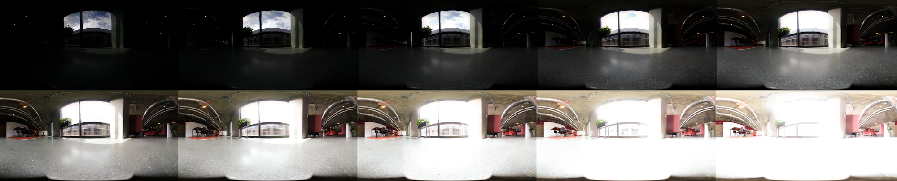
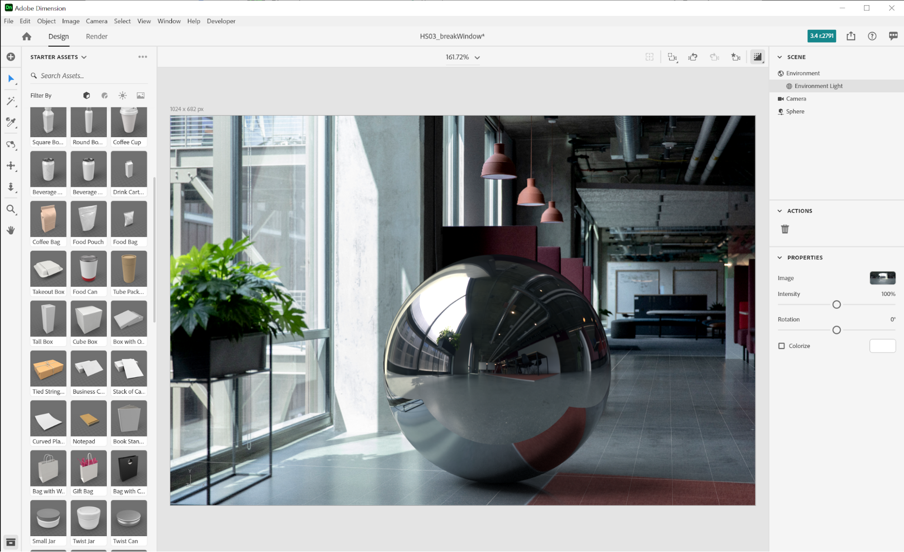

# Mit 3D-Rendering und Compositing fotorealistische virtuelle Fotos erstellen

![Eine Collage mit Beispielen fotorealistischer virtueller Fotos, die mit Adobe [!DNL Dimension]](assets/Photorealistic_1.png) erstellt wurden

Wenn Sie sich die Bilder oben ansehen, würden Sie verzeihen, wenn Sie davon ausgehen, dass alles, was Sie sehen, echt ist. Mit den technologischen Fortschritten bei der Darstellung fotorealistischer 3D-Bilder ist es jedoch schwieriger denn je, zu bestimmen, was real und was virtuell ist. In diesem Fall bestehen die Bilder aus realistischen, fotografischen und gerenderten 3D-Inhalten - und genau in diese Art von 3D-Design investieren Unternehmen.

Diese Technik, 3D-Modelle zu einem Bild oder Video zu &quot;kombinieren&quot;, ist nicht neu, und ihre Ursprünge reichen bis in die frühen Tage des VFX zurück (bis in die 1980er Jahre). Neu und aufregend ist, dass diese Technik zu einem leistungsstarken Tool für [Adobe [!DNL Dimension]](https://www.adobe.com/products/dimension.html)-Benutzer und einem faszinierenden neuen Arbeitsablauf für Fotografen geworden ist.

## Die Technologie zum Erstellen zusammengesetzter Bilder auf Adobe [!DNL Dimension]

![Bearbeiten der Ebene eines Metallkugelmodells in einer Adobe [!DNL Dimension]-Komposition](assets/Photorealistic_3.png)

Adobe [!DNL Dimension] hat es Benutzern ermöglicht, 2D- und 3D-Elemente direkt in der App nahtlos zusammenzufügen, indem die von Adobe Sensei unterstützte Bildabgleichfunktion verwendet wurde. Der Hauptvorteil von Compositing-Elementen auf diese Weise ist, dass der Prozess der Erstellung eines realistisch aussehenden Bildes durch die Ersetzung einer vollständig realisierten 3D-Szene mit einem Hintergrundbild, das von der Realität erfasst werden kann, erheblich beschleunigt wird.

![Die Funktion &quot;Bild angleichen&quot; auf Adobe [!DNL Dimension] analysiert das Hintergrundbild und schätzt die Brennweite und Position der Kamera, die für die Aufnahme verwendet wurde](assets/Photorealistic_4.gif)

Die Funktion &quot;Bild angleichen&quot; analysiert das Hintergrundbild und schätzt die Brennweite und Position der Kamera, mit der es aufgenommen wurde. In der [!DNL Dimension]-Szene wird dann eine 3D-Kamera erstellt, mit der 3D-Elemente in derselben Perspektive wie das Hintergrundbild gerendert werden können, sodass sie zusammengesetzt werden.

Aber was ist mit allem, was nicht innerhalb des Kamerarahmens aufgenommen wurde?  Die vollständige Umgebung, in der ein Bild aufgenommen wird, ist von entscheidender Bedeutung, da sie definiert, wie alles darin aussieht. Ein Objekt innerhalb eines Bildes reflektiert das Licht der Welt um es herum, was auch alles hinter der Kamera mit einschließt. Damit sich die 3D-Elemente mit Ebenen wirklich in den Hintergrund des Bildes einfügen, müssen sie die Beleuchtung der Umgebung, in der das Bild aufgenommen wurde, vollständig reflektieren.

Mit Bild angleichen wird versucht, die Lichtumgebung, in der ein Hintergrundbild aufgenommen wurde, zu &quot;halluzinieren&quot;. Die Funktion ist beeindruckend und liefert in kurzer Zeit hervorragende Ergebnisse. Die Aufnahme der Umgebung zusammen mit dem Hintergrundbild führt jedoch zu noch realistischeren Ergebnissen. Mit dieser Methode kann sogar die Adobe Sensei-Funktion trainiert werden, dies selbst zu tun.

Entdecke die Welt der 360° HDR-Panoramabilder. Diese Bilder werden schon seit langem in 3D-Grafiken verwendet, um die Beleuchtungseffekte einer umfassenden Beleuchtungsumgebung zu beschleunigen. Das Verfahren zu ihrer Erfassung in der Vergangenheit war aufgrund des hohen Kenntnisstandes und der speziellen Ausrüstung, die für ihre Herstellung erforderlich war, recht komplex. Mit der Einführung von 360°-Kameras ist die Erstellung dieser Bilder jetzt noch einfacher als je zuvor.

Kameras wie Ricoh Theta, Gopro MAX und Insta 360 können 360 Panoramen aufnehmen. Die Ricoh Theta verfügt über eine automatische Belichtungsreihe, die ein wichtiger Teil des Aufnahmeprozesses ist. Dies reduziert den Zeit- und Arbeitsaufwand für die Aufnahme von HDRs und macht sie für Fotografen zugänglicher.

## Verfahren zur Erstellung fotorealistischer Bildkompositionen

### [!DNL Capture]

Für den Einstieg in die Aufnahme von Umgebungen für Compositing benötigen Sie zwei Hauptelemente: ein hochwertiges Hintergrundbild oder Bilder und ein 360° HDR-Panorama der Umgebung, in der es aufgenommen wurde.

Einer der wichtigsten Aspekte beim effektiven Aufnehmen dieser Art von Inhalten ist es, die vorhandenen Fähigkeiten und Werkzeuge eines Fotografen zu nutzen. Um ein schönes Hintergrundbild zu erstellen, ist ein Auge für die Komposition und die Liebe zum Detail erforderlich. Auch bei Hintergrundbildern ist eine besondere Denkweise erforderlich, damit du etwas Nützliches erstellst, mit dem sich 3D-Elemente zusammensetzen lassen.

### Auswählen eines Speicherorts

Halte Ausschau nach Locations, die sowohl im Kontext als auch in Bezug auf die Beleuchtung interessant sind. Wenn man den Kontext betrachtet, kann es hilfreich sein, sich den potenziellen Nutzen einer Szene vorzustellen. Beispielsweise kann eine Ansicht einer leeren Straße zum Hinzufügen in einem 3D-Auto verwendet werden, während eine Ansicht eines Tisches in einem Café für [Anzeigen der Verpackung](https://www.adobe.com/products/dimension/packaging-design-mockup.html) von Lebensmittelprodukten verwendet werden kann.

Beim Fotografieren des Hintergrundbilds solltest du bedenken, dass darin 3D-Elemente zusammengefügt werden. Es sollte einen leeren Fokusbereich geben, um Platz für diese Objekte zu lassen. Oft liegt der Schwerpunkt der finalen Komposition auf dem 3D-Inhalt. Daher ist es wichtig, dass der Hintergrund nicht allzu stark hervorsticht.

Gleichermaßen wichtig ist die Lichtsituation im Bild, da sie sich stark auf die zusammengesetzten 3D-Inhalte auswirkt. Das Licht sollte von der Schulter oder der Seite kommen - das führt zu den besten Ergebnissen, da es beim Platzieren von 3D-Objekten in der Szene als Hauptlicht fungiert. Es mag verlockend sein, Fotos in Richtung Licht zu machen, wenn kein Element des Fokus zu sehen ist, aber denke daran, dass dies zu Inhalten führt, die immer hintergrundbeleuchtet sind. Das Hinzufügen eines temporären Standbildobjekts zur Szene kann nützlich sein, um die Beleuchtung zu komponieren und zu bewerten.

## Aufnahme des HDR-Panos

### Kameraposition

Platziere deine 360°-Kamera in der Mitte des Bereichs, auf den du dich für die Hintergrundaufnahme konzentrieren willst. Es kann ideal sein, wenn der Hintergrund eine breitere Szene zeigt, um die Kamera mit einem Einbeinstativ vom Boden zu heben, andernfalls kann die Kamera direkt auf den Boden gestellt werden.

### Color

Es ist sehr wichtig, die Farbe zwischen der Kamera, mit der die Umgebung aufgenommen wurde, und der Kamera, mit der der Hintergrund aufgenommen wurde, beizubehalten, da die Bilder zusammen verwendet werden. Hier haben wir die Farbtemperatur der beiden Kameras auf 5000k eingestellt und ein Foto von einer Farbkarte mit beiden Kameras für die weitere Ausrichtung in der Nachbearbeitung gemacht.

### Belichtungswerte in Klammern

Um mit der 360°-Kamera eine HDR-Umgebung zu erstellen, müssen mehrere EVs aufgenommen werden, um in der Nachbearbeitung zu einem HDR-Bild kombiniert zu werden. Die Anzahl der EVs ist nicht standardisiert, aber im Allgemeinen soll das obere Ende des Belichtungsbereichs bis zu einem Punkt gehen, an dem keine Informationen mehr in den Schatten vorhanden sind, und das untere Ende des Belichtungsbereichs bis zu einem Punkt, an dem keine Informationen mehr in den Glanzlichtern vorhanden sind.

Idealerweise verfügt die 360°-Kamera über eine automatische Belichtungsreihe, die es ermöglicht, die verschiedenen Belichtungsstufen von der Kamera zu stapeln. Ideale Einstellungen sind die Verwendung des niedrigsten verfügbaren ISO-Werts, um Rauschen zu vermeiden, und eines hohen Blendenwerts für die Schärfe. Die Belichtungswerte können dann mit der Verschlusszeit variiert und durch Stopps aufgelöst werden, also die Belichtung halbieren oder verdoppeln.

Hier ist ein Beispiel von Elektrofahrzeugen, die für die Aufnahme einer IBL im Freien verwendet werden:

01 - F 5.6, ISO 80, Verschlusszeit 1/25000, WB 5000 K

02 - F 5.6, ISO 80, Verschlusszeit 1/12500, WB 5000 K

03 - F 5.6, ISO 80, Verschlusszeit 1/6400, WB 5000 K

...

16 - F 5.6, ISO 80, Verschlusszeit 1, WB 5000 K

Wenn der verwendete 360°-Prozessor in der Lage ist, RAW-Bilder auszugeben, können die EVs in 2-4 Stopp-Inkrementen aufgeteilt werden, da sie mehr Informationen als 8-Bit-Bilder wie JPEG speichern.

Nachdem Sie Farbkorrekturen an den EVs vorgenommen haben, können sie vorübergehend in einzelne Dateien exportiert und dann in Photoshop zusammengeführt werden. Der Dateityp sollte von der Quelle abhängen, aber verwenden Sie in keinem der Fälle ein komprimiertes Format wie JPEG. Wähle in Photoshop &quot;Datei > Automatisieren > Zu HDR-Pro zusammenfügen&quot;, und wähle alle exportierten EVs aus.

Stellen Sie sicher, dass &quot;Modus&quot; auf 32 Bit eingestellt ist. Mit &quot;Geisterbilder entfernen&quot; können Sie Details entfernen, die sich zwischen den EVs geändert haben, aber verwenden Sie sie nicht, wenn Sie sie nicht benötigen. Der Schieberegler unter dem Histogramm beeinflusst nur die Vorschaubelichtung, also ignoriere sie. Deaktivieren Sie die Option &quot;Tonung in Adobe Camera Raw abschließen&quot; und klicken Sie auf &quot;OK&quot;.

Das Ergebnis ist ein HDR-Bild, mit dem Szenen in 3D beleuchtet werden können.

Die letzten Schritte bestehen darin, alle Schatten und Stativbeine zu entfernen, die am Nadir des Bildes sichtbar sind, und die Standardbelichtung des Bildes anzupassen, um die Szene korrekt zu beleuchten. Details können mit dem Klonwerkzeug in Photoshop entfernt werden. Die Belichtung sollte in Verbindung mit den Hintergründen in [!DNL Dimension] angepasst werden, da der Belichtungswert der HDR-IBL die Beleuchtungswerte für die 3D-Objekte ist.

### Den Hintergrund einfangen.

Nach der Aufnahme der Umgebung können Sie jetzt Hintergründe mit einer Kamera Ihrer Wahl erfassen. Je höher die Qualität und Auflösung, desto besser. Dies, zusammen mit einem Auge für die Komposition, das Fotografen haben, ist der wichtigste Vorteil dieses Prozesses. Die obigen Bilder wurden mit einer Canon 5D MK IV aufgenommen.

Es gibt viel Spielraum für den Rahmen und die Komposition mit dem Hintergrund. Die Kamera kann hohe oder niedrige Blenden für unterschiedliche Tiefenschärfe aufweisen, lange oder kurze Brennweiten verwenden und nach oben oder unten geneigt sein. Die Hauptanforderung ist, dass die Kamera auf den Mittelpunkt ausgerichtet ist, an dem die Umgebung mit der 360-Kamera aufgenommen wurde.

Wenn die Aufnahme abgeschlossen ist, sollten die Bilder nachbearbeitet werden, um der Farbe der Umgebung so nah wie möglich zu entsprechen. Farbe und Belichtung sollten so neutral und natürlich wie möglich sein. Alle stilisierten Looks sollten angewendet werden, nachdem 3D-Elemente mit der Adobe [!DNL Dimension] in das Bild eingefügt wurden.

## Zusammengesetztes Bild wird in [!DNL Dimension] zusammengestellt

Nachdem diese Elemente gesammelt und vervollständigt wurden, können sie jetzt in einer Szene auf Adobe [!DNL Dimension] zusammengestellt werden. Das geht so einfach wie das Ziehen des Hintergrunds in die Szene, wo es dann auf den Hintergrund angewendet wird. Fügen Sie dann das HDR-Panorama in den Slot mit dem Umgebungslicht-Bild hinzu.

Ziehen Sie das Hintergrundbild auf eine leere Stelle auf der Arbeitsfläche oder wählen Sie im Szenenfenster die Option Umgebung aus und fügen Sie das Bild zur Hintergrundeingabe hinzu.

![Das Hintergrundbild für ein virtuelles Foto kann über das Menü &quot;Eigenschaften&quot; in Adobe [!DNL Dimension]](assets/Photorealistic_20.png) ausgewählt werden.

Fügen Sie das HDR-Panorama hinzu, indem Sie das Umgebungslicht auswählen und es der Bildeingabe hinzufügen.

![Die Umgebungslichtquelle kann dem Hintergrundbild eines virtuellen Fotos über das Szenenmenü in Adobe [!DNL Dimension]](assets/Photorealistic_21.png) hinzugefügt werden.

Mit &quot;Bild angleichen&quot; kannst du dann den Hintergrund an die Auflösung und das Seitenverhältnis sowie die Kameraperspektive anpassen. Anstatt die Umgebung aus dem Hintergrundbild zu generieren, wird das erfasste HDR-Panoramabild verwendet, um die Szene zu beleuchten, sodass die Option &quot;Lichter erstellen&quot; deaktiviert bleiben kann.

![Verwenden der Funktion &quot;Bild angleichen&quot; auf Adobe [!DNL Dimension] zum Rendern eines 3D-Metallkugelbilds mit den Umgebungslichtern eines HDR-Panoramas](assets/Photorealistic_22.png)

Objekte, die du in die Szene einfügst, werden nun realitätsgetreu in den Hintergrund eingefügt, da sie von der Umgebung beleuchtet werden, in der das Bild aufgenommen wurde.

Um die Ausrichtung und Belichtung des HDR-Panos relativ zum Hintergrund schnell zu bewerten, kann in der Szene eine Kugel-Primitive mit einem metallischen Material platziert werden, die aus dem freien Bedienfeld für Elemente in [!DNL Dimension] entnommen wurde. Die Drehung des Umgebungslichts kann dann so positioniert werden, dass die Reflexionen korrekt aussehen. Wenn die Beleuchtung des HDR-Panoramas die Kugel über- oder unterbelichtet, sollte die Belichtung des HDR-Panoramas erhöht oder verringert werden, um dies zu kompensieren.

Um die Ausrichtung und Belichtung des HDR-Panos relativ zum Hintergrund schnell zu bewerten, kann in der Szene eine Kugel-Primitive mit einem metallischen Material platziert werden, die aus dem freien Bedienfeld für Elemente in [!DNL Dimension] entnommen wurde. Die Drehung des Umgebungslichts kann dann so positioniert werden, dass die Reflexionen korrekt aussehen. Wenn die Beleuchtung des HDR-Panoramas die Kugel über- oder unterbelichtet, sollte die Belichtung des HDR-Panoramas erhöht oder verringert werden, um dies zu kompensieren.

## Das Endergebnis: Eine fotorealistische Bildkomposition

![Ein Zeitraffer aus 3D-Compositing und Rendering für ein virtuelles Produktfoto auf Adobe [!DNL Dimension]](assets/Photorealistic_24.gif)

Sobald die Szene abgeschlossen ist, ist der Arbeitsablauf für den Endbenutzer unkompliziert. Ziehen Sie einfach Ihr eigenes Modell oder einen beliebigen [Adobe [!DNL Stock] 3D](https://stock.adobe.com/3d-assets)-Inhalt direkt in das Bild, um es so zu rendern, als wäre es zum Zeitpunkt der Aufnahme vorhanden. So eröffnen sich neue Möglichkeiten für die Erstellung realistischer Werbeinhalte oder die Möglichkeit, Designs in vielen verschiedenen Kontexten zu iterieren.

Das Ergebnis ist eine überzeugende Kombination aus Realität und 3D, die es Endanwendern ermöglicht, fotorealistische Bilder mit minimalem Aufwand zu erstellen. Probieren Sie es selbst aus mit [freien [!DNL Dimension] Szenen](https://assets.adobe.com/public/3926726a-2a17-43d4-4937-6d84a4d29338), die wir erstellt haben, um den Workflow zu demonstrieren.

[Laden Sie noch heute die neueste Version ](https://creativecloud.adobe.com/apps/download/dimension) von [!DNL Dimension] herunter und beginnen Sie mit der Erstellung fotorealistischer Bilder.
