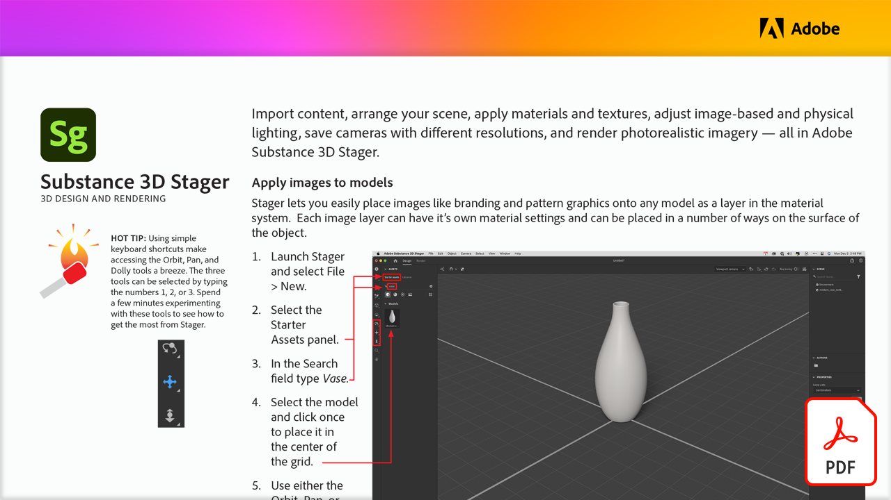

# 3D-Design und Rendering

Importiere Inhalte. Ordne Szenen an. Wende Materialien und Strukturen an. Passe Beleuchtung auf Bild- und Physikebene an. Speichere Kameras mit unterschiedlichen Auflösungen. Rendere fotorealistisches Bildmaterial - alles in Adobe Substance 3D Stager.

Wählen Sie die Abbildung unten, um dieses PDF-Tutorial anzuzeigen oder herunterzuladen.

[{&quot;width=680&quot;}](assets/Adobe-Substance-Stager.pdf){target="blank"}
