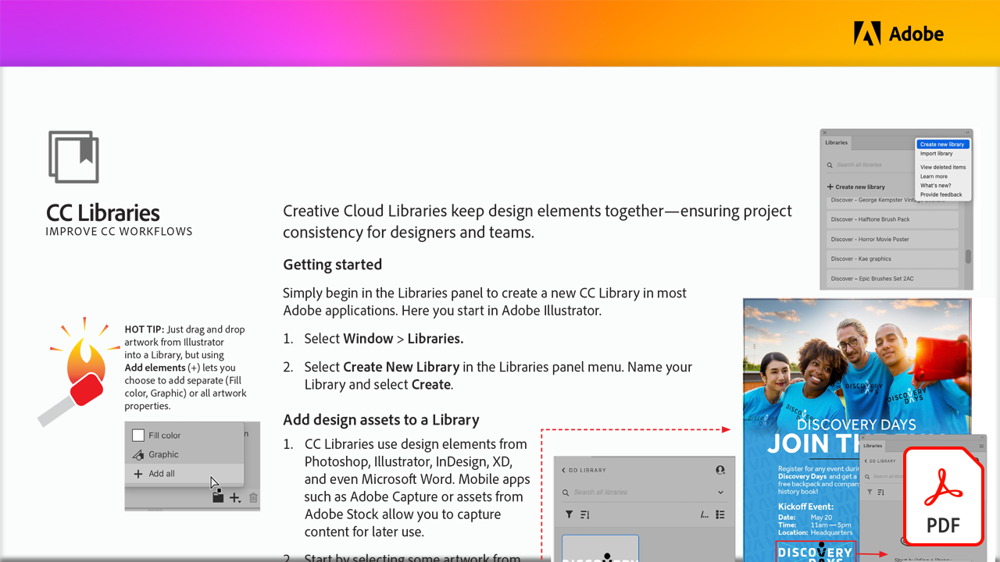

# Verbessern von CC-Workflows mit CC Libraries

In diesen Tutorials erfährst du, wie du mithilfe von Creative Cloud-Bibliotheken die Design-Elemente zusammenführst und so die Projektkonsistenz für Designer und Teams gewährleistest.

Wählen Sie die Abbildung unten, um dieses PDF-Tutorial anzuzeigen oder herunterzuladen.

[{width="680"}](assets/ImproveCCWorkflowsCCLibraries.pdf){target="blank"}
