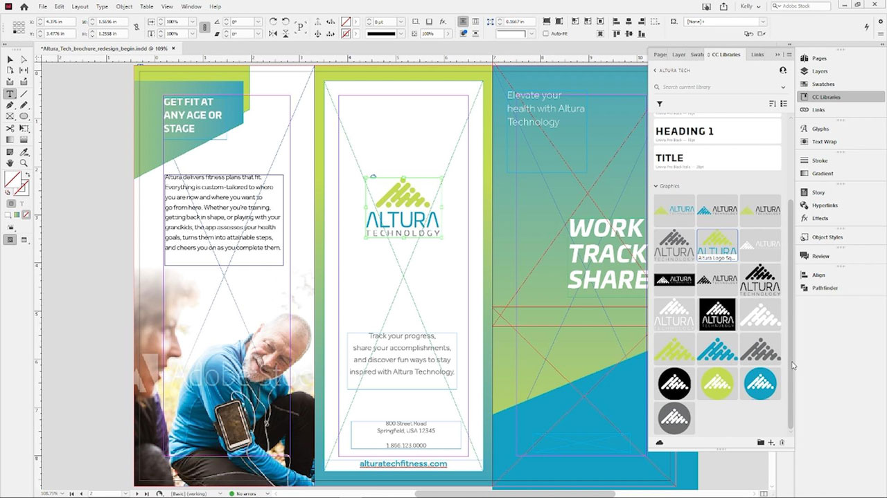
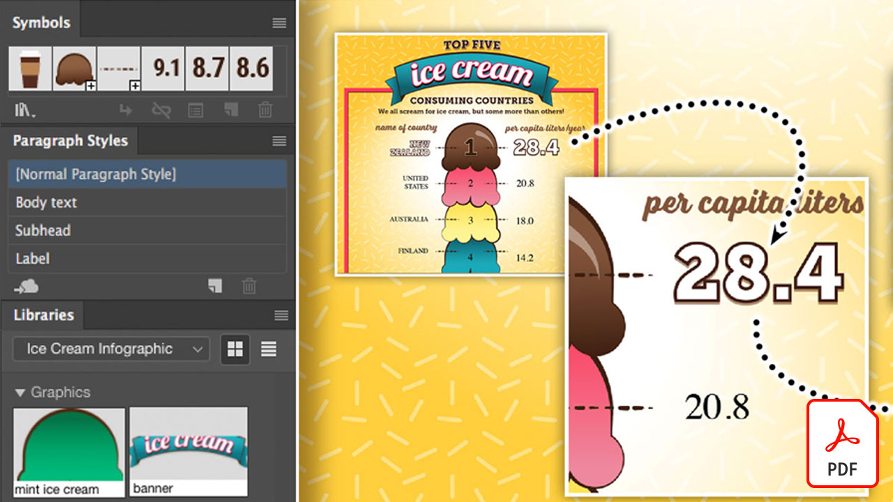
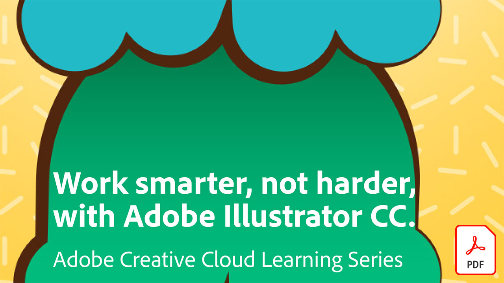
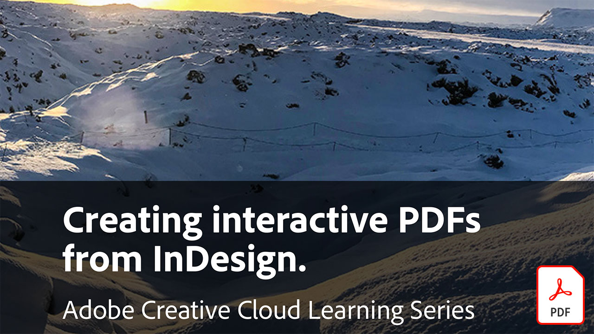
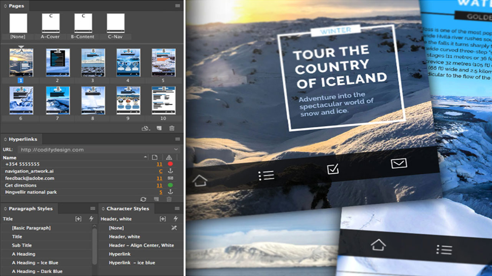
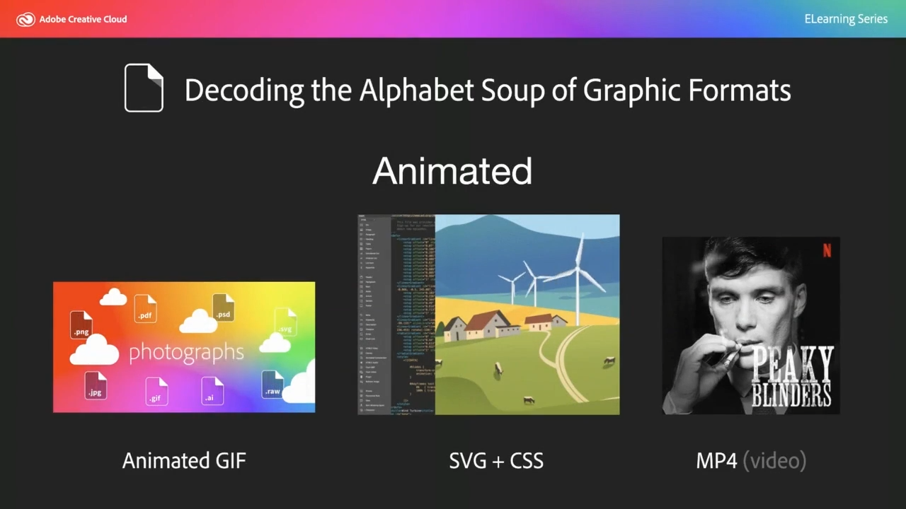

# Tutorials zu Creative Cloud für Unternehmen.

Als Unternehmen und Kreative müssen Sie mit verteilten Teams zusammenarbeiten, skalierbare Prozesse einrichten und die Systeme und Richtlinien des Unternehmens einhalten. Diese Tutorials helfen Ihnen, neue Funktionen im Creative Cloud zu erlernen - aus der Sicht eines Unternehmens.

## Tutorial zum Auswählen eines Produkts (in alphabetischer Reihenfolge) zum Anzeigen

### Adobe Acrobat

<table style="table-layout:fixed">
<tr>
 <td>
   
    

   <a href="acrobat-content-creators.md"><strong>Acrobat für Content-Ersteller</strong></a>
    

    <em>Tools von Acrobat zur Optimierung von Kreativ-Workflows</em>
     
  </td>
  <td>
    
    

     
  </td>
  <td>
    
    

     
  </td>
  <td>
    
    

     
  </td>
</tr>
</table>

### Adobe Portfolio

<table  style="table-layout:fixed">
<tr>
   <td>
   
    

   <a href="assets/GettingStartedWithAdobePortfolio.pdf"><strong>Erste Schritte mit Adobe Portfolio (PDF)</strong></a>
    

    <em>Mit Adobe Portfolio können Sie Ihre besten Arbeiten präsentieren und so Ihren Erfolg sowie neue Kreativtalente gewinnen</em>
     
  </td>
  <td>
   
    

   <a href="assets/ConnectingLightroomandBehancetoYourAdobePortfolio.pdf"><strong>Verbinden von Lightroom und Bēhance mit Ihrem Adobe Portfolio (PDF)</strong></a>
    

    <em>Bēhance-Projekte als Seiten in Ihrem Portfolio verwenden</em>
     
  </td>
  <td>
   
    

   <a href="assets/ShowYourBestWorkwithAdobePortfolio.pdf"><strong>Präsentieren Ihrer besten Arbeit mit Adobe Portfolio (PDF)</strong></a>
    

    <em>Mit Adobe Portfolio können Sie Ihre Arbeit hochladen, organisieren und mit potenziellen Mitarbeitern und Kunden auf der ganzen Welt teilen</em>
     
  </td>
  <td>
    
    

     
  </td>
 </tr>
 </table>

### CC-Bibliotheken

<table  style="table-layout:fixed">
<tr>
  <td>
   
   

   <a href="cc-workflows-cc-libraries.md"><strong>CC-Workflows mit CC-Bibliotheken verbessern</strong></a>
    

    <em>Erfahre, wie Creative Cloud-Bibliotheken die Design-Elemente zusammenhalten und so die Projektkonsistenz für Designer und Teams gewährleisten.</em>
     
  </td>
  <td>
   
   

   <a href="ccteamlibraries.md"><strong>Erstellen von Creative Cloud-Bibliotheken für Teams</strong></a>
    

    <em>Elemente über Creative Cloud-Bibliotheken für Teams innerhalb einer Gruppe oder eines Teams freigeben</em>
     
  </td>
  <td>
   
   

   <a href="sharecclibraries.md"><strong>Gemeinsame Nutzung von Branding-Elementen mit Creative Cloud-Bibliotheken für Teams</strong></a>
    

    <em>Erfahren Sie, wie Sie Branding-Elemente für Ihre Gruppe oder Ihr Team mithilfe von Creative Cloud-Bibliotheken für Teams erstellen, verwenden und freigeben.</em>
     
  </td>
  <td>
   
    

   <a href="assets/CreateAddandShareYourBrandAssetswithCreativeCloudLibraries.pdf"><strong>Branding-Elemente mithilfe von Creative Cloud-Bibliotheken erstellen, hinzufügen und freigeben (PDF)</strong></a>
    

    <em>Creative Cloud-Bibliotheken bieten ein integriertes Markensystem, über das Designer Branding-Elemente an Kreativteams weitergeben können</em>
     
  </td>
  </tr>
  <tr>
  <td>
   
    

   <a href="assets/ShareTextStylesFromIllustratorwithCreativeCloudLibraries.pdf"><strong>Freigeben von Textformaten aus Illustrator mit Creative Cloud-Bibliotheken (PDF)</strong></a>
    

    <em>Intelligenter arbeiten mit Illustrator.</em>
     
  </td>
  <td>
    
    

     
  </td>
  <td>
    
    

     
  </td>
  <td>
    
    

     
  </td>
</tr>
</table>

### Creative Cloud für Unternehmen

<table style="table-layout:fixed">
<tr>
 <td>
   
    

   <a href="collaboration-the-future-of-creativity.md"><strong>Zusammenarbeit: Die Zukunft der Kreativität</strong></a>
    

    <em>Zu den vielen Vorteilen eines Adobe Creative Cloud-Abonnements gehört der kostenlose Zugriff auf mehr als 20.000 professionell gestaltete und kuratierte Schriftarten von Adobe Fonts</em>
     
  </td>
  <td>
   
    

   <a href="assets/FromHandLetteringtoIllustratorviaCreativeCloud.pdf"><strong>Von Handlettering zu Illustrator per Creative Cloud (PDF)</strong></a>
    

    <em>Mit der Power von Creative Cloud für Unternehmen können Sie mit den Adobe-Apps für Mobilgeräte und Desktops von überall aus Inhalte erfassen, konvertieren und erstellen - auf jedem Gerät</em>
     
  </td>
  <td>
   
    

   <a href="assets/FromLightroomWebtoInDesignviaCreativeCloud.pdf"><strong>Von Lightroom Web auf InDesign über Creative Cloud (PDF)</strong></a>
    

    <em>Lasse deiner Kreativität freien Lauf, und erstelle mit Creative Cloud-Dateien und -Bibliotheken ein fertiges Design.</em>
     
  </td>
  <td>
    
    

     
  </td>
</tr>
</table>

### [!DNL Dimension]

<table  style="table-layout:fixed">
<tr>
   <td>
   
    

   <a href="assets/VisualizeyourProductinaRealisticEnvironment.pdf"><strong>Produkt in einer realistischen Umgebung visualisieren (PDF)</strong></a>
    

    <em>Wenn du sehen willst, wie deine Produkte in der realen Welt aussehen, Adobe [!DNL Dimension] ist Ihre Lösung für Endanwender</em>
     
  </td>
  <td>
    
    

     
  </td>
  <td>
    
    

     
  </td>
  <td>
    
    

     
  </td>
</tr>
</table>

### Fresco

<table>
<tr>
 <td>
   
    

   <a href="frescoworkshop.md"><strong>Fresco auf dem iPad (und iPhone) ausprobieren</strong></a>
    

    <em>Entdecke eine neue Welt des digitalen Zeichnens und Malens mit Adobe Fresco in diesem 15-minütigen, praktischen Workshop</em>
     
  </td>
  <td>
    
    

     
  </td>
  <td>
    
    

     
  </td>
  <td>
    
    

     
  </td>
</tr>
</table>

### Schriften

<table  style="table-layout:fixed">
<tr>
<td>
   
    

   <a href="taming-type-anxiety.md"><strong>Bezähmungstyp</strong></a>
    

    <em>Erfahren Sie, wie Sie auf über 20.000 professionell gestaltete Schriften in Creative Cloud zugreifen und diese verwenden können</em>
     
  </td>
  <td>
   
    

   <a href="assets/CreatingBeautifulTypographywithCreativeCloud.pdf"><strong>Typografie mit Creative Cloud (PDF)</strong></a>
    

    <em>Lernen Sie die neuesten typografischen Steuerelemente in Ihren bevorzugten Design-Tools kennen.</em>
     
  </td>
   <td>
   
    

   <a href="assets/DiscoveringFontswithCreativeCloud.pdf"><strong>Erkennen von Schriftarten beim Creative Cloud (PDF)</strong></a>
    

    <em>Die richtige Schrift für ein Projekt zu finden, kann manchmal eine überwältigende Aufgabe sein. Mit verschiedenen Creative Cloud-Apps und -Diensten ist es jetzt lustig und inspirierend, die richtige Schriftart zu finden</em>
     
  </td>
  <td>
   
    

   <a href="assets/UnleashHiddenGemsinOpenTypefonts.pdf"><strong>Versteckte Edelsteine in OpenType-Schriften freigeben (PDF)</strong></a>
    

    <em>Das OpenType-Format ermöglicht eine Schrift mit bis zu 65.536 Glyphen</em>
     
  </td>
</table>

### Illustrator

<table  style="table-layout:fixed">
<tr>
   <td>
   
    

   <a href="assets/GettoKnowGraphicStylesinIllustrator.pdf"><strong>Lernen Sie Grafikstile in Illustrator kennen (PDF)</strong></a>
    

    <em>Mit Illustrator kannst du Elemente ähnlich formatieren wie Text</em>
     
  </td>
   <td>
   
    

   <a href="assets/WorkSmarterNotHarderwithIllustrator.pdf"><strong>Intelligenter arbeiten mit Adobe Illustrator CC (PDF)</strong></a>
    

    <em>Schnellere Erstellung von Vektorgrafiken mit Illustrator</em>
     
  </td>
  <td>
   
    

   <a href="assets/IllustratorSymbolsandLayersequalsPerfectStructureforResponsiveSVG.pdf"><strong>Illustrator Symbols + Layers = Perfekte Struktur für responsives SVG! (PDF)</strong></a>
    

    <em>Illustrator bietet eine einzigartige Unterstützung für das SVG-Format, einschließlich der Möglichkeit, Symbole, Gruppen, IDs und präzise Vektordefinitionen Ihres Bildmaterials zu erstellen</em>
     
  </td>
  <td>
    
    

     
  </td>
</tr>
</table>

### InDesign

<table  style="table-layout:fixed">
<tr>
  <td>
   
    

   <a href="assets/CreatingInteractivePDFsfromInDesign.pdf"><strong>Erstellen interaktiver PDF von InDesign (PDF)</strong></a>
    

    <em>InDesign enthält viele Funktionen zum Formatieren, Formatieren, Verwalten und Verfolgen des Inhalts in Ihren Dokumenten</em>
     
  </td>
   <td>
   
    

   <a href="assets/EasilyGatherandIncorporateDesignFeedbackwithAdobeAcrobatandInDesign.pdf"><strong>Einfaches Sammeln und Einbinden von Design-Feedback mit Adobe Acrobat und InDesign (PDF)</strong></a>
    

    <em>Mit Acrobat können Sie detaillierte Kommentare und Anmerkungen hinzufügen. Anschließend können Sie diese Markups schnell wieder in Adobe InDesign importieren und im Kontext Ihres Layouts anzeigen</em>
     
  </td>
  <td>
   
    

   <a href="assets/StyleWebContentwithInDesign.pdf"><strong>Web-Inhalte mit Adobe InDesign CC formatieren (PDF)</strong></a>
    

    <em>Wussten Sie, dass Sie die Leistungsfähigkeit von InDesign nutzen können, um HTML- und Webgrafiken auszugeben?</em>
     
  </td>
  <td>
   
    

   <a href="assets/InteractivePDFBookmarksandLinkedTOCsfromInDesign.pdf"><strong>Interaktives PDF: Lesezeichen und verknüpfte Inhaltsverzeichnisse von InDesign (PDF)</strong></a>
    

    <em>Erfahren Sie, wie Sie die Inhaltsverzeichnisfunktion auf dem InDesign verwenden, um sowohl Lesezeichen als auch Hyperlinks zu generieren, die Ihren Lesern helfen, Informationen in Ihren PDF-Dateien schnell zu finden</em>
     
  </td>
</tr>
<tr>
  <td>
   
    

   <a href="assets/InteractivePDFGraphicalHyperlinksandNestedMasterPagesinInDesign.pdf"><strong>Interaktives PDF: Grafische Hyperlinks und verschachtelte Masterseiten auf dem InDesign (PDF)</strong></a>
    

    <em>Durch das Anwenden von Hyperlinks auf Masterseiten können Sie ein Navigationssystem auf allen Ihren Seiten schnell verwalten</em>
     
  </td>
  <td>
    
    

     
  </td>
  <td>
    
    

     
  </td>
  <td>
    
    

     
  </td>
</tr>
</table>

### Photoshop

<table style="table-layout:fixed">
<tr>
  <td>
    
    

    <a href="alphabetsoup.md"><strong>Dekodieren der Buchstabensuppe von Grafikformaten</strong></a>
    

    <em>JPG-, PNG-, SVG-, GIF- und EPS-Dateien werden häufig im Design verwendet, einige für Webseiten, andere für Präsentationen, Publikationen und Kreativprojekte. Aber was bedeuten sie, und was sollten Sie wählen?</em>
     
  </td>
  <td>
    
    

    <a href="compositepsipad.md"><strong>Erstellen einzigartiger Kompositionen mit dem Adobe [!DNL Stock] und Photoshop für iPad</strong></a>
    

    <em>Nutze die Power von Photoshop. Erfahren Sie, wie Sie eine Ihrer bevorzugten Creative Cloud-Anwendungen mit einer neu gestalteten, Touch-basierten Oberfläche ganz neu verwenden können.</em>
     
  </td>
  <td>
    
    

    <a href="cinemagraphps.md"><strong>Erstellen von Cinemagrammen mit Photoshop</strong></a>
    

    <em>In diesem Schritt-für-Schritt-Tutorial erstellen Sie ein lebendiges Foto, indem Sie ein Video von Adobe kombinieren [!DNL Stock] mit cleveren Maskierungstechniken in Photoshop</em>
     
  </td>
  <td>
    
    

    <a href="assets/AddRemarkableLightingtoaPhotowithPhotoshopandAfterEffects.pdf"><strong>Mit Photoshop und After Effects ein Foto aufwerten (PDF)</strong></a>
    

    <em>Erfahren Sie, wie Sie mit dem Effekt "Lichtburst" in Adobe After Effects ein Foto dramatisch verbessern können</em>
     
  </td>
</tr>
<tr>
  <td>
    
    

    <a href="assets/CreateCinemagraphsinaSnapwithPhotoshopandAdobeStock.pdf"><strong>Mit Photoshop und Adobe im Handumdrehen Cinemagramme erstellen [!DNL Stock] (PDF)</strong></a>
    

    <em>Auf dem Adobe nach Videos in Endlosschleife suchen [!DNL Stock] für das schnelle Zusammenstellen von Cinemagrammen in Photoshop</em>
     
  </td>
  <td>
    
    

    <a href="assets/CreatingaLivingPhotographwithPhotoshopPart1.pdf"><strong>Lebende Fotos mit Photoshop erstellen - Teil 1 (PDF)</strong></a>
    

    <em>Mit Adobe Photoshop kannst du deine Kurzvideos schnell in lebendige Fotos verwandeln, die deine Zielgruppe auf jeder sozialen Plattform faszinieren.</em>
     
  </td>
  <td>
    
    

    <a href="assets/CreatingaLivingPhotographwithPhotoshopPart2.pdf"><strong>Lebende Fotos mit Photoshop erstellen - Teil 2 (PDF)</strong></a>
    

    <em>Wenn du Fotos mit Videos kombinierst, kannst du deinen Fotos eine interessante Qualität verleihen, ohne dabei die Botschaft oder den Ton des Originalbildes zu beeinträchtigen</em>
     
  </td>
  <td>
    
    

    <a href="assets/PhotoshopAfterEffectsAwesomenessAdobeMAX2018LabRecap.pdf"><strong>Photoshop + After Effects = Klasse: Adobe MAX 2018 Lab Recap (PDF)</strong></a>
    

    <em>Kombiniere Photoshop und After Effects zu atemberaubenden Bildern und Effekten. Diese How-tos zeigen dir Schritt für Schritt, wie du sie für die Verwendung auf jedem Gerät brauchst</em>
     
  </td>
</tr>
<tr>
  <td>
    
    

    <a href="assets/QuicklyBrandYourInstagramPhotoswithAdobePhotoshopActions.pdf"><strong>Schnelles Branding Ihrer Instagram-Fotos mit Adobe Photoshop-Aktionen (PDF)</strong></a>
    

    <em>In Photoshop durch Aktionen Zeit sparen</em>
     
  </td>
  <td>
    
    

    <a href="assets/WorkSmarterNotHarderwithPhotoshop.pdf"><strong>Intelligenter arbeiten mit Photoshop (PDF)</strong></a>
    

    <em>Änderungen an Photoshop können zeitaufwendig sein, müssen aber nicht</em>
     
  </td>
  <td>
    
    

    <a href="assets/AnyoneCanBeCreativewithAdobeCreativeCloud.pdf"><strong>Ein wenig Adobe Photoshop zu Ihren kreativen Fertigkeiten hinzufügen (PDF)</strong></a>
    

    <em>Mit Adobe Photoshop kreative Skills erweitern.</em>
     
  </td>
  <td>
    
    

    <a href="assets/GreenScreenisNotJustforVideo.pdf"><strong>Greenscreen ist nicht nur für Video (PDF)</strong></a>
    

    <em>Sie können Greenscreen in einem Fotostudio verwenden und After Effects verwenden, um die Fotoverwendung in Photoshop vorzubereiten.</em>
     
  </td>
</tr>  
</table>
