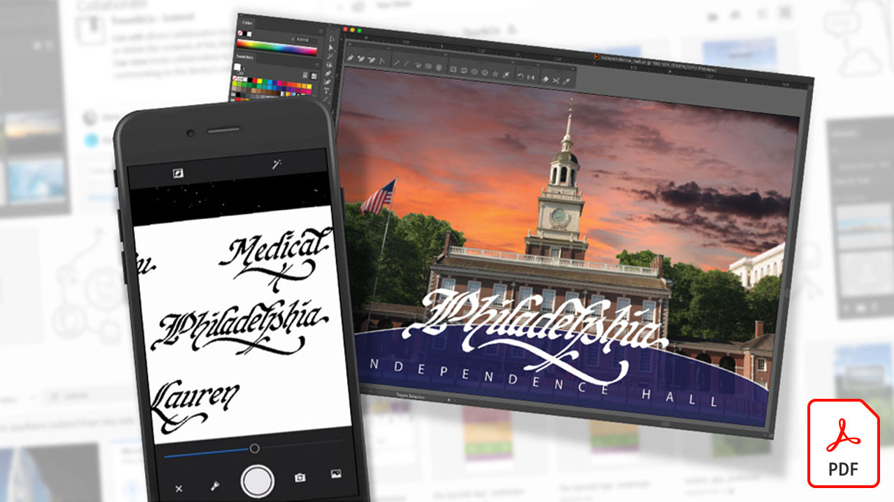

# Tutorials zum Creative Cloud für Unternehmen

Als kreatives Unternehmen müssen Sie mit verteilten Teams zusammenarbeiten, skalierbare Prozesse einrichten und Unternehmenssysteme und Richtlinien einhalten. Anhand dieser Tutorials lernen Sie die neuen Funktionen in Creative Cloud kennen - aus Unternehmensperspektive.

## Klicken Sie hier, um ein Produkt-Tutorial anzuzeigen

### Creative Cloud für Unternehmen

<table style="table-layout:fixed">
<tr>
 <td>
   
    

   <a href="assets/FromHandLetteringtoIllustratorviaCreativeCloud.pdf"><strong>Von Hand schreiben über Creative Cloud nach Illustrator (PDF)</strong></a>
    

    <em>Die leistungsstarken Creative Cloud-Apps für Unternehmen, Adoben und Desktop-Applikationen ermöglichen es Ihnen, von überall aus zu erfassen, zu konvertieren und zu erstellen — auf einem beliebigen Gerät</em>
     
  </td>
  <td>
   
    

   <a href="assets/FromLightroomWebtoInDesignviaCreativeCloud.pdf"><strong>Von Lightroom Web über Creative Cloud zum InDesign (PDF)</strong></a>
    

    <em>Mit Creative Cloud- und Bibliotheksdateien kreativ von der Kamera zum fertigen Design</em>
     
  </td>
  <td>
    
    

     
  </td>
</tr>
</table>

### Spark

<table style="table-layout:fixed">
<tr>
 <td>
   
    

   <a href="assets/AddingaGlideshowtoyourSparkPageAdobeBlog.pdf"><strong>Hinzufügen einer Glideshow zu Ihrer Spark-Seite (PDF)</strong></a>
    

    <em>Adobe Spark Page bietet einige fantastische und benutzerfreundliche Layout-Komponenten, die Ihre Webstorys zum Leben erwecken</em>
     
  </td>
  <td>
   
    

   <a href="assets/CreatingYourBrandinAdobeSpark.pdf"><strong>Marke in Adobe Spark erstellen (PDF)</strong></a>
    

    <em>Adobe Spark macht es leicht, Ihre Marke zu definieren</em>
     
  </td>
  <td>
   
    

   <a href="assets/MeetYourNewProductionArtistAdobeSparkPost.pdf"><strong>Treffen Sie Ihren neuen Produktionskünstler: Adobe Spark Post (PDF)</strong></a>
    

    <em>Adobe Spark lernt von Ihnen, wenn Sie Layouts erstellen, Farben definieren, Grafiken importieren und Elemente innerhalb Ihrer Kompositionen anordnen</em>
     
  </td>
</tr>
</table>

### Photoshop

<table style="table-layout:fixed">
<tr>
   <td>
    
    

    <a href="alphabetsoup.md"><strong>Decodieren der Alphabetsuppe von Grafikformaten</strong></a>
    

    <em>JPG-, PNG-, SVG-, GIF- und EPS-Dateien werden häufig im Design verwendet, einige für Webseiten, andere für Präsentationen, Publikationen und kreative Projekte. Aber was bedeuten sie und welche sollten Sie auswählen?</em>
     
  </td>
  <td>
    
    

    <a href="compositepsipad.md"><strong>Mit Adobe [!DNL Stock] und Photoshop für das iPad einzigartige Kompositionen erstellen</strong></a>
    

    <em>Bringen Sie die Power von Photoshop an Ihre Fingerkuppen. Erfahren Sie, wie Sie mit einer überarbeiteten Touch-basierten Oberfläche eine Ihrer bevorzugten Creative Cloud-Applikationen ganz neu verwenden können.
     </em>
  </td>
  <td>
    
    

    <a href="cinemagraphps.md"><strong>Erstellen von Cinemagrammen mit Photoshop</strong></a>
    

    <em>In diesem Schritt-für-Schritt-Workshop-Tutorial erstellen Sie ein lebendiges Foto, indem Sie Videos aus der Adobe [!DNL Stock] mit cleveren Maskierungstechniken in Photoshop kombinieren</em>
     
  </td>
</tr>
<tr>
   <td>
    
    

    <a href="assets/AddRemarkableLightingtoaPhotowithPhotoshopandAfterEffects.pdf"><strong>Mit Photoshop und After Effects ein Foto mit bemerkenswerter Beleuchtung versehen (PDF)</strong></a>
    

    <em>Erfahren Sie, wie Sie mit dem Effekt "Lichtbrecher"in Adobe After Effects ein Foto dramatisch optimieren können</em>
     
   </td>
   <td>
    
    

    <a href="assets/CreateCinemagraphsinaSnapwithPhotoshopandAdobeStock.pdf"><strong>Schnelles Erstellen von Cinemagrammen mit Photoshop und Adobe [!DNL Stock] (PDF)</strong></a>
    

    <em>Suche nach Videos auf Adobe [!DNL Stock], die sich nahtlos in Endlosschleife abspielen lassen, um in Photoshop aufatemberaubende Kinemagraphen schnell zu erstellen</em>
     
  </td>
   <td>
    
    

    <a href="assets/CreatingaLivingPhotographwithPhotoshopPart1.pdf"><strong>Lebensfotos mit Photoshop erstellen — Teil 1 (PDF)</strong></a>
    

    <em>Mit Adobe Photoshop können Sie Ihre Kurzvideos schnell in lebendige Fotos verwandeln, die Ihr Publikum auf jeder sozialen Plattform faszinieren</em>
     
  </td>
</tr>
<tr>
   <td>
    
    

    <a href="assets/CreatingaLivingPhotographwithPhotoshopPart2.pdf"><strong>Lebensfotos mit Photoshop erstellen — Teil 2 (PDF)</strong></a>
    

    <em>Durch die Kombination von Fotos mit Videos können Sie Ihren Fotos eine beeindruckende Qualität verleihen, ohne die Botschaft oder den Ton Ihres Originalbildes zu verlieren</em>
     
  </td>
  <td>
    
    

    <a href="assets/PhotoshopAfterEffectsAwesomenessAdobeMAX2018LabRecap.pdf"><strong>Photoshop + After Effects = Bewusstsein: Adobe MAX 2018 Lab Recap (PDF)</strong></a>
    

    <em>In diesem praktischen Schritt-für-Schritt-Labor erstellen Sie mit Photoshop und After Effects atemberaubende Bilder und Effekte, die für jedes Medium geeignet sind</em>
     
  </td>
  <td>
    
    

    <a href="assets/QuicklyBrandYourInstagramPhotoswithAdobePhotoshopActions.pdf"><strong>Schnelles Branding Ihrer Instagram-Fotos mit Adobe Photoshop-Aktionen (PDF)</strong></a>
    

    <em>Mit Aktionen in Photoshop das Tedion eliminieren und Zeit sparen</em>
     
  </td>
</tr>
<tr>
    <td>
    
    

    <a href="assets/WorkSmarterNotHarderwithPhotoshop.pdf"><strong>Mit Photoshop (PDF) intelligenter und nicht härter arbeiten</strong></a>
    

    <em>Änderungen in Photoshop können zeitaufwendig sein, müssen aber nicht unbedingt zeitaufwendig sein</em>
     
  </td>
   <td>
    
    

    <a href="assets/AnyoneCanBeCreativewithAdobeCreativeCloud.pdf"><strong>Ein kleines Adobe Photoshop zu Ihrer Kreativität hinzufügen (PDF)</strong></a>
    

    <em>Ein kleines Adobe Photoshop zu Ihrem kreativen Know-how hinzufügen</em>
     
  </td>
  <td>
    
    

    <a href="assets/GreenScreenisNotJustforVideo.pdf"><strong>Grüner Bildschirm ist nicht nur für Video (PDF)</strong></a>
    

    <em>Sie können den grünen Bildschirm in einem Fotostudio verwenden und After Effects verwenden, um die Fotoverwendung in Photoshop vorzubereiten</em>
     
  </td>
</tr>  
</table>

### Fresco

<table>
<tr>
 <td>
   
    

   <a href="frescoworkshop.md"><strong>Testen Sie Ihre Hand auf dem Fresco auf dem iPad (und iPhone).</strong></a>
    

    <em>In diesem 15-minütigen Workshop mit Adobe Fresco eine ganz neue Welt des digitalen Zeichnens und Gemäldes entdecken</em>
     
  </td>
  <td>
    
    

     
  </td>
  <td>
    
    

     
  </td>
</tr>
</table>

### Adobe Portfolio

<table  style="table-layout:fixed">
<tr>
   <td>
   
    

   <a href="assets/GettingStartedWithAdobePortfolio.pdf"><strong>Erste Schritte mit Adobe Portfolio (PDF)</strong></a>
    

    <em>Die Freigabe Ihrer besten Arbeit mit Adobe Portfolio ist ein effektiver Weg, Ihren Erfolg zu teilen und neue kreative Talente anzuziehen</em>
     
  </td>
   <td>
   
    

   <a href="assets/ConnectingLightroomandBehancetoYourAdobePortfolio.pdf"><strong>Verbinden von Lightroom und Bēhance mit Ihrem Adobe Portfolio (PDF)</strong></a>
    

    <em>Bēhance-Projekte als Seiten in Ihrem Portfolio verwenden</em>
     
  </td>
  <td>
   
    

   <a href="assets/ShowYourBestWorkwithAdobePortfolio.pdf"><strong>Beste Arbeit mit Adobe Portfolio anzeigen (PDF)</strong></a>
    

    <em>Mit Adobe Portfolio können Sie Ihre Arbeit hochladen, organisieren und mit potenziellen Mitarbeitern und Kunden weltweit teilen</em>
     
  </td>
 </tr>
 </table>

### CC Libraries

<table  style="table-layout:fixed">
<tr>
  <td>
   
   

   <a href="ccteamlibraries.md"><strong>Erstellen von Creative Cloud-Bibliotheken für Teams</strong></a>
    

    <em>Creative Cloud Libraries für Teams- verwenden</em>
     
  </td>
  <td>
   
   

   <a href="sharecclibraries.md"><strong>Freigeben von Branding-Elementen mit Creative Cloud Libraries für Teams</strong></a>
    

    <em>Erfahren Sie, wie Sie mit Creative Cloud Libraries für Teams Branding-Assets für Ihre Gruppe oder Ihr Team erstellen, verwenden und freigeben</em>
     
  </td>
  <td>
   
    

   <a href="assets/CreateAddandShareYourBrandAssetswithCreativeCloudLibraries.pdf"><strong>Branding-Elemente mit Creative Cloud Libraries erstellen, hinzufügen und freigeben (PDF)</strong></a>
    

    <em>Creative Cloud Libraries bietet ein integriertes Branding-System, mit dem Designer Branding-Assets in Kreativ-Teams freigeben können</em>
     
  </td>
</tr>
<tr>
  <td>
   
    

   <a href="assets/ShareTextStylesFromIllustratorwithCreativeCloudLibraries.pdf"><strong>Textstile aus Illustrator mit Creative Cloud Libraries freigeben (PDF)</strong></a>
    

    <em>Intelligenter und nicht schwieriger in Illustrator arbeiten</em>
     
  </td>
  <td>
    
    

     
  </td>
  <td>
    
    

     
  </td>
</tr>
</table>

### Schriften

<table  style="table-layout:fixed">
<tr>
  <td>
   
    

   <a href="assets/CreatingBeautifulTypographywithCreativeCloud.pdf"><strong>Typografie mit Creative Cloud erstellen (PDF)</strong></a>
    

    <em>Erfahren Sie, wie Sie die modernsten typografischen Steuerelemente Ihrer bevorzugten Design-Werkzeuge nutzen können</em>
     
  </td>
   <td>
   
    

   <a href="assets/DiscoveringFontswithCreativeCloud.pdf"><strong>Schriften mit Creative Cloud entdecken (PDF)</strong></a>
    

    <em>Die richtige Schrift für ein Projekt zu finden, kann manchmal überwältigend erscheinen. Mit verschiedenen Creative Cloud-Applikationen und -Diensten ist es jetzt lustig und inspirierend, die richtige Schrift zu finden
     </em>
  </td>
  <td>
   
    

   <a href="assets/UnleashHiddenGemsinOpenTypefonts.pdf"><strong>Ausgeblendete Farbtöne in OpenType-Schriftarten lösen (PDF)</strong></a>
    

    <em>Das OpenType-Format ermöglicht eine Schrift mit bis zu 65.536 Glyphen</em>
     
  </td>
</tr>
</table>

### InDesign

<table  style="table-layout:fixed">
<tr>
  <td>
   
    

   <a href="assets/CreatingInteractivePDFsfromInDesign.pdf"><strong>Erstellen interaktiver PDF-Dateien aus dem InDesign (PDF)</strong></a>
    

    <em>InDesign enthält viele Funktionen, mit denen Sie den Inhalt in Ihren Dokumenten formatieren, formatieren, verwalten und verfolgen können</em>
     
  </td>
   <td>
   
    

   <a href="assets/EasilyGatherandIncorporateDesignFeedbackwithAdobeAcrobatandInDesign.pdf"><strong>Einfaches Sammeln und Einbinden von Design-Feedback mit Adobe Acrobat und InDesign (PDF)</strong></a>
    

    <em>Stakeholder können Acrobat verwenden, um detaillierte Kommentare und Anmerkungen hinzuzufügen. Anschließend können Sie diese Markups schnell wieder in Adobe InDesign importieren, um sie im Kontext Ihres Layouts zu sehen</em>
     
  </td>
  <td>
   
    

   <a href="assets/StyleWebContentwithInDesign.pdf"><strong>Webinhalte mit Adobe InDesign CC formatieren (PDF)</strong></a>
    

    <em>Wussten Sie, dass Sie die Leistungsfähigkeit des InDesign nutzen können, um HTML- und Webgrafiken auszugeben?</em>
     
  </td>
</tr>
<tr>
   <td>
   
    

   <a href="assets/InteractivePDFBookmarksandLinkedTOCsfromInDesign.pdf"><strong>Interaktive PDF: Lesezeichen und verknüpfte Inhaltsverzeichnisse von InDesign (PDF)</strong></a>
    

    <em>Erfahren Sie, wie Sie mit der Inhaltsverzeichnisfunktion auf dem InDesign sowohl Lesezeichen als auch Hyperlinks generieren, mit denen Leser schnell Informationen in PDF-Dateien finden können.</em>
     
  </td>
   <td>
   
    

   <a href="assets/InteractivePDFGraphicalHyperlinksandNestedMasterPagesinInDesign.pdf"><strong>Interaktive PDF: Grafische Hyperlinks und verschachtelte Vorgabeseiten auf InDesign (PDF)</strong></a>
    

    <em>Durch das Anwenden von Hyperlinks auf Masterseiten können Sie schnell ein Navigationssystem auf allen Ihren Seiten verwalten</em>
     
  </td>
  <td>
    
    

     
  </td>
</tr>
</table>

### Illustrator

<table  style="table-layout:fixed">
<tr>
   <td>
   
    

   <a href="assets/GettoKnowGraphicStylesinIllustrator.pdf"><strong>Grafikstile in Illustrator kennenlernen (PDF)</strong></a>
    

    <em>Mit Illustrator können Sie Grafiken ähnlich formatieren wie Text.</em>
     
  </td>
   <td>
   
    

   <a href="assets/WorkSmarterNotHarderwithIllustrator.pdf"><strong>Mit Adobe Illustrator CC (PDF) intelligenter und nicht schwieriger arbeiten</strong></a>
    

    <em>Vektorzeichnungen in Illustrator schneller erstellen</em>
     
  </td>
  <td>
   
    

   <a href="assets/IllustratorSymbolsandLayersequalsPerfectStructureforResponsiveSVG.pdf"><strong>Illustrator Symbols + Layers = Perfekte Struktur für Responsive SVG! (PDF)</strong></a>
    

    <em>Illustrator bietet beispiellose Unterstützung für das SVG-Format, einschließlich der Möglichkeit, Symbole, Gruppen, IDs und präzise Vektordefinitionen für Ihre Grafiken zu erstellen</em>
     
  </td>
</tr>
</table>

### [!DNL Dimension]

<table  style="table-layout:fixed">
<tr>
   <td>
   
    

   <a href="assets/VisualizeyourProductinaRealisticEnvironment.pdf"><strong>Produkt in einer realistischen Umgebung visualisieren (PDF)</strong></a>
    

    <em>Wenn Sie sehen möchten, wie Ihre Produkte in der realen Welt aussehen, ist Adobe [!DNL-Dimension] Ihre App</em>
     
  </td>
  <td>
    
    

     
  </td>
  <td>
    
    

     
  </td>
</tr>
</table>
