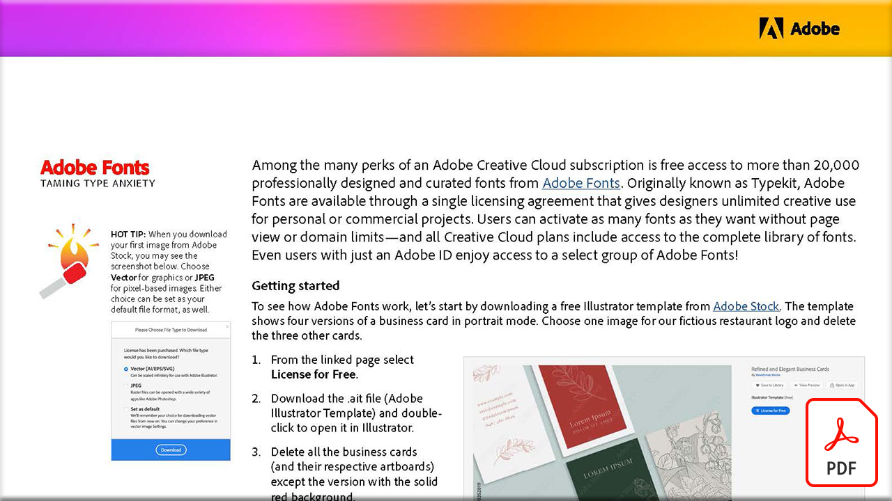

# Angst vor der Zähmung

Zu den zahlreichen Vorteilen eines Adobe Creative Cloud-Abonnements gehört der kostenlose Zugriff auf mehr als 20.000 professionell gestaltete und kuratierte Schriftarten aus Adobe Fonts. Adobe Fonts wurde ursprünglich als Typekit bezeichnet und ist als Einzellizenzvertrag erhältlich, der Designern eine unbegrenzte kreative Nutzung für private oder kommerzielle Projekte ermöglicht.

Wählen Sie die Abbildung unten, um dieses PDF-Tutorial anzuzeigen oder herunterzuladen.

[{width="680"}](assets/Adobe-Fonts-Taming-Font-Anxiety.pdf){target="blank"}
