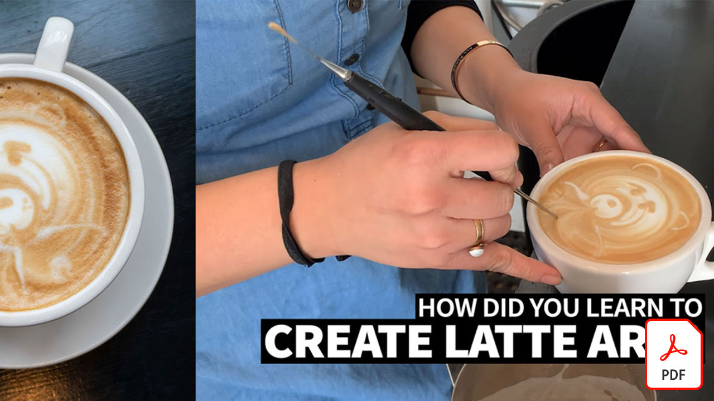

# Video-Kurzanleitungen

Lasse deine Ideen Wirklichkeit werden - mit den Programmen, Mobile Apps und Services von Adobe für Videobearbeitung, Motion Graphics, Visual Effects und Animation. Wählen Sie ein Bild aus, um eine PDF der Kurzanleitung herunterzuladen oder anzuzeigen.

## Adobe Audition

<table>
<tr>
   <td>
      
      

      <a href="assets/QuicklyRemoveUnwantedAudioContentwiththeSpotHealingBrushinAdobeAudition.pdf" target="_blank"><strong>Unerwünschte Audioinhalte mit dem Bereichsreparatur-Pinsel in Adobe Audition entfernen (PDF)</strong></a>
      

      <em>Mit dem Bereichsreparatur-Pinsel von Adobe Photoshop entfernst du störende Geräusche aus deinen Audiodateien in Adobe Audition.</em>
       
  </td>
  <td>
    
    

     
  </td>
  <td>
    
    

     
  </td>
  <td>
    
    

     
  </td>
</tr>
</table>

## Adobe Expreß (früher Adobe Spark)

<table>
<tr>
<td>
   
    

   <a href="assets/ShowcaseyourSparkVideoinyourSparkPage.pdf" target="_blank"><strong>Spark Video in Ihrer Spark Page präsentieren (PDF)</strong></a>
    

    <em>Mit Adobe Spark Page kannst du Videos aus verschiedenen Quellen laden, einschließlich Videos, die du mit Spark Video erstellst.</em>
     
  </td>
  <td>
    
    

     
  </td>
  <td>
    
    

     
  </td>
  <td>
    
    

     
  </td>
</tr>
</table>

## After Effects

<table>
<tr>
 <td>
   
    

   <a href="assets/AfterEffectsforPhotography.pdf" target="_blank"><strong>After Effects für Fotografie (PDF)</strong></a>
    

    <em>Lerne, wie du mit den Effekten von After Effects deine Fotos aufpeppen kannst</em>
     
  </td>
  <td>
   
    

   <a href="assets/CinemagraphsTheMesmerizingPlaceBetweenaPhotoandaVideo.pdf" target="_blank"><strong>Cinemagramme: Der faszinierende Ort zwischen einem Foto und einem Video (PDF)</strong></a>
    

    <em>Erfahre mehr über Cinemagramme - diese auffälligen Hybriden, die irgendwo zwischen einem Foto und einem Video existieren</em>
     
  </td>
  <td>
   
    

   <a href="assets/CreateanIllustrationfromanAdobeStockPhotowithAfterEffects.pdf" target="_blank"><strong>Eine Illustration aus einer Adobe erstellen. [!DNL Stock] Foto mit After Effects (PDF)</strong></a>
    

    <em>Kombiniere die Effekte "Farbton/Sättigung" und "Tonwertkorrektur" in After Effects, um eine stilisierte Illustration aus einer Adobe zu erstellen [!DNL Stock] Foto</em>
     
  </td>
   <td>
   
    

   <a href="assets/CreateBeautifulKaleidoscopePatternswithAfterEffects.pdf" target="_blank"><strong>Erstellen wunderschöner Kaleidoskop-Muster mit After Effects (PDF)</strong></a>
    

    <em>Erstellen Sie mit dem CC Kaleida-Effekt in Adobe After Effects aus jedem Bild eine unendliche Anzahl von Mustern und Texturen</em>
     
  </td>
</tr>
<tr>
<td>
   
    

   <a href="assets/CreateIntricateTransparencyinyourPhotographswithKeyinginAfterEffects.pdf" target="_blank"><strong>Erstellen komplizierter Transparenz in Ihren Fotos mit Keying in After Effects (PDF)</strong></a>
    

    <em>Keying wird oft für Videos eingesetzt und kann auch eine große Hilfe sein, wenn Fotos für Design-Projekte benötigt werden</em>
     
  </td>
 <td>
   
    

   <a href="assets/CreateAnimatedTitlesUsingMotionGraphicsTemplatesinAdobePremiereRush.pdf" target="_blank"><strong>Erstellen animierter Titel mithilfe von Animationsvorlagen in Adobe Premiere [!DNL Rush] (PDF)</strong></a>
    

    <em>Füge professionell gestaltete Animationsvorlagen hinzu, die zu deiner Geschichte passen oder zu deiner persönlichen Marke passen, damit deine Videos noch besser aussehen</em>
     
  </td>
  <td>
      
      

      <a href="assets/DazzlingLightEffectsforPhotographywithAfterEffects.pdf" target="_blank"><strong>Umwerfende Lichteffekte für die Fotografie mit After Effects (PDF)</strong></a>
      

      <em>Lichteffekte in Adobe After Effects können den Look eines Fotos enorm verändern.</em>
       
  </td>
  <td>
      
      

      <a href="assets/EditingVRPhotography360photoswithAfterEffects.pdf" target="_blank"><strong>Bearbeiten von VR-Fotografie (360-Grad-Fotos) mit After Effects (PDF)</strong></a>
      

      <em>Interaktivere Spiele und Erlebnisse sind zwar nicht so geläufig, aber 360-Grad-Fotografie gibt es bereits</em>
       
  </td>
</tr>
</table>

## Premiere Rush

<table>
<tr>
   <td>
      
      

      <a href="assets/SmoothlyCombineMusicandDialogueorNarrationwithAutoduckinginAdobePremiereRush.pdf" target="_blank"><strong>Musik, Dialog und Begleitkommentare per Ducking kombinieren [!DNL Adobe Premiere Rush] (PDF)</strong></a>
      

      <em>Adobe Premiere [!DNL Rush] bietet erweiterte Videobearbeitungsfunktionen in einer intuitiven Anwendung, sodass jeder in wenigen Minuten ein Video in Profiqualität erstellen kann</em>
       
  </td>
  <td>
    
    

     
  </td>
  <td>
    
    

     
  </td>
  <td>
    
    

     
  </td>
</tr>
</table>
