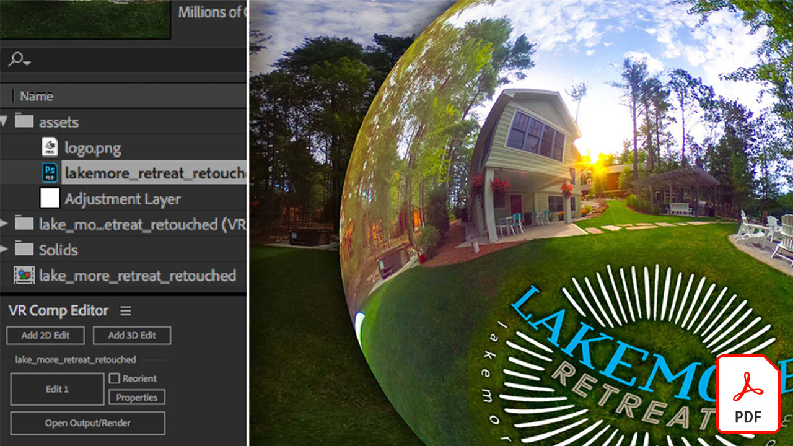

# Video-Kurzanleitungen

Lasse deine Ideen Wirklichkeit werden - mit den Desktop-Programmen, Mobile Apps und Services von Adobe für Videobearbeitung, Motion Graphics, Visual Effects und Animation. Wählen Sie ein Bild aus, um eine PDF der Kurzanleitung herunterzuladen oder anzuzeigen.

## Adobe Audition

<table>
<tr>
   <td>
      
      

      <a href="assets/QuicklyRemoveUnwantedAudioContentwiththeSpotHealingBrushinAdobeAudition.pdf" target="_blank"><strong>Unerwünschte Audioinhalte mit dem Bereichsreparatur-Pinsel in Adobe Audition (PDF) schnell entfernen</strong></a>
      

      <em>Wussten Sie, dass Sie mit dem Adobe Photoshop-Bereichsreparatur-Pinsel störende Geräusche aus Ihren Audiodateien in Adobe Audition entfernen können?</em>
      2 
  </td>
  <td>
    
    

     
  </td>
  <td>
    
    

     
  </td>
  <td>
    
    

     
  </td>
</tr>
</table>

## Adobe Expreß (früher Adobe Spark)

<table>
<tr>
<td>
   
    

   <a href="assets/ShowcaseyourSparkVideoinyourSparkPage.pdf" target="_blank"><strong>Spark Video in Ihrer Spark Page darstellen (PDF)</strong></a>
    

    Mit <em>Adobe Spark Page können Sie Videos aus verschiedenen Quellen laden, einschließlich Videos, die Sie mit Spark Video erstellen!</em>
    2 
  </td>
  <td>
    
    

     
  </td>
  <td>
    
    

     
  </td>
  <td>
    
    

     
  </td>
</tr>
</table>

## After Effects

<table>
<tr>
 <td>
   
    

   <a href="assets/AfterEffectsforPhotography.pdf" target="_blank"><strong>After Effects für Fotografie (PDF)</strong></a>
    

    <em>Erfahren Sie, wie Sie Ihre Fotos mit den Effekten von After Effects optimieren</em>
    2 
  </td>
  <td>
   
    

   <a href="assets/CinemagraphsTheMesmerizingPlaceBetweenaPhotoandaVideo.pdf" target="_blank"><strong>Cinemagramme: Der faszinierende Platz zwischen einem Foto und einem Video (PDF)</strong></a>
    

    <em>Erfahren Sie mehr über Cinemagramme - diese auffälligen Hybriden, die irgendwo zwischen einem Foto und einem Video vorhanden sind</em>
    2 
  </td>
  <td>
   
    

   <a href="assets/CreateanIllustrationfromanAdobeStockPhotowithAfterEffects.pdf" target="_blank"><strong>Illustration aus einem Adobe [!DNL Stock]-Foto mit After Effects (PDF) erstellen</strong></a>
    

    <em>Kombinieren Sie Farbton/Sättigung und Tonwertkorrektur mit den Cartoon-Effekten in After Effects, um eine einzigartige stilisierte Illustration aus einem Adobe [!DNL Stock]-Foto zu erstellen</em>
    3 
  </td>
   <td>
   
    

   <a href="assets/CreateBeautifulKaleidoscopePatternswithAfterEffects.pdf" target="_blank"><strong>Erstelle wunderschöne Kaleidoskop-Muster mit After Effects (PDF)</strong></a>
    

    <em>Erstellen Sie mit dem CC Kaleida-Effekt in Adobe After Effects eine unendliche Anzahl von Mustern und Texturen aus einem beliebigen Bild.</em>
    2 
  </td>
</tr>
<tr>
<td>
   
    

   <a href="assets/CreateIntricateTransparencyinyourPhotographswithKeyinginAfterEffects.pdf" target="_blank"><strong>Erstellen von komplexer Transparenz in Ihren Fotos mit Keying in After Effects (PDF)</strong></a>
    

    <em>Keying wird häufig für Videos verwendet. Es kann auch eine große Hilfe sein, wenn Ihre Fotos für Design-Projekte benötigt werden</em>
    2 
  </td>
 <td>
   
    

   <a href="assets/CreateAnimatedTitlesUsingMotionGraphicsTemplatesinAdobePremiereRush.pdf" target="_blank"><strong>Animierte Titel mit Animationsvorlagen in Adobe Premiere erstellen [!DNL Rush] (PDF)</strong></a>
    

    <em>Lassen Sie Ihre Videos noch spektakulärer aussehen, indem Sie professionell gestaltete Animationsvorlagen hinzufügen, die zu Ihrer Geschichte passen oder zu Ihrem persönlichen Branding passen</em>
    2 
  </td>
  <td>
      
      

      <a href="assets/DazzlingLightEffectsforPhotographywithAfterEffects.pdf" target="_blank"><strong>Verblüffende Lichteffekte für die Fotografie mit After Effects (PDF)</strong></a>
      

      <em>Lichteffekte in Adobe After Effects können das Aussehen Ihres Fotos erheblich verändern</em>
      2 
  </td>
  <td>
      
      

      <a href="assets/EditingVRPhotography360photoswithAfterEffects.pdf" target="_blank"><strong>Bearbeiten von VR-Fotografie (360-Grad-Fotos) mit After Effects (PDF)</strong></a>
      

      <em>Während interaktivere Spiele und Erlebnisse nicht ganz so alltäglich sind, gibt es 360-Grad-Fotografie bereits</em>
      2 
  </td>
</tr>
</table>

## Premiere Rush

<table>
<tr>
   <td>
      
      

      <a href="assets/SmoothlyCombineMusicandDialogueorNarrationwithAutoduckinginAdobePremiereRush.pdf" target="_blank"><strong>Musik und Dialog oder Sprechertext reibungslos kombinieren mit automatischem Ducking in [!DNL Adobe Premiere Rush] (PDF)</strong></a>
      

      <em>Adobe Premiere [!DNL Rush] bietet erweiterte Videobearbeitungsfunktionen in einer benutzerfreundlichen App, sodass jeder in wenigen Minuten ein Video in professioneller Qualität erstellen kann</em>
      3 
  </td>
  <td>
    
    

     
  </td>
  <td>
    
    

     
  </td>
  <td>
    
    

     
  </td>
</tr>
</table>
