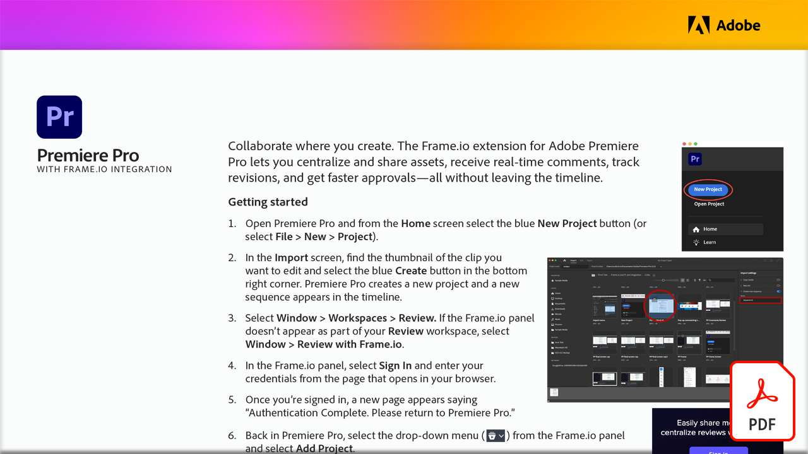

# Adobe-Videotutorials

Lasse deine Ideen Wirklichkeit werden - mit den Desktop-Programmen, Mobile Apps und Services von Adobe für Videobearbeitung, Motion Graphics, Visual Effects und Animation. Wählen Sie ein Bild aus, um ein Tutorial anzuzeigen.

<table>
<tr>
 <td>
   
    

   <a href="motion-graphics-templates.md"><strong>Professionelle Animationsvorlagen</strong></a>
    

    <em>Motion Graphics-Vorlagen (.mogrt) sind eine kooperative und effiziente Methode zum Erstellen anpassbarer Animationspakete - Titel, Logoanimationen, Bauchbinden - und zum Teilen mit Redaktionsteams</em>
     
  </td>
  <td>
   
    

   <a href="video-review-frame-io.md"><strong>Videoüberprüfung mit Frame.io</strong></a>
    

    <em>Erfahren Sie, wie Sie mit der Frame.io-Erweiterung für Adobe Premiere Pro Assets zentralisieren und freigeben, Kommentare in Echtzeit erhalten, Überarbeitungen verfolgen und schnellere Genehmigungen erhalten können - alles, ohne die Zeitleiste zu verlassen</em>
     
  </td>
  <td>
    
    

     
  </td>
  <td>
    
    

     
  </td>
</tr>
</table>
