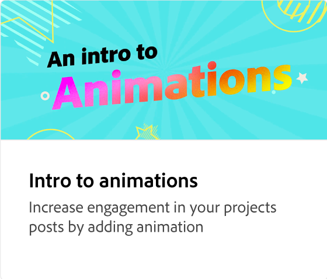

# Hinzufügen von Abschnitten zu Ihrer Animation

Verfeinere deine Animation, indem du Elemente wie Bilder und Überschriften zu einer Animation hinzufügst. Hier erfahren Sie, wie Sie Elemente in einer Szene hinzufügen, duplizieren, neu anordnen oder ersetzen, ohne die Animationen zu verändern.

>[!VIDEO](https://video.tv.adobe.com/v/3433929?quality=12&learn=on&hidetitle=true&captions=ger)

## Weitere Videos dieser Serie

<table style="table-layout:fixed">
<tr>
   <td>
         
   </td>
  <td>
         
   </td>
   <td>
         
   </td>
   <td>
         
   </td>
</tr>
<tr>
    <td>
         
   </td>
   <td>
         
   </td>
   <td>
         
   </td>
   <td>
         
   </td>
</tr>
</table>
