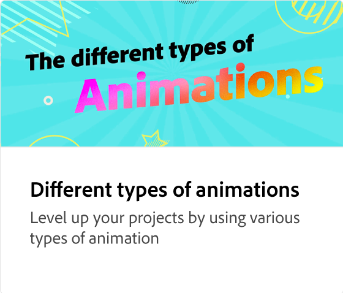
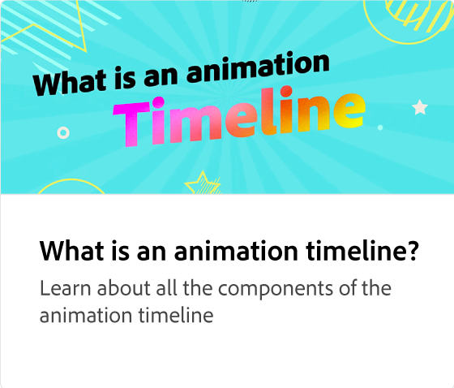

# Hinzufügen von Audio zu Animationen

Erfahren Sie, wie Sie mit Adobe Express ansprechende und einprägsame Projekte mit Audio erstellen, einschließlich lizenzfreier Adobe Stock-Audiodateien.

>[!VIDEO](https://video.tv.adobe.com/v/3426983?quality=12&learn=on&hidetitle=true)

## Weitere Videos dieser Serie

<table style="table-layout:fixed">
<tr>
   <td>
         
   </td>
  <td>
         
   </td>
   <td>
         
   </td>
   <td>
         
   </td>
</tr>
<tr>
    <td>
         
   </td>
   <td>
         
   </td>
   <td>
         
   </td>
   <td>
         
   </td>
</tr>
</table>
