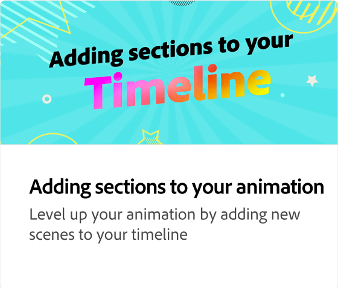

# Verschiedene Animationstypen

Erfahren Sie mehr über die drei verschiedenen Arten von Animationen (Intro, Looping und Outro), die Sie Ihren Projekten hinzufügen können, um sie ansprechender zu gestalten. Jede Animation hat einen anderen Stil, den Sie in der Vorschau anzeigen und auswählen können.

>[!VIDEO](https://video.tv.adobe.com/v/3426976?quality=12&learn=on&hidetitle=true)

## Weitere Videos dieser Serie

<table style="table-layout:fixed">
<tr>
   <td>
         
   </td>
   <td>
         
   </td>
   <td>
         
   </td>
   <td>
         
   </td>
</tr>
<tr>
   <td>
         
   </td>
   <td>
         
   </td>
   <td>
         
   </td>
   <td>
         
   </td>
</tr>
</table>
