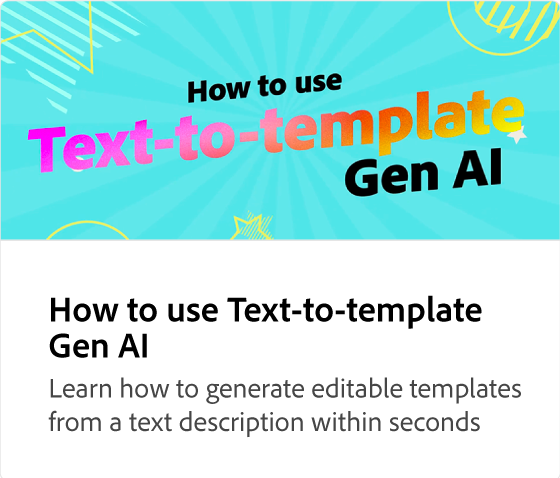

# Verwenden des Objektradiergummis

Erfahren Sie, wie Sie bestimmte Bereiche Ihrer Bilder löschen können. Alternativ können Sie das Werkzeug &quot;Wiederherstellen&quot; verwenden, um Teile Ihres Bildes wiederherzustellen.

>[!VIDEO](https://video.tv.adobe.com/v/3427019?quality=12&learn=on&hidetitle=true)

## Weitere Videos dieser Serie

<table style="table-layout:fixed">
<tr>
   <td>
         
   </td>
   <td>
         
   </td>
   <td>
         
   </td>  
   <td>
      
   </td>
</tr>
<tr>
   <td>
      
   </td>
   <td>
      
   </td>
   <td>
      
   </td>
   <td>
      
   </td>
</tr>
</table>
