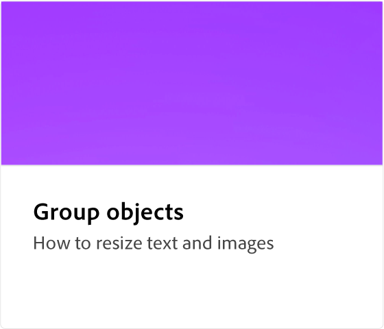

# Adobe [!DNL Express] How-tos

Als Ausgangspunkt kannst du mit KI-Technologie auf Basis von Adobe Firefly kreative Arbeiten erstellen, die auffallen. Flyer, TikToks, Lebensläufe und Reels mit Adobe Expreß.

<table style="table-layout:fixed">
<tr>
 <td>
      
 </td>
 <td>
      
 </td>
 <td>
      
 </td>     
 <td>
      
  </td>
</tr>
<tr>
   <td>
      
  </td>
   <td>
      
  </td>
  <td>
      
  </td>
  <td>
      
  </td>
</tr>
<tr>
   <td>
      
  </td>
  <td>
      
  </td>
  <td>
   
  </td>
  <td>
      
  </td>
</tr>
<tr>
   <td>
   
  </td>
 <td>
         
 </td>
  <td>
         
   </td>
  <td>
         
   </td>
</tr>
<tr>
   <td>
      
  </td>
  <td>
      
   </td>
  <td>
      
  </td>
   <td>
      
  </td>
</tr>
<tr>
   <td>
         
   </td>
  <td>
         
   </td>
  <td>
      
      

       
   </td>
   <td>
      
      

       
   </td>
</tr>
</table>
