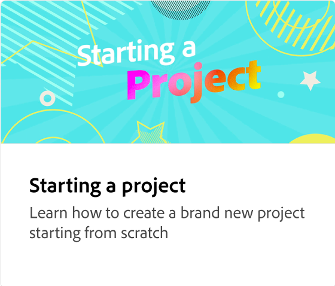
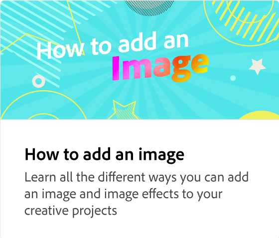

# Text hinzufügen

Lernen Sie verschiedene Methoden kennen, wie Sie Text zu kreativen Projekten hinzufügen können. Bearbeiten, Verschieben und Löschen von Textebenen, Ändern von Schriften, Anpassen von Textgröße und -layout, Ausrichten von Text, Ändern von Flächenfarbe und Kontur, Hinzufügen von Schlagschatten sowie Verwenden von Formen und Ausschneiden von Text. Empfohlene Schriften werden als Anregung bereitgestellt.

>[!VIDEO](https://video.tv.adobe.com/v/3420222?quality=12&learn=on&hidetitle=true)

## Weitere Videos dieser Serie

<table style="table-layout:fixed">
<tr>
 <td>
      
  </td>
   <td>
      
  </td>
   <td>
      
  </td>
  <td>
      
  </td>
</tr>
<tr>
   <td>
      
  </td>
   <td>
      
  </td>
   <td>
         
   </td>
    <td>
         
   </td>
</tr>
<tr>
   <td>
   
   </td>
   <td>
   
   </td>
   <td>
   
   </td>
   <td>
      
      

       
   </td>
</tr>
</table>