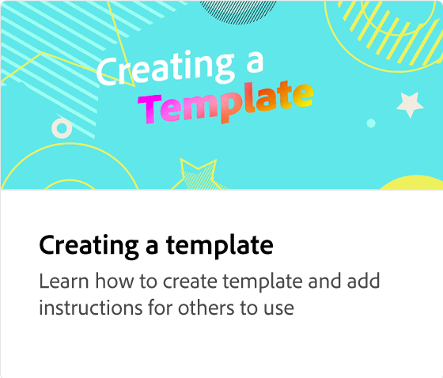

# Einfache Markenkonsistenz mit Vorlagen.

Erfahrt, wie ihr markengerechte Inhalte schnell und effizient für das gesamte Unternehmen erstellen könnt. In diesem Tutorial erfahren Sie, wie Sie markengerechte Inhalte erstellen, die sofort weitergegeben und lokalisiert werden können.

>[!VIDEO](https://video.tv.adobe.com/v/3427099?quality=12&learn=on&hidetitle=true)

## Weitere Videos dieser Serie

<table style="table-layout:fixed">
<tr>
    <td>
        
        

            <a href="lock-layers.md"><strong>Wie und warum Ebenen gesperrt werden</strong></a>
            

            <em>Erfahren Sie, warum es wichtig ist, verschiedene Elemente Ihrer Vorlage zu sperren</em>
             
    </td>
    <td>
         
         

         <a href="create-templates.md"><strong>Maximale Effizienz: Wiederverwendbare Vorlagen erstellen</strong></a>
         

         <em>Erfahren Sie, wie Sie mithilfe von Vorlagen Markenkonsistenz, Effizienz und Kosteneinsparungen in Ihrem Unternehmen erzielen</em>
          
   </td>
   <td>
         
         

         <a href="share-templates.md"><strong>Vorlagen speichern und freigeben</strong></a>
         

         <em>Erfahren Sie, wie Sie Vorlagen speichern und in einer Branding-Kit oder Bibliothek für Ihr Team freigeben</em>
          
   </td>
    <td>
      
      

       
    </td>
</tr>
</table>
