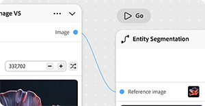
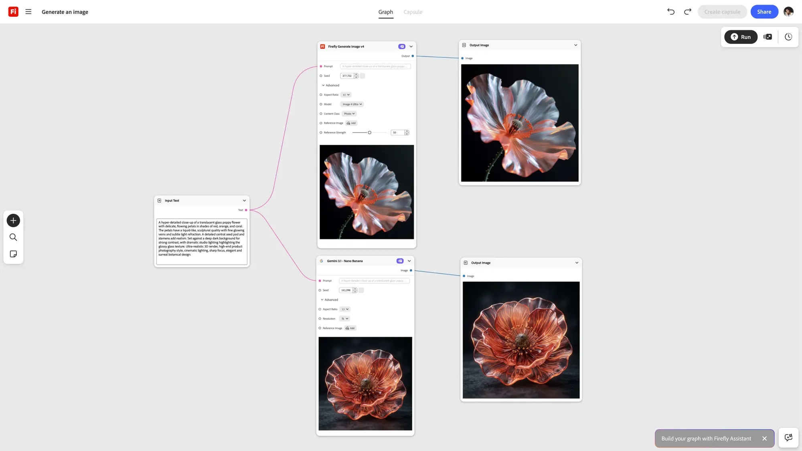

# &#x200B;2. Firefly Graph-Schlüsselkonzepte

Erfahren Sie mehr über die Schlüsselkonzepte, die Ihnen den Einstieg in Firefly Graph erleichtern.

## Knoten

Ein Knoten führt einen Schritt im Workflow aus - einen Knoten, einen Job. Ein Knoten kann ein Bild generieren, eine Maske anwenden, eine Farbe ändern oder eine andere kreative Aktion ausführen.

{align="center"}

## Anschluss

Die Verbindungspunkte auf einem Knoten. Die Ausgangsanschlüsse geben die Daten an einen Knoten weiter. Eingangsports empfangen Daten, die eintreffen. Das Verbinden von Ports ist die Art und Weise, wie Daten durch Ihren Arbeitsablauf fließen.

{align="center"}

## Widget

Die interaktiven Steuerelemente auf einem Knoten, wie Textfelder, Dropdown-Listen und Schieberegler, mit denen Sie die Einstellungen direkt im Editor konfigurieren können.

{align="center"}

## Verbindung

Eine Verbindung führt einen Ein- oder Ausgang zwischen zwei Knoten. Ein Diagramm liest sich von links nach rechts, von Ihrer Quelleingabe bis zur Endausgabe.

{align="center"}

## Diagramm

Der vollständige Workflow, den Sie im Editor erstellen. Ein Diagramm besteht aus Knoten und Verbindungen, die auf der Arbeitsfläche angeordnet sind, um eine endgültige Ausgabe zu erzeugen.

{align="center"}

## Nächster Schritt

Möchtest du was aufbauen? Wechseln Sie zu [3. Erstellen Sie Ihr erstes Diagramm &#x200B;](https://experienceleague.adobe.com/de/docs/creative-cloud-enterprise-learn/cce-learning-hub/fireflyoverview/firefly-graph/create-your-first-graph) für eine Schritt-für-Schritt-Anleitung.

Zurück zu [Erste Schritte mit Firefly Graph](https://experienceleague.adobe.com/de/docs/creative-cloud-enterprise-learn/cce-learning-hub/fireflyoverview/firefly-graph/overview-firefly-graph).
