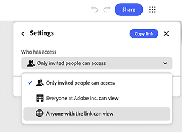

# &#x200B;5. Ein Diagramm freigeben.

Erfahre, wie du ein Diagramm für andere freigeben kannst. Beim Freigeben eines Diagramms wird der Live-Arbeitsablauf freigegeben, nicht nur die Ausgabe. Jeder mit Bearbeitungszugriff kann sie erneut ausführen, ändern und an eine andere Person übergeben. Verwenden Sie den Zugriff auf Linkebene für eine breite Sichtbarkeit innerhalb des Unternehmens und nennen Sie Einladungen mit einer bestimmten Rolle für jeden, der direkten Zugriff benötigt.

1. Wählen Sie **Freigeben** in der oberen rechten Ecke des Diagramms aus.

   {align="center"}

   Das Dialogfeld wird mit einem Feld zum Hinzufügen von Namen oder E-Mails und einer Übersicht darüber geöffnet, wer derzeit Zugriff hat. Standardmäßig können nur eingeladene Personen auf das Diagramm zugreifen.

1. Wählen Sie das Zahnradsymbol aus, um **Einstellungen** zu öffnen.

   {align="center"}

   Es stehen drei Zugriffsebenen zur Verfügung: nur eingeladene Personen, alle Mitarbeiter der Organisation oder jede Person mit dem Link.

1. Wählen Sie **Jeder in [Organisation] kann** anzeigen, damit jeder im Unternehmen das Diagramm mit dem Link öffnen kann.

   {align="center"}

1. Aktivieren Sie die Option Über Suche auffindbar , damit Mitglieder das Diagramm finden können, ohne den Link überhaupt zu benötigen.

   {align="center"}

   Ein Bestätigungsbanner zeigt genau an, wer das Diagramm über den Link anzeigen kann. Überprüfen Sie dies, bevor Sie den Link an eine beliebige Stelle senden. Es gilt für jeden zukünftigen Empfänger dieses Links, nicht nur für die nächste eingeladene Person.

1. Geben Sie eine E-Mail-Adresse direkt in das Einladungsfeld ein, um einer Person separat von der Einstellung für allgemeine Links einen personengebundenen Zugriff zu gewähren. Wählen Sie den zugehörigen Eintrag aus dem Vorschlag aus, der unter dem Feld angezeigt wird.

   {align="center"}

1. Wählen Sie die Dropdown-Liste &quot;Rolle&quot; neben ihrem Namen aus, um &quot;Editor&quot; oder &quot;Anzeige&quot; auszuwählen.

   {align="center"}

   Der Bearbeiter kann das Diagramm bearbeiten, herunterladen und freigeben. Der Viewer kann es nur anzeigen. Wählen Sie die schmalere Rolle, es sei denn, die Person muss das Diagramm selbst ändern.

1. Fügen Sie im Feld **Nachricht** eine optionale Notiz hinzu, damit der Empfänger weiß, warum er Zugriff erhält. Wählen Sie **Als Editor einladen** oder **Als Viewer einladen**, wenn diese Rolle ausgewählt wurde, um sie zu senden.

   {align="center"}

## Nächster Schritt

Sie möchten mit einer Vorlage beginnen? Wechseln Sie zu [5. Passen Sie eine Vorlage ](https://experienceleague.adobe.com/en/docs/creative-cloud-enterprise-learn/cce-learning-hub/fireflyoverview/firefly-graph/customize-template) an, damit sie Ihren eigenen Auftrag widerspiegelt.

Zurück zu [Erste Schritte mit Firefly Graph](https://experienceleague.adobe.com/en/docs/creative-cloud-enterprise-learn/cce-learning-hub/fireflyoverview/firefly-graph/overview-firefly-graph).