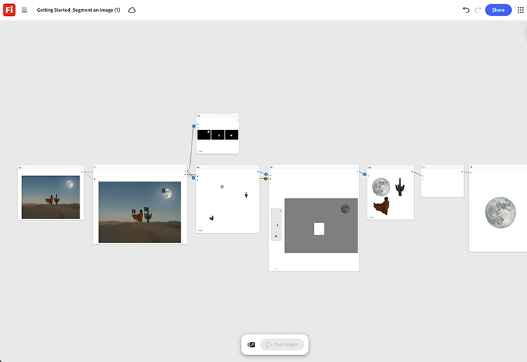

# Erste Schritte - Segmentieren eines Bildes

Erfahren Sie, wie Sie ein beliebiges Quellbild laden und den Segmentierungsknoten ausführen, um das Motiv vom Hintergrund zu isolieren. [Erste Schritte öffnen - Segmentieren einer Bildvorlage](https://firefly.adobe.com/graph/edit/id/urn:aaid:sc:VA6C2:c090820d-b733-44c7-910d-5e216c19c5cc).

[!BADGE Branchenbeispiele]{type=Informative tooltip="Beispiele aus der Branche"}

* **Gesundheit** - Segmentieren Sie ein medizinisches Gerät aus einer geschäftigen Studioaufnahme, um es auf einen sauberen klinischen Hintergrund für eine Produktseite zu legen, ohne dass ein erneuter Hintergrund erstellt wird.
* **Einzelhandel** - Isolieren Sie ein Kleidungsstück aus einem Lifestyle-Foto, um ein sauberes, reines Produktkatalogbild zu erstellen.
* **Automotive** - Schneiden Sie ein Fahrzeug aus einem Drehort-Shooting, um es vor einer Studiokulisse für den Druck zu platzieren.

>[!TIP]
>
>**Bevor Sie beginnen** - Um optimale Ergebnisse zu erzielen, passen Sie diese Vorlage an Ihr eigenes Branding, Produkt und Ihren eigenen Workflow an. Tauschen Sie Ihre Referenzbilder, Eingabeaufforderungen und Texte ein, bevor Sie eine Ausgabe verwenden.

{align="center"}

Zurück zu [Erste Schritte mit Firefly Graph](https://experienceleague.adobe.com/de/docs/creative-cloud-enterprise-learn/cce-learning-hub/fireflyoverview/firefly-graph/overview-firefly-graph).
