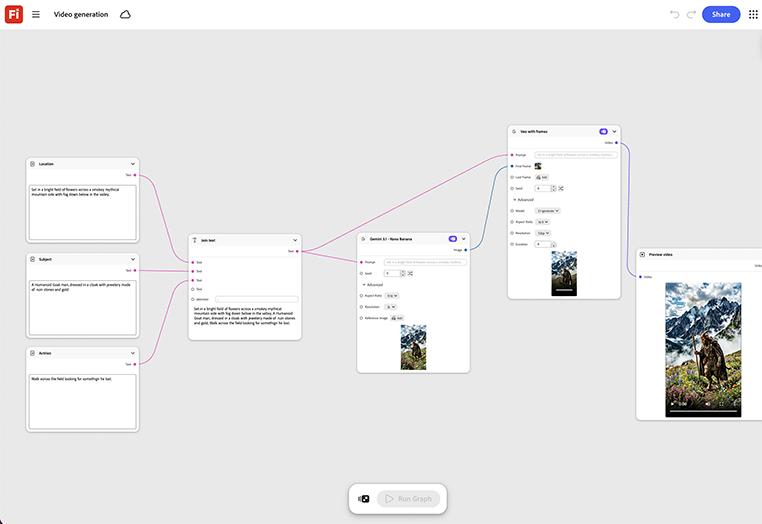

# Erste Schritte - Videogenerierung

Erfahre, wie du ein genehmigtes Standbild mit Key Art und einer kurzen Bewegungsaufforderung einfügst. Die Vorlage generiert einen Videoschnitt, der nicht aus einem neuen Dreh, sondern aus derselben Schlüsselgrafik erstellt wurde. [Erste Schritte öffnen - Videogenerierung](https://firefly.adobe.com/graph/edit/id/urn:aaid:sc:US:4729e537-95d5-56a6-b7c4-a1d4dadb76c9).

[!BADGE Branchenbeispiele]{type=Informative tooltip="Beispiele aus der Branche"}

* **Finanzen** - Verwandeln Sie die Schlüsselgrafik einer genehmigten Druckkampagne in ein kurzes Video für kostenpflichtige Social-Media-Videos, ohne ein separates Videoshooting zu planen.
* **Getränke** - Animieren Sie ein Hero-Produkt, das in einen kurzen Teaser für den Einführungstag geschossen wurde.
* **Einzelhandel** - Erweitern Sie ein einzelnes Kampagnenfoto in einen kurzen Videoschnitt für Social Media.

>[!TIP]
>
>**Bevor Sie beginnen** - Um optimale Ergebnisse zu erzielen, passen Sie diese Vorlage an Ihr eigenes Branding, Produkt und Ihren eigenen Workflow an. Tauschen Sie Ihre Referenzbilder, Eingabeaufforderungen und Texte ein, bevor Sie eine Ausgabe verwenden.

{align="center"}

Zurück zu [Erste Schritte mit Firefly Graph](https://experienceleague.adobe.com/en/docs/creative-cloud-enterprise-learn/cce-learning-hub/fireflyoverview/firefly-graph/overview-firefly-graph).
