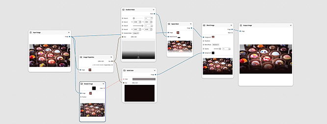

# &#x200B;1. Was ist [!DNL Firefly Graph]?

Die meisten generativen KI-Tools liefern dir nur eine Ausgabe von einer Eingabeaufforderung. Wenn sich der kurze Abschnitt ändert, baust du das ganze Ding von Hand neu, und es gibt nichts zu übergeben außer der endgültigen Datei.

Firefly Graph funktioniert anders. Anstelle einer einzelnen Eingabeaufforderung erstellen Sie ein **Diagramm**: einen visuellen, schrittweisen Arbeitsablauf, bei dem jede Eingabe, Transformation und Ausgabe zusammen erfasst wird. Ändern Sie einen Schritt und führen Sie ihn erneut aus - Sie bauen nicht die gesamte Kette neu auf. Jeder Schritt ist ein sichtbarer Knoten, den dein Team inspizieren, anpassen und intakt übergeben kann.

Kurz gesagt, Graph ersetzt nicht Ihren kreativen Prozess - er verwandelt diesen Prozess in etwas, das Sie sehen, wiederverwenden und skalieren können.

## Ihre Schritte werden sichtbar gemacht

Denken Sie an einen Workflow, den Sie bereits heute ausführen: Beginnen Sie mit einer kurzen Einführung, sammeln Sie Ihre Eingaben, erstellen Sie Variationen, verfeinern Sie, exportieren Sie. Das Diagramm ändert diese Schritte nicht - es macht jeden sichtbar und wiederverwendbar:

| Dein Workflow heute noch | Was Diagramm sichtbar macht |
|---|---|
| Einführung. | Der Brief wird zu einer Diagrammeingabe |
| Erfassen von Eingaben | Eingänge werden direkt mit Knoten verbunden |
| Varianten erstellen. | Varianten laufen parallel |
| Verfeinern | Knoten verfeinern, ohne den Rest zu berühren |
| Exportieren | Direkt aus dem Diagramm exportieren |

Das ist die Verschiebung: die gleiche Arbeit, aber jede Entscheidung auf dem Weg ist jetzt etwas, das du sehen, optimieren und wiederverwenden kannst - anstelle eines schwarzen Kastens müsstest du das nächste Mal von Grund auf wiederholen.

## Nächster Schritt

Wenn Sie mit der Idee zufrieden sind, fahren Sie mit [2 fort. Wichtige Konzepte: Knoten, Verbindungen und Vorlagen](https://experienceleague.adobe.com/en/docs/creative-cloud-enterprise-learn/cce-learning-hub/fireflyoverview/firefly-graph/key-concepts), um das Vokabular zu erlernen, das Sie verwenden, um ein Diagramm zu erstellen.
