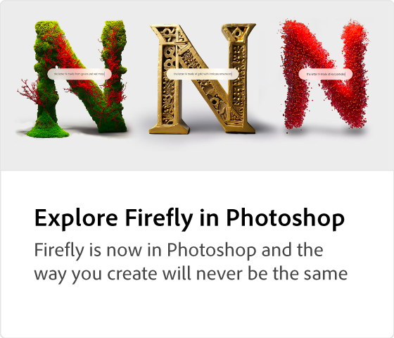

# Adobe [!DNL Firefly] overview

Firefly ist die neue Familie kreativer, generativer KI-Modelle für Adobe-Produkte, die sich zunächst auf die Erstellung von Bild- und Texteffekten konzentrieren. Firefly bietet neue Möglichkeiten zur Idealisierung, Erstellung und Kommunikation und verbessert gleichzeitig die Workflows im Kreativbereich erheblich.

## Möglichkeiten mit Adobe Firefly

  

>[!VIDEO](https://video.tv.adobe.com/v/3416970t1?quality=12&learn=on&hidetitle=true)

## Weitere Informationen zum Adobe Firefly

<table style="table-layout:fixed">
<tr>
   <td>
      
  </td>
  <td>
      
  </td>
  <td>
      
  </td>
  <td>
    
    

     
  </td>
</tr>
</table>

## Firefly-Tutorials

<table style="table-layout:fixed">
<tr>
   <td>
      
   </td>
   <td>
      
   </td>
   <td>
      
   </td>
  <td>
      
  </td>
</tr>
<tr>
<td>
      
  </td>
<td>
      
  </td>
  <td>
    
    

     
  </td>
  <td>
    
    

     
  </td>
</tr>
</table>
