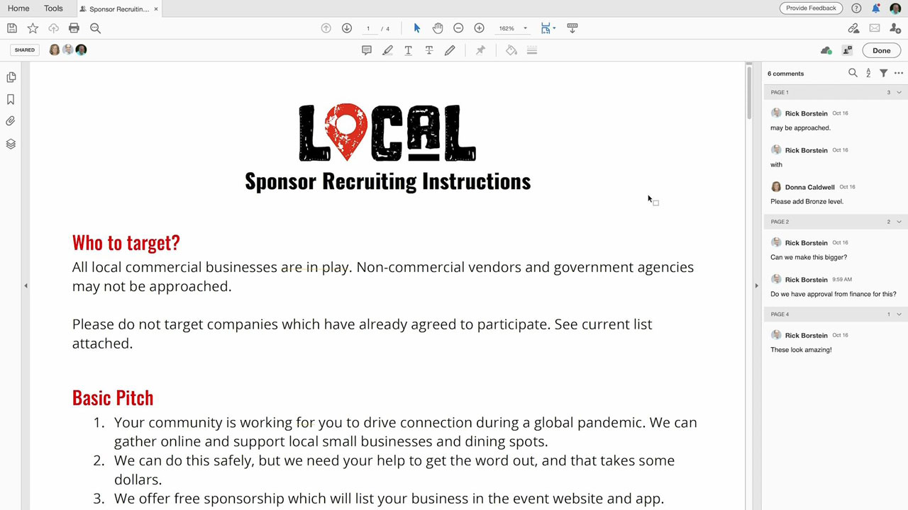
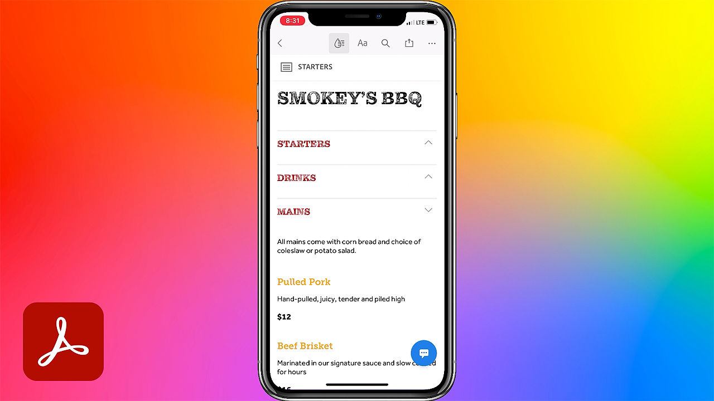

# Acrobat &amp; Sign.

Mit Adobe Document Cloud, den weltweit führenden Lösungen für PDF und elektronische Unterschriften, verwandelt ihr manuelle Dokumentenprozesse in effiziente digitale Workflows. Team-Mitglieder können Dokumente, Workflows und Aufgaben ohne Verzögerung bearbeiten - überall, jederzeit und direkt aus Microsoft- oder Enterprise-Programmen heraus.

## Tutorials für Produkte durchsuchen

<table style="table-layout:fixed">
<tr>
 <td>
   
    

   <a href="acrobat-sign.md#tutorial1"><strong>Initiieren einer freigegebenen Acrobat-Überprüfung</strong></a>
    

    <em>Überprüfer einladen, ihre Kommentare einem PDF-Dokument hinzuzufügen</em>
    2 
  </td>
  <td>
    
    

    <a href="acrobat-sign.md#tutorial2"><strong>Onlineverzicht auf Forms mit Adobe Sign erstellen</strong></a>
    

    <em>Dokumente schnell in Online-Formulare umwandeln und online bereitstellen, wo jeder, der sie braucht, sie ausfüllen und unterschreiben kann</em>
    2 
  </td>
  <td>
   
    

    <a href="acrobat-sign.md#tutorial3"><strong>Signatur mit Adobe Sign anfordern</strong></a>
    

    <em>Wechseln Sie von Word zu PDF und senden Sie das Dokument zur Signatur mit Adobe Sign</em>
    2 
  </td>
</tr>
<tr>
 <td>
   
    

   <a href="acrobat-sign.md#tutorial4"><strong>Menüs auf Mobilgeräten mit Liquid Mode anzeigen</strong></a>
    

    <em>Verwenden Sie den Liquid Mode, um das Leseerlebnis beim PDF auf Mobilgeräten zu verbessern</em>
    2 
  </td>
  <td>
    
    

    <a href="acrobat-sign.md#tutorial5"><strong>Dokumente von Ihrem Mobiltelefon aus nach PDF scannen</strong></a>
    

    <em>Mit Adobe Scan können Sie Dokumente, Formulare, Visitenkarten und Whiteboards einfach erfassen und in hochwertige Adobe-PDF umwandeln</em>
    2 
  </td>
  <td>
    
    

     
  </td>
</tr>
</table>

## Initiieren einer gemeinsamen Acrobat-Überprüfung (3:49) {#tutorial1}

>[!VIDEO](https://video.tv.adobe.com/v/326777?hidetitle=true)

**Beschreibung**
Lade Prüfer ein, ihr PDF-Dokument mit Kommentaren zu versehen.

In diesem Tutorial lernen Sie Folgendes:
* PDF-Kommentare auf dem Document Cloud hosten
* Kommentare an zentraler Stelle zusammenführen
* Gleichzeitiges Kommentieren fördert die Zusammenarbeit

**Adobe-PDF für Review- und Kommentaroptionen**

**Präsentiert von:**
Dan Armstrong, Lösungsberater (Digitale Medien)
Rick Borstein, Senior Manager Solution Consulting (Digital Media)

## Online-Verzicht auf Forms mit Adobe Sign erstellen (5:19) {#tutorial2}

>[!VIDEO](https://video.tv.adobe.com/v/326776?hidetitle=true)

**Beschreibung**
Wandelt Dokumente in Online-Formulare um, die jeder online ausfüllen und unterschreiben kann.

In diesem Tutorial lernen Sie Folgendes:
* Papierformulare digitalisieren.
* Digitale Formulare auf eurer Website bereitstellen, sodass Kunden von ihrem eigenen Gerät aus darauf zugreifen können
* Abgeschlossene Formulare werden automatisch für Ihre Unterlagen archiviert

**Präsentiert von:**
Taylor Kobey, Lösungsberater (Digitale Medien)
Emily Palmer, Lösungsberaterin (Digitale Medien)

## Unterschrift bei Adobe Sign anfordern (3:21) {#tutorial3}

>[!VIDEO](https://video.tv.adobe.com/v/326801?hidetitle=true)

**Beschreibung**
Von Word auf PDF umsteigen und Dokumente mit Adobe Sign zur Unterzeichnung versenden.

In diesem Tutorial lernen Sie Folgendes:
* Versendet Dokumente zur Unterzeichnung - mit den Tools, die ihr täglich nutzt

**Präsentiert von:**
Rick Borstein, Senior Manager Solution Consulting (Digital Media)

## Menüs auf Mobilgeräten mit Liquid Mode anzeigen (2:57) {#tutorial4}

>[!VIDEO](https://video.tv.adobe.com/v/327093?hidetitle=true)

**Beschreibung**
Verwenden Sie den Liquid Mode, um das Leseerlebnis beim PDF auf Mobilgeräten zu verbessern.

In diesem Tutorial lernen Sie Folgendes:
* Responsive PDF von Dateien auf Mobilgeräten
* PDF-Layout optimieren
* Zusätzliche Funktionen zum einfachen Lesen von Dokumenten auf dem Smartphone oder Tablet

**Präsentiert von:**
Emilie Enke, Associate Solutions Consultant (Digital Media)

## Dokumente von Ihrem Mobiltelefon aus nach PDF scannen (5:53) {#tutorial5}

>[!VIDEO](https://video.tv.adobe.com/v/327094?hidetitle=true)

**Beschreibung**
Mit Adobe Scan kannst du Dokumente, Formulare, Visitenkarten und Whiteboards einfach abfotografieren und in hochwertige Adobe-PDF umwandeln.

In diesem Tutorial lernen Sie Folgendes:
* Mit deinem Smartphone kannst du Dokumente, Formulare, Visitenkarten und Whiteboards aufnehmen und in hochwertige Adobe-PDF umwandeln.
* Handgeschriebenen oder gedruckten Text automatisch erkennen und schärfen und unerwünschte Blendeffekte und Schatten entfernen
* Öffne die gescannte PDF in Acrobat Reader, um sie mit Notizen und Kommentaren zu versehen und mit deinem Team abzustimmen

**Präsentiert von:**
Emilie Enke, Associate Solutions Consultant (Digital Media)

**Ressourcen für Acrobat und Adobe Sign**

[Training und Support](https://helpx.adobe.com/support/document-cloud.html) ist Ihr Hub für zusätzliche Tutorials, [Neuerungen](https://helpx.adobe.com/acrobat/using/whats-new.html) und Links zu Community-Foren.

**Version Oktober 2020**

Beginnen Sie mit der Nutzung dieser Funktionen (und mehr!), indem Sie das neueste Update von Ihrem Creative Cloud-Client herunterladen.
