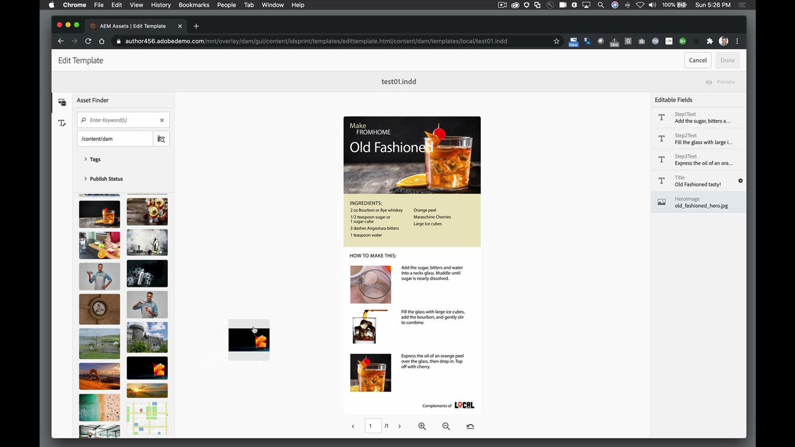

# AEM Assets und Asset Link

Adobe Experience Manager ist die branchenführende Lösung für Digital Experience Management für Unternehmen und mittelständische Unternehmen. Sie bietet eine moderne, skalierbare Grundlage für die Bereitstellung überzeugender Erlebnisse, die die Interaktion mit der Marke fördern, die Nachfrage steigern und die Kundentreue steigern. Experience Manager bietet ein umfassendes Toolset zur Erstellung, Verwaltung und Bereitstellung digitaler Erlebnisse auf allen Kanälen.

## Tutorials für Produkte durchsuchen

<table style="table-layout:fixed">
<tr>
 <td>
   
    

   <a href="aem.md#tutorial1"><strong>AEM und Asset Link</strong></a>
    

    <em>Mit Asset Link in AEM gespeicherte Assets in Echtzeit aktualisieren</em>
    2 
  </td>
   <td>
   
    

   <a href="aem.md#tutorial2"><strong>InDesign in AEM gehosteter Dateien</strong></a>
    

    <em>Ihr InDesign-Dokument in AEM hosten, sodass mehrere Benutzer Inhaltsvarianten erstellen können - gleichzeitig</em>
    2 
  </td>
  <td>
    
    

     
  </td>
</tr>
</table>

## AEM und Asset Link (5:45) {#tutorial1}

>[!VIDEO](https://video.tv.adobe.com/v/326828?hidetitle=true)

**Beschreibung**
Aktualisiert Assets in Echtzeit, die mit Asset Link in AEM gespeichert sind.

In diesem Tutorial lernen Sie Folgendes:
* Über ein eigenes Bedienfeld, in dem Sie Elemente in Ihren Design-Programmen suchen und durchsuchen können, finden Sie genau das, was Sie brauchen
* Einfaches Hochladen von Elementen aus Design-Programmen
* Checkt Assets aus dem DAM aus und checkt sie in euer Design-Programm ein, um in Echtzeit Aktualisierungen vorzunehmen

**Präsentiert von:**
Eric Rowse, Senior Solutions Consultant (Digital Media)

## In AEM gehostete InDesign-Dateien (3:16) {#tutorial2}

>[!VIDEO](https://video.tv.adobe.com/v/326829?hidetitle=true)

**Beschreibung**
Hosten Sie Ihr InDesign-Dokument in AEM, sodass mehrere Benutzer gleichzeitig Inhaltsvarianten erstellen können.

In diesem Tutorial lernen Sie Folgendes:
* Hochladen einer InDesign-Datei in AEM für allgemeinen Speicherzugriff
* Sicheres Erstellen von Varianten, ohne befürchten zu müssen, die Quelldatei zu ruinieren
* Dokumentfelder sind vorformatiert, sodass Sie Inhalte schnell bearbeiten oder ändern können

**Präsentiert von:**
Eric Rowse, Senior Solutions Consultant (Digital Media)

<table style="table-layout:fixed">
<tr>
 <td>
   
    

   <a href="https://www.adobe.com/marketing/experience-manager.html"><strong>Adobe Experience Manager</strong></a>
    

    <em>Eine leistungsstarke Kombination für Ihre Anforderungen an Content Management und Digital Asset Management</em>
    2 
  </td>
  <td>
   
    

   <a href="https://www.adobe.com/marketing/experience-manager-assets.html"><strong>AEM Assets</strong></a>
    

    <em>Digital Asset Management der nächsten Generation</em>
    2 
  </td>
  <td>
   
    

   <a href="https://www.adobe.com/marketing/experience-manager-assets/benefits.html"><strong>AEM Assets: Vorteile</strong></a>
    

    <em>Lassen Sie Ihre digitalen Assets für sich arbeiten</em>
    2 
  </td>
</tr>
</table>

**Asset Link &amp; AEM Ressourcen**

[Training und Support](https://helpx.adobe.com/support/experience-manager.html) ist Ihr Hub für zusätzliche Tutorials, Neuerungen und Links zu Community-Foren.

**Version Oktober 2020**

Beginnen Sie mit der Nutzung dieser Funktionen (und mehr!), indem Sie das neueste Update von Ihrem Creative Cloud-Client herunterladen.
