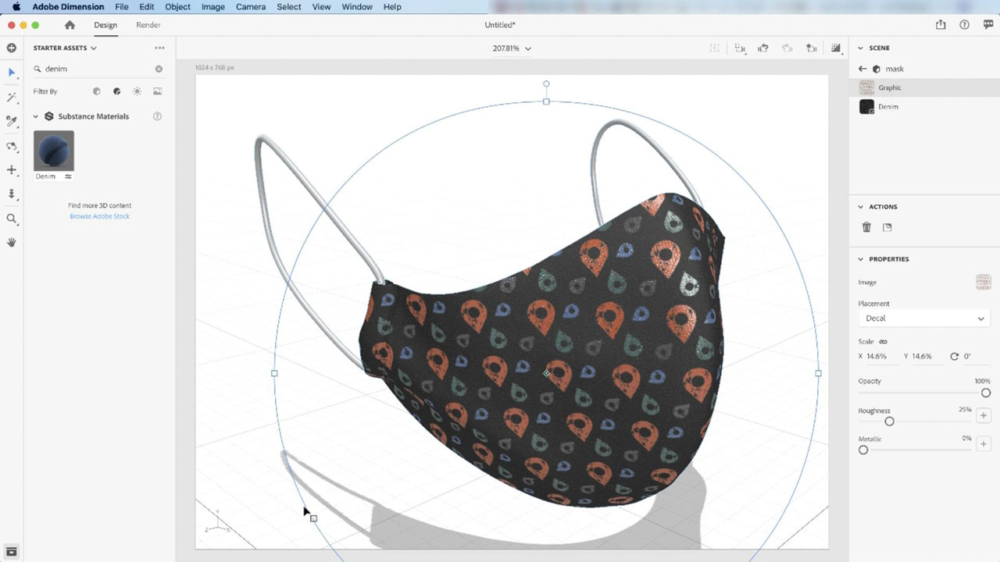

# [!DNL Dimension]

Gestalte überzeugenden 3D-Content schneller - mit hochwertigen Modellen, Materialien und Lichteffekten. Mit [!DNL Dimension] ist es ganz einfach, Branding-Visualisierungen, Illustrationen, Produktmodelle, Verpackungs-Designs und andere kreative Arbeiten zu erstellen.

## Tutorials für Produkte durchsuchen

<table style="table-layout:fixed">
<tr>
 <td>
   
    

   <a href="dimension.md#tutorial1"><strong>Anwenden von Substance-Materialien auf 3D-Modelle</strong></a>
    

    <em>Substance-Materialien unterstützen Tausende von Variationen von Mustern und Design in einem einzigen Material</em>
    2 
  </td>
  <td>
    
    

     
  </td>
  <td>
    
    

     
  </td>
</tr>
</table>

## Anwenden von Substance-Materialien auf 3D-Modelle (11:42) {#tutorial1}

>[!VIDEO](https://video.tv.adobe.com/v/326944?hidetitle=true)

**Beschreibung**
Substance-Materialien unterstützen mehrere Tausend Muster- und Design-Varianten in einem einzigen Material.

In diesem Tutorial lernen Sie Folgendes:
* Gestalte überzeugenden 3D-Content schneller - mit hochwertigen Modellen, Materialien und Lichtern.

**Präsentiert von:**
Jim Babbage, Senior Solutions Consultant (Digital Media)

**Dimension-Ressourcen**

[Training und Support](https://helpx.adobe.com/de/support/dimension.html) ist Ihr Hub für zusätzliche Tutorials, [Neuerungen](https://helpx.adobe.com/de/dimension/user-guide.html/dimension/using/whats-new.ug.html) und Links zu Community-Foren.

**Version Oktober 2020**

Beginnen Sie mit der Nutzung dieser Funktionen (und mehr!), indem Sie das neueste Update von Ihrem Creative Cloud-Client herunterladen.
