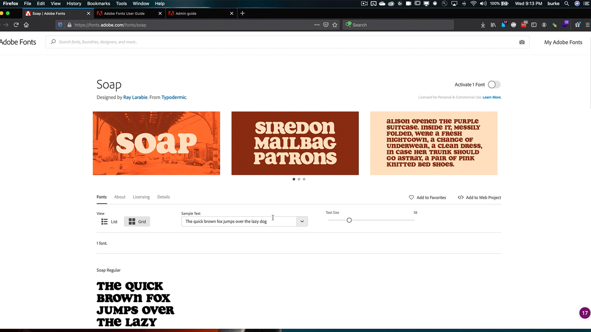

# Enterprise-Administration

Nutze die Vorteile von Adobe-Berechtigungen und Kreativelementen im gesamten Unternehmen.

## Tutorials für Enterprise-Administration durchsuchen

<table style="table-layout:fixed">
<tr>
 <td>
   
    

   <a href="enterprise.md#tutorial1"><strong>Adobe Fonts</strong></a>
    

    <em>Entdecken Sie die fast 200 Produktfamilien in Adobe Fonts und die Benutzerfreundlichkeit des Adobe Fonts-Services.</em>
     
  </td>
  <td>
    
    

     
  </td>
  <td>
    
    

     
  </td>
</tr>
</table>

## Adobe Fonts (5:20) {#tutorial1}

>[!VIDEO](https://video.tv.adobe.com/v/328226?hidetitle=true)

**Beschreibung:**

Entdecken Sie die fast 200 Produktfamilien in Adobe Fonts und die Benutzerfreundlichkeit des Adobe Fonts-Dienstes.

In diesem Tutorial lernen Sie Folgendes:
* Über die leistungsstarke Browser-Oberfläche finden Sie schnell und einfach die richtige Schriftart
* Zeit- und Kosteneinsparungen durch native Creative Cloud-Integrationen
* Alle Schriften zentral in der Adobe Admin Console verwalten

**Präsentiert von:**

Todd Burke, Principal Solutions Consultant (Digital Media)

**Enterprise-Verwaltungsressourcen:**

[Adobe Fonts-Benutzerhandbuch](https://helpx.adobe.com/fonts/user-guide.html)

[Handbuch für Unternehmensadministratoren](https://helpx.adobe.com/enterprise/admin-guide.html)
