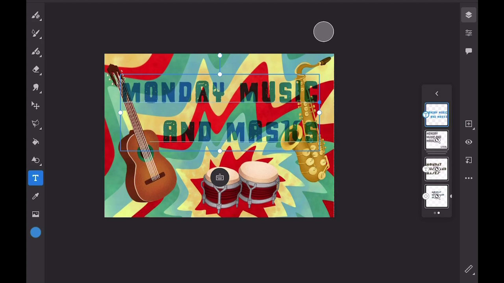
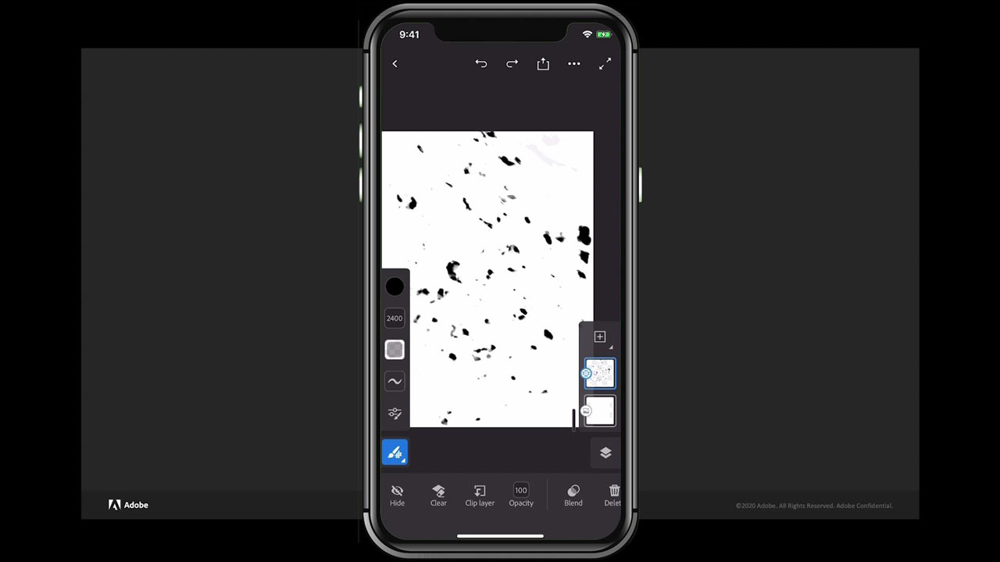

# Fresco

Adobe Fresco ist eine plattformübergreifende App zum Erstellen von Zeichnungen und Gemälden mithilfe von pinselbasierten Methoden, die Vektor- und Raster-Workflows mit Cloud-Dokumenten kombinieren.

## Tutorials für Produkte durchsuchen

<table style="table-layout:fixed">
<tr>
 <td>
   
    

   <a href="fresco.md#tutorial1"><strong>Einführung in das Zeichnen mit Adobe Fresco</strong></a>
    

    <em>Verwenden Sie die leistungsstarken Auswahl- und Farbbearbeitungswerkzeuge in Adobe Fresco, um ein Bild dramatisch zu ändern, damit es Ihren Branding-Anforderungen entspricht</em>
    2 
  </td>
  <td>
   
    

   <a href="fresco.md#tutorial2"><strong>Strukturiertes Bildmaterial erstellen - Fresco in Illustrator</strong></a>
    

    <em>Malen und Zeichnen von Texturen in Adobe Fresco und Erfahren Sie, wie Sie sie in Illustrator verwenden</em>
    2 
  </td>
  <td>
    
    

     
  </td>
</tr>
</table>

## Einführung in das Zeichnen mit Adobe Fresco (19:07) {#tutorial1}

>[!VIDEO](https://video.tv.adobe.com/v/326946?hidetitle=true)

**Beschreibung**
Entdecke, wie du mit Adobe Fresco auf Basis von Pinseln Zeichnungen und Bilder erstellen kannst, die Vektor- und Raster-Workflows mit Cloud-Dokumenten kombinieren.

In diesem Tutorial lernen Sie Folgendes:
* Verwenden Sie einzigartige interaktive Pinsel, die Aquarell und Ölfarbe zusammen mit Ihren bevorzugten Pixel- und Vektorpinseln nachahmen
* Erstellen von strukturierten Effekten durch Überlagerung verschiedener Pinsel und Verwendung von Masken
* Überall kreativ - mit der neuen Fresco-App für iPhone
* Exportieren Sie Ihre Arbeit in verschiedene Formate, um sie in anderen mobilen Apps und Desktop-Applikationen zu verwenden

**Präsentiert von:**
Liz Tanonis, Solutions Consultant (Digital Media)

## Erstellen von strukturierten Grafiken - Fresco in Illustrator (4:10) {#tutorial2}

>[!VIDEO](https://video.tv.adobe.com/v/326947?hidetitle=true)

**Beschreibung**
Zeichne und male Strukturen in Adobe Fresco. Erfahre, wie du sie in Illustrator einsetzt.

In diesem Tutorial lernen Sie Folgendes:
* Grafiken in Adobe Fresco für iPhone erstellen und für die Verwendung in anderen Creative Cloud-Programmen exportieren
* Mit dem Bildnachzeichner-Werkzeug in Illustrator Vektorgrafiken erstellen
* Anwenden handgefertigter Strukturen auf Vektorgrafiken in Illustrator

**Präsentiert von:**
Liz Tanonis, Solutions Consultant (Digital Media)

**Fresco Ressourcen**

[Training und Support](https://helpx.adobe.com/support/adobe-fresco.html) ist Ihr Hub für zusätzliche Tutorials, [Neuerungen](https://helpx.adobe.com/fresco/using/whats-new.html) und Links zu Community-Foren.

**Version Oktober 2020**

Beginnen Sie mit der Nutzung dieser Funktionen (und mehr!), indem Sie das neueste Update von Ihrem Creative Cloud-Client herunterladen.
