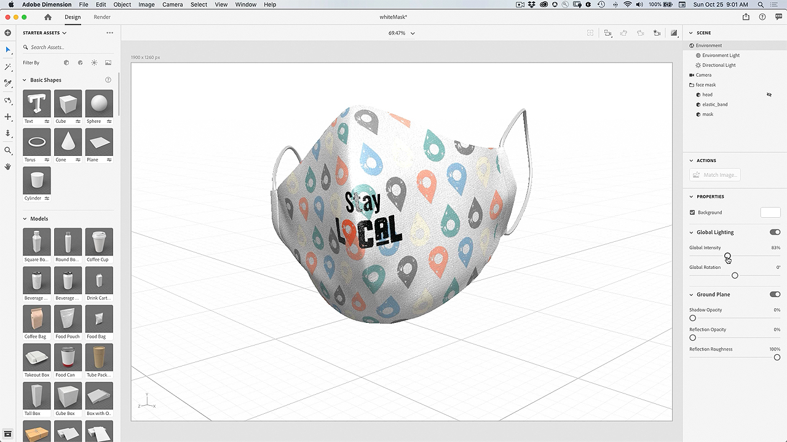
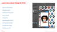

# Design to Print Plug-in - Anpassen einer Gesichtsmaske

Wäre es nicht toll, wenn du eine Gesichtsmaske mit deiner eigenen Grafik anpassen könntest? Mit dem Plug-in &quot;Adobe Design to Print&quot; kannst du deine Designs auf Hunderten von Zazzle-Produkten visualisieren und direkt auf ihrem Online-Marktplatz veröffentlichen.

## Tutorials für Facemask-Projekte durchsuchen

<table style="table-layout:fixed">
<tr>
 <td>
   
    

   <a href="handsonproject.md#tutorial1"><strong>Photoshop Design to Print-Plug-in installieren</strong></a>
    

    <em>Wähle mit den Auswahl- und Farbbearbeitungswerkzeugen in Adobe Photoshop ein Bild mit Branding-Elementen aus.</em>
     
  </td>
  <td>
    
    

    <a href="handsonproject.md#tutorial2"><strong>Anpassen einer Gesichtsmaske mit dem Befehl "Design to Print"</strong></a>
    

    <em>Anpassen Ihrer eigenen Azzle Gesichtsmaske</em>
     
  </td>
  <td>
    
    

   <a href="handsonproject.md#tutorial3"><strong>Erstellen einer 3D-Visualisierung Ihrer Gesichtsmaske</strong></a>
    

    <em>Eine 3D-Visualisierung deiner Gesichtsmaske für die Event-Galerie erstellen.</em>
     
  </td>
</tr>
</table>

## Photoshop Design to Print Plug-in installieren (1:50) {#tutorial1}

>[!VIDEO](https://video.tv.adobe.com/v/327096?hidetitle=true)

**Beschreibung**
Hier erfahren Sie, wie Sie das Plug-in &quot;Design to Print&quot; für Photoshop installieren.

In diesem Tutorial lernen Sie Folgendes:
* Visualisiere deine Designs für Produkte wie Bekleidung, Accessoires, Briefpapier und Wanddekoration in Echtzeit.
* Veröffentlichung auf dem Online-Marktplatz von Adobe.

**Präsentiert von:**
Patti Sokol, Principal Solutions Consultant (Digital Media)

## Anpassen einer Gesichtsmaske mit &quot;Drucken&quot; (7:54) {#tutorial2}

>[!VIDEO](https://video.tv.adobe.com/v/327097?hidetitle=true)

**Beschreibung**
Anpassen Ihrer eigenen Azzle Gesichtsmaske

In diesem Tutorial lernen Sie Folgendes:
* Visualisiere deine Designs für Produkte wie Bekleidung, Accessoires, Briefpapier und Wanddekoration in Echtzeit.
* Veröffentlichung auf dem Online-Marktplatz von Adobe.

**Klicken Sie auf Bild , um die PDF &quot;Design to Print erlernen&quot; herunterzuladen.**

**Präsentiert von:**
Patti Sokol, Principal Solutions Consultant (Digital Media)

## Erstellen einer 3D-Visualisierung Ihrer Gesichtsmaske (7:54) {#tutorial3}

>[!VIDEO](https://video.tv.adobe.com/v/327098?hidetitle=true)

**Beschreibung**
Eine 3D-Visualisierung deiner Gesichtsmaske für die Event-Galerie erstellen.

In diesem Tutorial lernen Sie Folgendes:
* Fotorealistische 3D-Visualisierungen erstellen.
* Füge Materialien hinzu, und steuere die Beleuchtung für einen professionellen Look
* Elemente importieren, um Ihr Branding oder andere Designs anzuwenden

**Zum Herunterladen auf Bild klicken [!DNL Dimension] Datei mit 3D-Modell einer weißen Maske**

**Präsentiert von:**
Patti Sokol, Principal Solutions Consultant (Digital Media)
