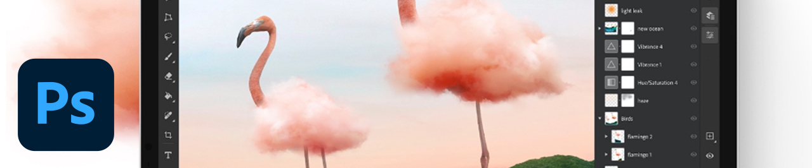
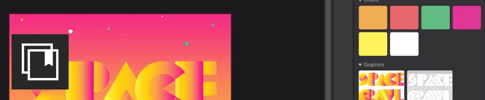

# Tutorials

Als kreativer Unternehmensanwender müssen Sie mit verteilten Teams zusammenarbeiten, skalierbare Prozesse einrichten und die Systeme und Richtlinien des Unternehmens einhalten. Anhand dieser Tutorials können Sie sich mit den neuen Funktionen in der Version 2021 von Creative Cloud vertraut machen - aus der Sicht des Unternehmens.

## Tutorials nach Desktop-Produkten

<table style="table-layout:fixed">
<tr>
 <td>
    
    

    <a href="acrobat-sign.md"><strong>Acrobat und Adobe Sign</strong></a>
    

    <em>Erstellen, Bearbeiten und Signieren von PDF-Dokumenten und -Formularen</em>
     
  </td>
  <td>
    
    

    <a href="dimension.md"><strong>Dimension</strong></a>
    

    <em>Erstellen fotorealistischer 3D-Bilder für Branding, Produktfotos und Verpackungs-Design</em>
     
  </td>
  <td>
    
    

    <a href="illustrator.md"><strong>Illustrator</strong></a>
    

    <em>Vektorgrafik und Illustration</em>
     
  </td>
</tr>
<tr>
 <td>
    
    

    <a href="indesign.md"><strong>InDesign</strong></a>
    

    <em>Printdesign und Layout für Print- und digitale Publikationen</em>
     
  </td>
  <td>
    
    

    <a href="photoshop.md"><strong>Photoshop</strong></a>
    

    <em>Bearbeite und kombiniere Bilder und Grafiken auf dem Desktop.</em>
     
  </td>
  <td>
    
    

    <a href="rush.md"><strong>Rush</strong></a>
    

    <em>Onlinevideos überall erstellen und teilen</em>
     
  </td>
</tr>
<tr>
 <td>
    
    

    <a href="xd.md"><strong>XD</strong></a>
    

    <em>Benutzererfahrungen entwerfen, Prototypen erstellen und freigeben</em>
     
  </td>
  <td>
    
    

     
  </td>
  <td>
    
    

     
  </td>
</tr>
</table>

### Tutorials per Mobile App.

<table style="table-layout:fixed">
<tr>
 <td>
    
    

    <a href="capture.md"><strong>Capture</strong></a>
    

    <em>Beliebiges Bild in ein Farbthema, eine Vektorgrafik, einen Pinsel und mehr umwandeln</em>
     
  </td>
  <td>
    
    

    <a href="fresco.md"><strong>Fresco</strong></a>
    

    <em>Zeichnen und Malen weitergedacht.</em>
     
  </td>
  <td>
    
    

    <a href="illustratoripad.md"><strong>Illustrator auf iPad</strong></a>
    

    <em>Vektorgrafik und Illustration</em>
     
  </td>
</tr>
<tr>
 <td>
    
    

    <a href="photoshopipad.md"><strong>Photoshop auf iPad</strong></a>
    

    <em>Bearbeite und kombiniere Bilder und Grafiken auf dem Desktop und dem iPad.</em>
     
  </td>
  <td>
    
    

     
  </td>
  <td>
    
    

     
  </td>
</tr>
</table>

### Tutorials von Integration

<table style="table-layout:fixed">
<tr>
 <td>
    
    

    <a href="aem.md"><strong>AEM Assets &amp; Asset Link</strong></a>
    

    <em>Digital Asset Management der nächsten Generation</em>
     
  </td>
  <td>
    
    

    <a href="creativeclouddesktopapp.md"><strong>Creative Cloud-Desktop-Applikation</strong></a>
    

    <em>Der Creative Cloud-Client ist Ihr Hub für die Verwaltung von CC-Programmen, -Services und die Zusammenarbeit - und vieles mehr!</em>
     
  </td>
  <td>
    
    

    <a href="cclibraries.md"><strong>CC-Bibliotheken</strong></a>
    

    <em>Halten Sie Ihre Assets und Ihre Projekte für das Branding bereit</em>
     
  </td>
</tr>
<tr>
<td>
    
    

    <a href="indesignserver.md"><strong>InDesign Server</strong></a>
    

    <em>Die ausgefeilten Tools des InDesign in Kombination mit benutzerdefinierter Automatisierung</em>
     
  </td>
 <td>
    
    

    <a href="stock.md"><strong>Adobe [!DNL Stock]</strong></a>
    

    <em>Hochwertige digitale Bilder, Illustrationen, Videos, Audiomaterial, Vorlagen und mehr</em>
     
  </td>
  <td>
    
    

     
  </td>
</tr>
</table>

### Praxisprojekt: Erstellen einer eigenen Gesichtsmaske

<table style="table-layout:fixed">
<tr>
 <td>
    
    

    <a href="handsonproject.md"><strong>Eigene Gesichtsmaske erstellen</strong></a>
    

    <em>Mit dem Plug-in "Adobe Design to Print" können Sie Ihre Designs auf Hunderten von Zazzle-Produkten visualisieren und direkt auf ihrem Online-Marktplatz veröffentlichen</em>
     
  </td>
  <td>
    
    

     
  </td>
  <td>
    
    

     
  </td>
</tr>
</table>
