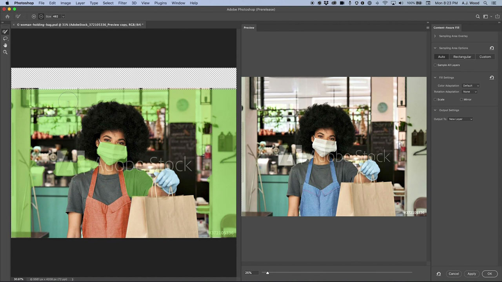

# Photoshop

Photoshop ist die weltweit führende Software für Bildbearbeitung und Grafik-Design. Sie bietet Profis auf allen Geräten uneingeschränkte kreative Freiheit. Lasse deiner Kreativität freien Lauf. Egal wo du inspiriert wirst. Photoshop hat alles, was du brauchst - setze jede Idee um.

## Tutorials für Produkte durchsuchen

<table style="table-layout:fixed">
<tr>
 <td>
   
    

   <a href="photoshop.md#tutorial1"><strong>Bilder an Ihre Kampagne anpassen</strong></a>
    

    <em>Verwenden Sie die leistungsstarken Auswahl- und Farbbearbeitungswerkzeuge in Adobe Photoshop, um ein Bild dramatisch zu ändern, damit es Ihren Branding-Anforderungen entspricht</em>
    2 
  </td>
  <td>
    
    

    <a href="photoshop.md#tutorial2"><strong>Himmel auswählen und ersetzen</strong></a>
    

    <em>Automatisches Auswählen des Himmels in einem Bild und Ersetzen durch einen Himmel Ihrer Wahl, automatisches Anpassen der Farben des Bildes an Ihre Auswahl</em>
    2 
  </td>
  <td>
    
    

     
  </td>
</tr>
</table>

## Bilder an Ihre Kampagne anpassen (5:45) {#tutorial1}

>[!VIDEO](https://video.tv.adobe.com/v/326950?hidetitle=true)

**Beschreibung**
Mit den Auswahlwerkzeugen und den Farbwerkzeugen von Adobe Photoshop kannst du ein Bild komplett verändern, sodass es deinen Branding-Anforderungen entspricht.

In diesem Tutorial lernen Sie Folgendes:
* Mit dem Objektauswahl-Werkzeug lassen sich Objekte schneller und einfacher auswählen.
* Die inhaltsbasierte Füllung ermöglicht eine bessere Kontrolle der Musterbereiche innerhalb eines Quellbilds, um das Klonen und Patchen von Zielbereichen zu verbessern.
* Pinsel können verschiedene Formen haben, um bessere Ergebnisse zu erzielen
* Adobe KI nutzt künstliche Intelligenz für Routineaufgaben

**Präsentiert von:**
A.J Wood, Senior Solutions Consultant (Digital Media)

## Himmel auswählen und ersetzen (2:16) {#tutorial2}

>[!VIDEO](https://video.tv.adobe.com/v/326953?hidetitle=true)

**Beschreibung**
Wählt den Himmel in einem Bild automatisch aus, und ersetzt ihn durch einen anderen. Die Farben des Bildes werden automatisch an die Auswahl angepasst.

In diesem Tutorial lernen Sie Folgendes:
* Sky Replacement bietet eine Ein-Klick-Lösung, um den Himmel in Ihren Bildern sofort zu tauschen
* Sky Replacement speichert seine Ausgabe als Ebenengruppe mit jeder Maske, jeder Anpassung und jedem Bild, um sie weiter zu verfeinern

**Präsentiert von:**
A.J Wood, Senior Solutions Consultant (Digital Media)

**Photoshop-Ressourcen**

[Training und Support](https://helpx.adobe.com/de/support/photoshop.html) ist Ihr Hub für zusätzliche Tutorials, [Neuerungen](https://helpx.adobe.com/de/photoshop/using/whats-new.html) und Links zu Community-Foren.

**Version Oktober 2020**

Beginnen Sie mit der Nutzung dieser Funktionen (und mehr!), indem Sie das neueste Update von Ihrem Creative Cloud-Client herunterladen.
