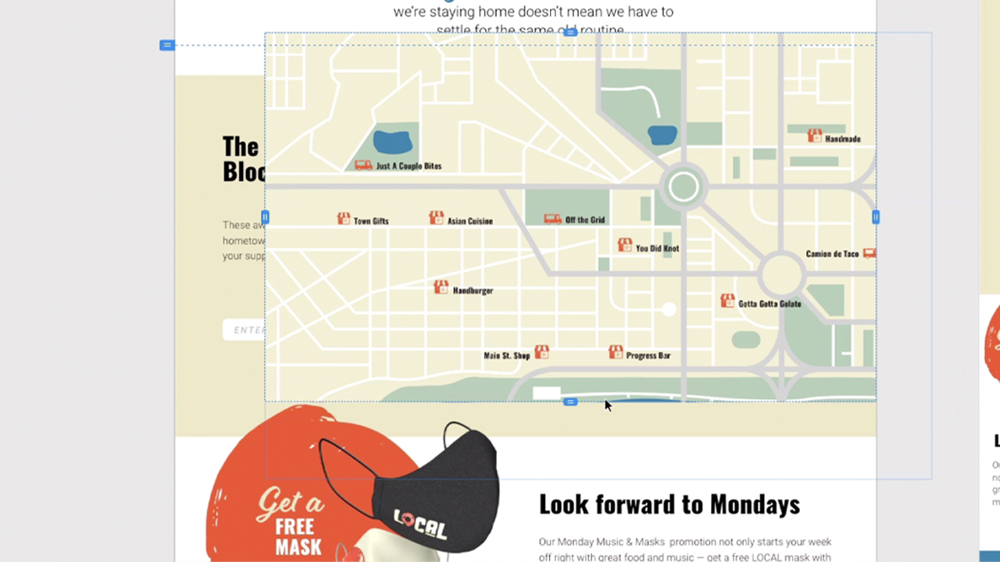

# XD

Adobe XD ist ein Tool für UX-Design und Prototyping für Websites, Apps, Voice UI oder Spiele.

## Tutorials für Produkte durchsuchen

<table style="table-layout:fixed">
<tr>
 <td>
   
    

   <a href="xd.md#tutorial1"><strong>Komponenten mit Hover-Status erstellen</strong></a>
    

    <em>Wiederverwendbare, dynamisch skalierbare Schaltflächen für Ihre interaktiven Designs erstellen</em>
    2 
  </td>
  <td>
    
    

    <a href="xd.md#tutorial2"><strong>Ein Wiederholungsraster erstellen und ausfüllen</strong></a>
    

    <em>Ein einzelnes Element mit einem einfachen Klicken und Ziehen in Wiederholungsraster umwandeln</em>
    2 
  </td>
  <td>
   
    

    <a href="xd.md#tutorial3"><strong>Mit Stapeln arbeiten</strong></a>
    

    <em>Verwenden Sie die Stapeleigenschaft, um Elemente einfach neu anzuordnen</em>
    2 
  </td>
</tr>
<tr>
 <td>
    
    

    <a href="xd.md#tutorial4"><strong>Prototyp erstellen: Ankerverknüpfungen und 
Bildlaufgruppen</strong></a>
    

    <em>Navigation und Bildlauf zu einem Prototyp hinzufügen</em>
    2 
  </td>
  <td>
    
    

    <a href="xd.md#tutorial5"><strong>Prototyp erstellen - Interaktive Komponentenzustände</strong></a>
    

    <em>Interaktivität und ein Überlagerungsmenü zu einem Prototyp hinzufügen</em>
    2 
  </td>
  <td>
   
    

   <a href="xd.md#tutorial7"><strong>E-Mail - Ein Wiederholungsraster erstellen und ausfüllen</strong></a>
    

    <em>Ein einzelnes Element mit einem einfachen Klicken und Ziehen in Wiederholungsraster umwandeln</em>
    2 
  </td>
</tr>
<tr>
 <td>
    
    

    <a href="xd.md#tutorial7"><strong>E-Mail - Mit Stapeln arbeiten</strong></a>
    

    <em>Verwenden Sie die Stapeleigenschaft, um Elemente einfach neu anzuordnen</em>
    2 
  </td>
  <td>
    
    

     
  </td>
  <td>
    
    

     
  </td>
</tr>
</table>

## [!UICONTROL Komponenten] mit Hover-Status erstellen (7:35) {#tutorial1}

>[!VIDEO](https://video.tv.adobe.com/v/326874?hidetitle=true)

**Beschreibung**
Erstelle wiederverwendbare Buttons mit dynamischer Skalierung für deine interaktiven Designs.

In diesem Tutorial lernen Sie Folgendes:
* Änderungen an einer Quellhauptkomponente vornehmen und diese Änderungen werden automatisch an alle Instanzen dieser Komponente übertragen
* Komponenten für Konsistenz, Zeitersparnis und weniger Mausklicks einsetzen

**Präsentiert von:**
Michael Murphy, Senior Solutions Consultant (Digital Media)

## Ein Wiederholungsraster erstellen und füllen (2:57) {#tutorial2}

>[!VIDEO](https://video.tv.adobe.com/v/326955?hidetitle=true)

**Beschreibung**
Wandle ein einzelnes Element in ein Wiederholungsraster um. Einfach klicken und ziehen.

In diesem Tutorial lernen Sie Folgendes:
* Ziehe ein Raster in einer beliebigen Größe auf. Sofort verfügbar.
* Fülle dein Raster mit Inhalten und Daten, und XD platzierst alle Bilder und Texte wie von Zauberhand
* Nimm Änderungen an jeder beliebigen Stelle in deinem Design vor.

**Präsentiert von:**
Ashley Dvorin, Senior Solutions Consultant (Digital Media)

## Arbeiten mit Stapeln (5:33) {#tutorial3}

>[!VIDEO](https://video.tv.adobe.com/v/326956?hidetitle=true)

**Beschreibung**
Verwenden Sie die Stack-Eigenschaft, um Elemente einfach neu anzuordnen.

In diesem Tutorial lernen Sie Folgendes:
* Die Ausrichtung von sowie Abstände zwischen Objekten auf der Arbeitsfläche bleiben auch bei Design-Änderungen erhalten
* Füge neue Objekte ein, oder ändere die Anordnung in einem Stapel. Alle Elemente werden automatisch angepasst.

**Präsentiert von:**
Michael Murphy, Senior Solutions Consultant (Digital Media)

## Prototyp erstellen - Ankerlinks und Bildlaufgruppen (9:55) {#tutorial4}

>[!VIDEO](https://video.tv.adobe.com/v/326957?hidetitle=true)

**Beschreibung**
Fügen Sie einem Prototyp Navigation und Bildlauf hinzu.

In diesem Tutorial lernen Sie Folgendes:
* Mit einer Aktion kannst du Links in deinem Prototyp setzen, über die User an verschiedene Stellen auf der Zeichenfläche springen können
* Erstelle Aktivitäts-Feeds, Bilderkarussells oder Produktlisten, die User separat vom restlichen Design durchscrollen können
* Erstellen von Gruppen, die vertikal und/oder horizontal gescrollt werden können

**Präsentiert von:**
Michael Murphy, Senior Solutions Consultant (Digital Media)

## Prototyp erstellen - Interaktive Komponentenzustände (8:55) {#tutorial5}

>[!VIDEO](https://video.tv.adobe.com/v/326958?hidetitle=true)

**Beschreibung**
Fügen Sie einem Prototyp Interaktivität und ein Überlagerungsmenü hinzu.

In diesem Tutorial lernen Sie Folgendes:
* Interaktive und animierte User Experiences ohne zusätzliche Zeichenflächen.
* Erstelle mehrere Prototyp- oder Interaktions-Flows im selben XD-Dokument. Veröffentliche jeden Flow über einen eigenen Link.

**Präsentiert von:**
Emilie Enke, Associate Solutions Consultant (Digital Media)

## E-Mail - Erstellen und Ausfüllen eines Wiederholungsrasters (4:45) {#tutorial6}

>[!VIDEO](https://video.tv.adobe.com/v/326775?hidetitle=true)

**Beschreibung**
Wandle ein einzelnes Element in ein Wiederholungsraster um. Einfach klicken und ziehen.

In diesem Tutorial lernen Sie Folgendes:
* Ziehe ein Raster in einer beliebigen Größe auf. Sofort verfügbar.
* Fülle dein Raster mit Inhalten und Daten, und XD platzierst alle Bilder und Texte wie von Zauberhand
* Nimm Änderungen an jeder beliebigen Stelle in deinem Design vor.

**Präsentiert von:**
Victoria Torres, Lösungsberaterin (Digitale Medien)

## E-Mail - Mit Stapeln arbeiten (3:38) {#tutorial7}

>[!VIDEO](https://video.tv.adobe.com/v/326759?hidetitle=true)

**Beschreibung**
Verwenden Sie die Stack-Eigenschaft, um Elemente einfach neu anzuordnen.

In diesem Tutorial lernen Sie Folgendes:
* Die Ausrichtung von sowie Abstände zwischen Objekten auf der Arbeitsfläche bleiben auch bei Design-Änderungen erhalten
* Füge neue Objekte ein, oder ändere die Anordnung in einem Stapel. Alle Elemente werden automatisch angepasst.

**Präsentiert von:**
Victoria Torres, Lösungsberaterin (Digitale Medien)

**XD Ressourcen**

[Training und Support](https://helpx.adobe.com/de/support/xd.html) ist Ihr Hub für zusätzliche Tutorials, [Neuerungen](https://helpx.adobe.com/xd/user-guide.html/xd/help/whats-new.ug.html) und Links zu Community-Foren.

**Version Oktober 2020**

Beginnen Sie mit der Nutzung dieser Funktionen (und mehr!), indem Sie das neueste Update von Ihrem Creative Cloud-Client herunterladen.
