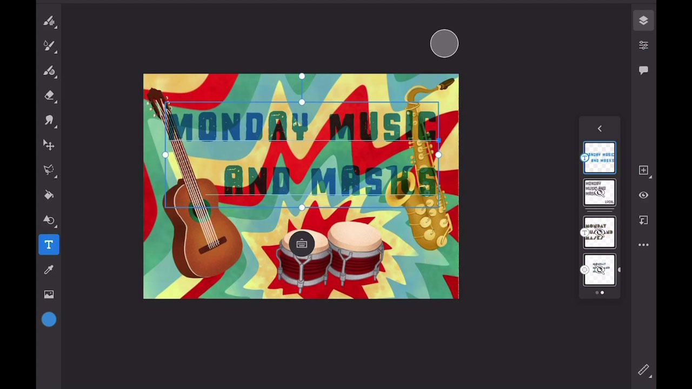

# Fresco

Adobe Fresco ist eine plattformübergreifende App für die Erstellung von Zeichnungen und Gemälden mit pinselbasierten Methoden, die Vektor- und Rasterabläufe mit Cloud-Dokumenten kombinieren.

## Tutorials durchsuchen

<table style="table-layout:fixed">
<tr>
 <td>
   
    

   <a href="fresco.md#tutorial1"><strong>Mit Adobe Fresco zeichnen</strong></a>
    

    <em>Verwenden Sie die leistungsstarken Auswahl- und Farbbearbeitungswerkzeuge in Adobe Fresco, um ein Bild dramatisch an Ihre Branding-Anforderungen anzupassen</em>
     
  </td>
  <td>
   
    

   <a href="fresco.md#tutorial2"><strong>Strukturierte Grafik erstellen - Fresco zu Illustrator</strong></a>
    

    <em>Zeichnen und Malen von Texturen in Adobe Fresco und ihre Verwendung in Illustrator</em>
     
  </td>
  <td>
    
    

     
  </td>
</tr>
</table>

## Zeichnen mit Adobe Fresco (19:07) {#tutorial1}

>[!VIDEO](https://video.tv.adobe.com/v/326946?hidetitle=true)

**Beschreibung**
Entdecken Sie Adobe Fresco für die Erstellung von Zeichnungen und Gemälden mithilfe von pinselbasierten Methoden, die Vektor- und Rasterabläufe mit Cloud-Dokumenten kombinieren.

In diesem Tutorial lernen Sie Folgendes:
* Verwenden Sie einzigartige Live-Pinsel, die Aquarell- und Ölgemälde mit Ihren bevorzugten Pixel- und Vektorpinseln nachahmen
* Erstellen Sie strukturierte Effekte, indem Sie verschiedene Pinsel überlagern und Masken verwenden
* Mit der neuen Fresco-App für iPhone überall erstellen
* Exportieren Sie Ihre Arbeit in verschiedene Formate, um sie in anderen Appi- und Desktop-Apps zu verwenden

**Vorgestellt von:**
Liz Tanonis, Solutions Consultant (Digital Media)

## Strukturierte Grafik erstellen - Fresco zu Illustrator (4:10) {#tutorial2}

>[!VIDEO](https://video.tv.adobe.com/v/326947?hidetitle=true)

**Beschreibung**
Malen und Zeichnen von Texturen in Adobe Fresco und lernen Sie, wie Sie sie in Illustrator verwenden.

In diesem Tutorial lernen Sie Folgendes:
* Grafiken in der Adobe Fresco App für iPhone erstellen und für andere Creative Cloud-Apps exportieren
* Bildnachzeichner-Werkzeug in Illustrator zum Konvertieren von Grafiken in Vektoren verwenden
* Anwenden von Strukturen auf Vektorgrafiken in Illustrator

**Vorgestellt von:**
Liz Tanonis, Solutions Consultant (Digital Media)

**Fresco-Ressourcen**

[Lernen und ](https://helpx.adobe.com/support/adobe-fresco.html) unterstützen Sie bei weiteren Tutorials,  [Neuerungen](https://helpx.adobe.com/fresco/using/whats-new.html) und Links zu Community-Foren.

**Version Oktober 2020**

Beginnen Sie mit der Verwendung dieser Funktionen (und mehr!) indem Sie das neueste Update von Ihrer Creative Cloud-Desktop-App herunterladen.
