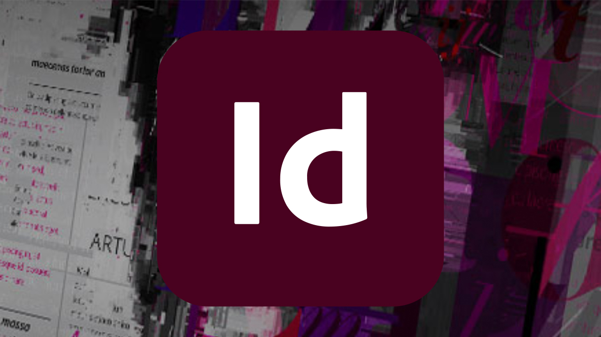

# InDesign Server

Adobe Adobe® InDesign® Server ist eine robuste und skalierbare Engine, die die Design-, Layout- und typografischen Funktionen von InDesign nutzt, um ansprechende automatisierte Dokumente programmgesteuert erstellen zu können.

## Tutorials durchsuchen

<table style="table-layout:fixed">
<tr>
 <td>
   
    

   <a href="indesignserver.md#tutorial1"><strong>Datengesteuerte InDesign Server</strong></a>
    

    <em>Das datengesteuerte Design kann programmgesteuert mit InDesign Server erreicht werden</em>
     
  </td>
  <td>
    
    

     
  </td>
  <td>
    
    

     
  </td>
</tr>
</table>

## Datengesteuerte InDesign Server (4:14) {#tutorial1}

>[!VIDEO](https://video.tv.adobe.com/v/326901?hidetitle=true)

**Beschreibung**
Datenbasiertes Design kann programmgesteuert mit InDesign Server erreicht werden.

In diesem Tutorial lernen Sie Folgendes:
* Erstellen von InDesign-Vorlagen mit vorformatierten Text- oder Objektformaten
* Fluss externer datenbasierter Inhalte zur schnelleren Personalisierung von Inhalten
* Erstellen Sie Volltonfarben-PDFs oder binden Sie sie in andere AEM Ausgabeformate Ihres Layouts ein

**Vorgestellt von:**
Eric Rowse, Senior Solutions Consultant (Digital Media)

## Zusätzliche InDesign Server-Ressourcen

<table>
<tr>
 <td>
   
    

   <a href="https://www.adobe.com/products/indesignserver/buying-guide.html"><strong>InDesign Server: Auswahlhilfe</strong></a>
    

    <em>Ressourcen für interne Entwickler oder Partner</em>
     
  </td>
  <td>
   
    

   <a href="https://www.adobe.com/products/indesignserver/partner.html"><strong>InDesign Server: Partner suchen</strong></a>
    

    <em>Adobe empfiehlt, mit Partnern zusammenzuarbeiten, um die Lösung zu finden, die Ihren Anforderungen entspricht</em>
     
  </td>
  <td>
    
    

     
  </td>
</tr>
</table>

**InDesign Server-Ressourcen**

[Lernen und ](https://www.adobe.com/products/indesignserver.html) unterstützen Sie bei weiteren Tutorials, Neuerungen und Links zu Community-Foren.

**Version Oktober 2020**

Beginnen Sie mit der Verwendung dieser Funktionen (und mehr!) indem Sie das neueste Update von Ihrer Creative Cloud-Desktop-App herunterladen.
