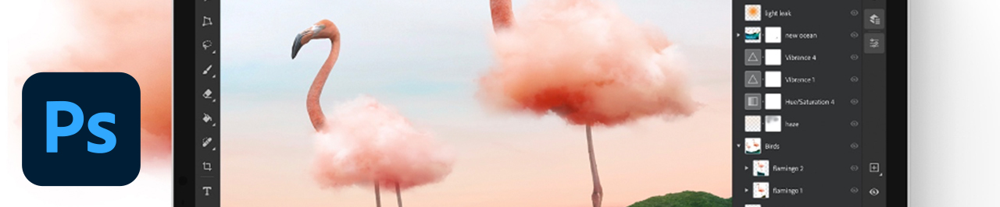

# Tutorials

Als kreatives Unternehmen müssen Sie mit verteilten Teams zusammenarbeiten, skalierbare Prozesse einrichten und Unternehmenssysteme und Richtlinien einhalten. Anhand dieser Tutorials lernen Sie die neuen Funktionen in der Version 2021 von Creative Cloud aus Unternehmensperspektive kennen.

## Tutorials nach Desktop-Produkten

<table style="table-layout:fixed">
<tr>
 <td>
    
    

    <a href="acrobat-sign.md"><strong>Acrobat &amp; Adobe Sign</strong></a>
    

    <em>PDF-Dokumente und -Formulare erstellen, bearbeiten und signieren</em>
     
  </td>
  <td>
    
    

    <a href="dimension.md"><strong>Dimension</strong></a>
    

    <em>Fotorealistische 3D-Bilder für Branding, Produktaufnahmen und Verpackungs-Design erstellen</em>
     
  </td>
  <td>
    
    

    <a href="illustrator.md"><strong>Illustrator</strong></a>
    

    <em>Vektorgrafiken und Illustrationen</em>
     
  </td>
</tr>
<tr>
 <td>
    
    

    <a href="indesign.md"><strong>InDesign</strong></a>
    

    <em>Seitendesign und Layout für Print und digitale Veröffentlichung</em>
     
  </td>
  <td>
    
    

    <a href="photoshop.md"><strong>Photoshop</strong></a>
    

    <em>Bilder, Grafiken und Grafiken auf dem Desktop bearbeiten, zusammensetzen und erstellen</em>
     
  </td>
  <td>
    
    

    <a href="rush.md"><strong>Rush</strong></a>
    

    <em>Online-Videos überall erstellen und freigeben</em>
     
  </td>
</tr>
<tr>
 <td>
    
    

    <a href="xd.md"><strong>XD</strong></a>
    

    <em>Benutzererlebnisse entwerfen, Prototypen erstellen und freigeben</em>
     
  </td>
  <td>
    
    

     
  </td>
  <td>
    
    

     
  </td>
</tr>
</table>

### Tutorials nach Mobilanwendung

<table style="table-layout:fixed">
<tr>
 <td>
    
    

    <a href="capture.md"><strong>Capture</strong></a>
    

    <em>Bilder in Farbpaletten, Vektorgrafiken, Pinsel und mehr umwandeln</em>
     
  </td>
  <td>
    
    

    <a href="fresco.md"><strong>Fresco</strong></a>
    

    <em>Die Freude am Zeichnen und Malen von überall wiederentdecken</em>
     
  </td>
  <td>
    
    

    <a href="illustratoripad.md"><strong>Illustrator auf dem iPad</strong></a>
    

    <em>Vektorgrafiken und Illustrationen</em>
     
  </td>
</tr>
<tr>
 <td>
    
    

    <a href="photoshopipad.md"><strong>Photoshop auf dem iPad</strong></a>
    

    <em>Bilder, Grafiken und Grafiken auf dem Desktop und iPad bearbeiten, zusammensetzen und erstellen</em>
     
  </td>
  <td>
    
    

     
  </td>
  <td>
    
    

     
  </td>
</tr>
</table>

### Tutorials nach Integration

<table style="table-layout:fixed">
<tr>
 <td>
    
    

    <a href="aem.md"><strong>AEM Assets &amp; Asset Link</strong></a>
    

    <em>Digital Asset Management der nächsten Generation</em>
     
  </td>
  <td>
    
    

    <a href="creativeclouddesktopapp.md"><strong>Creative Cloud-Desktop-App</strong></a>
    

    <em>Die Creative Cloud-Desktop-Applikation ist die zentrale Anlaufstelle für die Verwaltung von CC-Applikationen, -Diensten und der Zusammenarbeit.</em>
     
  </td>
  <td>
    
    

    <a href="cclibraries.md"><strong>CC Libraries</strong></a>
    

    <em>Ihre Assets und Ihre Projekte unter dem Markennamen speichern</em>
     
  </td>
</tr>
<tr>
<td>
    
    

    <a href="indesignserver.md"><strong>InDesign Server</strong></a>
    

    <em>Die anspruchsvollen Tools des InDesign gepaart mit individueller Automatisierung</em>
     
  </td>
 <td>
    
    

    <a href="stock.md"><strong>Adobe [!DNL Stock]</strong></a>
    

    <em>Hochwertige digitale Bilder, Illustrationen, Videos, Audio, Vorlagen und mehr</em>
     
  </td>
  <td>
    
    

     
  </td>
</tr>
</table>

### Hands-On-Projekt: Eigene Gesichtsmaske erstellen

<table style="table-layout:fixed">
<tr>
 <td>
    
    

    <a href="handsonproject.md"><strong>Eigene Gesichtsmaske erstellen</strong></a>
    

    <em>Mit dem Plug-in Adobe Design to Print können Sie Ihre Designs auf Hunderten von Zazzle-Produkten visualisieren und direkt auf ihrem Online-Marktplatz veröffentlichen</em>
     
  </td>
  <td>
    
    

     
  </td>
  <td>
    
    

     
  </td>
</tr>
</table>
