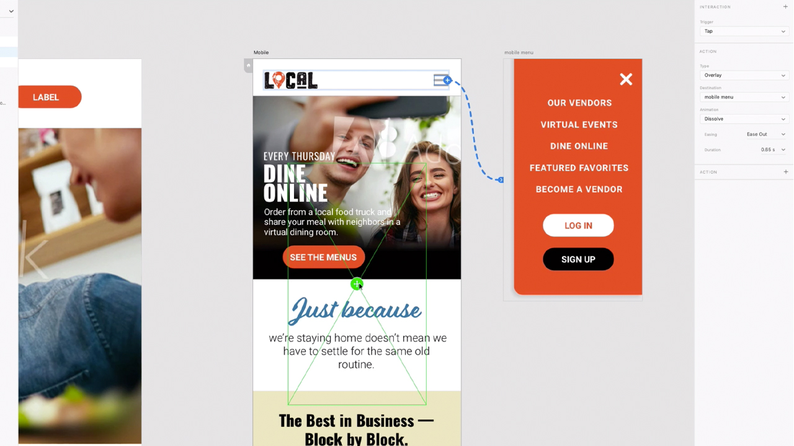

# XD

Adobe XD ist ein Design- und Prototyping-Tool für User Experience Design und Design für Websites, Apps, Sprachschnittstellen, Spiele und andere digitale Erlebnisse.

## Tutorials durchsuchen

<table style="table-layout:fixed">
<tr>
 <td>
   
    

   <a href="xd.md#tutorial1"><strong>Komponenten mit Hover-Status erstellen</strong></a>
    

    <em>Wiederverwendbare, dynamisch skalierbare Schaltflächen für Ihre interaktiven Designs erstellen</em>
     
  </td>
  <td>
    
    

    <a href="xd.md#tutorial2"><strong>Wiederholungsraster erstellen und ausfüllen</strong></a>
    

    <em>Ein einzelnes Element in Wiederholungsraster umwandeln, indem Sie einfach klicken und ziehen</em>
     
  </td>
  <td>
   
    

    <a href="xd.md#tutorial3"><strong>Arbeiten mit Stapeln</strong></a>
    

    <em>Elemente mithilfe der stack-Eigenschaft leicht neu anordnen</em>
     
  </td>
</tr>
<tr>
 <td>
    
    

    <a href="xd.md#tutorial4"><strong>Erstellen eines Prototyps: Ankerverknüpfungen und Bildlaufgruppen</strong></a>
    

    <em>Navigation und Bildlauf zu einem Prototyp hinzufügen</em>
     
  </td>
  <td>
    
    

    <a href="xd.md#tutorial5"><strong>Prototyp erstellen - Status interaktiver Komponenten</strong></a>
    

    <em>Interaktivität und Überlagerungsmenü zu einem Prototyp hinzufügen</em>
     
  </td>
  <td>
   
    

   <a href="xd.md#tutorial7"><strong>E-Mail - Wiederholungsraster erstellen und ausfüllen</strong></a>
    

    <em>Ein einzelnes Element in Wiederholungsraster umwandeln, indem Sie einfach klicken und ziehen</em>
     
  </td>
</tr>
<tr>
 <td>
    
    

    <a href="xd.md#tutorial7"><strong>E-Mail - Arbeiten mit Stapeln</strong></a>
    

    <em>Elemente mithilfe der stack-Eigenschaft leicht neu anordnen</em>
     
  </td>
  <td>
    
    

     
  </td>
  <td>
    
    

     
  </td>
</tr>
</table>

## [!UICONTROL Komponenten] mit Hover-Status erstellen (7:35) {#tutorial1}

>[!VIDEO](https://video.tv.adobe.com/v/326874?hidetitle=true)

**Beschreibung**
Erstellen Sie wiederverwendbare, dynamisch skalierbare Schaltflächen für Ihre interaktiven Designs.

In diesem Tutorial lernen Sie Folgendes:
* Änderungen an einer Quellmain-Komponente vornehmen und diese Änderungen werden automatisch an alle Instanzen dieser Komponente übertragen
* Komponenten für Konsistenz, Zeitersparnis und weniger Klicks verwenden

**Vorgestellt von:**
Michael Murphy, Senior Solutions Consultant (Digital Media)

## Wiederholungsraster erstellen und ausfüllen (2:57) {#tutorial2}

>[!VIDEO](https://video.tv.adobe.com/v/326955?hidetitle=true)

****
BeschreibungVerwandeln Sie ein einzelnes Element in sich wiederholende Raster mit einfachem Klicken und Ziehen.

In diesem Tutorial lernen Sie Folgendes:
* Optimieren Sie Ihren Workflow und ziehen Sie jedes benötigte Raster heraus.
* Inhalte und Daten einbinden und XD Bilder und Text auf Ihrem Raster platzieren
* Nehmen Sie einmal Änderungen vor und wenden Sie sie in eine beliebige Richtung an.

**Vorgestellt von:**
Ashley Dvorin, Senior Solutions Consultant (Digital Media)

## Mit Stapeln arbeiten (5:33) {#tutorial3}

>[!VIDEO](https://video.tv.adobe.com/v/326956?hidetitle=true)

**Beschreibung**
Verwenden Sie die stack-Eigenschaft, um Elemente einfach neu anzuordnen.

In diesem Tutorial lernen Sie Folgendes:
* Ausrichtung und Abstand zwischen Objekten auf der Arbeitsfläche beibehalten, selbst wenn sich das Design ändert
* Neue Objekte in einen Stapel einfügen oder Objekte neu anordnen und alles automatisch anpassen

**Vorgestellt von:**
Michael Murphy, Senior Solutions Consultant (Digital Media)

## Prototyp erstellen - Ankerverknüpfungen und Bildlaufgruppen (9:55) {#tutorial4}

>[!VIDEO](https://video.tv.adobe.com/v/326957?hidetitle=true)

**Beschreibung**
Fügen Sie einem Prototyp Navigation und Bildlauf hinzu.

In diesem Tutorial lernen Sie Folgendes:
* Fügen Sie Ihren Prototypen Verknüpfungen mit einer Aktion hinzu, mit der Benutzer zu verschiedenen Punkten auf derselben Zeichenfläche springen können
* Erstellen Sie Aktivitäts-Feeds, Bildkarussells, Produktlisten und vieles mehr, indem Sie Bereiche definieren, die unabhängig vom Rest Ihres Designs scrollen
* Gruppen erstellen, die vertikal, horizontal oder beide scrollen

**Vorgestellt von:**
Michael Murphy, Senior Solutions Consultant (Digital Media)

## Prototyp erstellen - Status interaktiver Komponenten (8:55) {#tutorial5}

>[!VIDEO](https://video.tv.adobe.com/v/326958?hidetitle=true)

**Beschreibung**
Fügen Sie einem Prototyp Interaktivität und ein Überlagerungsmenü hinzu.

In diesem Tutorial lernen Sie Folgendes:
* Erstellen Sie ein nicht lineares interaktives und animiertes Benutzererlebnis ohne zusätzliche Zeichenflächen
* Erstellen mehrerer Prototypen oder Interaktions-Textflüsse in einem einzelnen XD Dokument und Veröffentlichen eindeutiger, gemeinsam nutzbarer Verknüpfungen für jeden Textfluss

**Vorgestellt von:**
Emilie Enke, Associate Solutions Consultant (Digital Media)

## E-Mail - Wiederholungsraster erstellen und ausfüllen (4:45) {#tutorial6}

>[!VIDEO](https://video.tv.adobe.com/v/326775?hidetitle=true)

****
BeschreibungVerwandeln Sie ein einzelnes Element in sich wiederholende Raster mit einfachem Klicken und Ziehen.

In diesem Tutorial lernen Sie Folgendes:
* Optimieren Sie Ihren Workflow und ziehen Sie jedes benötigte Raster heraus.
* Inhalte und Daten einbinden und XD Bilder und Text auf Ihrem Raster platzieren
* Nehmen Sie einmal Änderungen vor und wenden Sie sie in eine beliebige Richtung an.

**Vorgestellt von:**
Victoria Torres, Solutions Consultant (Digital Media)

## E-Mail - Arbeiten mit Stapeln (3:38) {#tutorial7}

>[!VIDEO](https://video.tv.adobe.com/v/326759?hidetitle=true)

**Beschreibung**
Verwenden Sie die stack-Eigenschaft, um Elemente einfach neu anzuordnen.

In diesem Tutorial lernen Sie Folgendes:
* Ausrichtung und Abstand zwischen Objekten auf der Arbeitsfläche beibehalten, selbst wenn sich das Design ändert
* Neue Objekte in einen Stapel einfügen oder Objekte neu anordnen und alles automatisch anpassen

**Vorgestellt von:**
Victoria Torres, Solutions Consultant (Digital Media)

**XD**

[Lernen und ](https://helpx.adobe.com/support/xd.html) unterstützen Sie bei weiteren Tutorials,  [Neuerungen](https://helpx.adobe.com/xd/user-guide.html/xd/help/whats-new.ug.html) und Links zu Community-Foren.

**Version Oktober 2020**

Beginnen Sie mit der Verwendung dieser Funktionen (und mehr!) indem Sie das neueste Update von Ihrer Creative Cloud-Desktop-App herunterladen.
