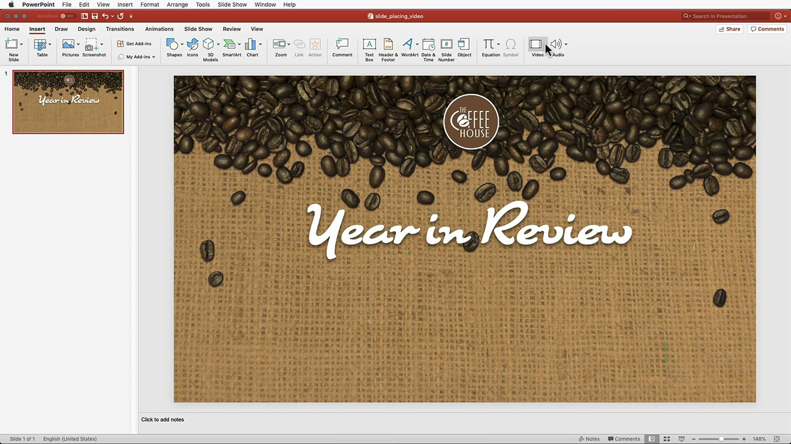
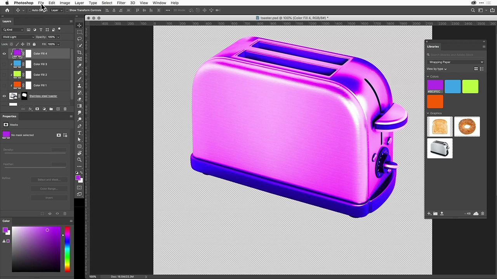

# Adobe [!DNL Stock]-Tutorials

Kreative stehen unter Druck, schnell ansprechende visuelle Inhalte bereitzustellen. Über Adobe Stock können Kreativteams auf über 300 Millionen lizenzfreie Bilder, Videos, Audiodateien, Vorlagen, Illustrationen und 3D-Stockmedien zugreifen, die sie täglich in ihren Creative Cloud-Programmen verwenden. Unbegrenzter Zugriff auf Adobe Stock Standard-Stockmedien mit Creative Cloud Pro Edition. Entdecken Sie die neuesten Sammlungen unter stock.adobe.com. Wählen Sie ein Bild aus, um ein Tutorial anzuzeigen.

<table>
<tr>
   <td>
      
      

      <a href="stunning-digital-assets.md"><strong>Beeindruckende digitale Assets (PDF)</strong></a>
      

      <em>In diesem praktischen Tutorial erfahren Sie, wie Sie Adobe Stock mit CC Libraries integrieren, um konsistente und professionelle Designergebnisse für Druck und Bildschirm zu erstellen</em>
      2 
  </td>
  <td>
      
      

      <a href="searchstock.md"><strong>Adobe [!DNL Stock]-Lizenzierungsverlauf durchsuchen</strong></a>
      

      <em>Erfahren Sie, wie Sie den Adobe [!DNL Stock]-Lizenzierungsverlauf Ihres Unternehmens schnell auf der Creative Cloud für Unternehmen durchsuchen</em>
      3 
  </td>
  <td>
      
      

      <a href="handdrawn.md"><strong>Handgezeichnete Skizze zum Adobe von [!DNL Stock] Bildern hinzufügen</strong></a>
      

      <em>Optimieren Sie Ihr Kreativ-Marketing mit individuellen Techniken, die Ihren Bildern Tiefe und Dimension verleihen, mithilfe von Photoshop für iPad</em>
      2 
  </td>
  <td>
   
    

   <a href="flairtypography.md"><strong>Typografie mit Masken und Animation verfeinern</strong></a>
    

    <em>Erwecken Sie Ihren Text zum Leben mit Elementen von Adobe [!DNL Stock] und Animationsstilen von After Effects</em>
    3 
  </td>
</tr>
<tr>
  <td>
      
      

      <a href="animatevector.md"><strong>Eine Adobe [!DNL Stock]-Vektorillustration in Photoshop animieren</strong></a>
      

      <em>Animation in Ihre Newslettergrafiken mit bearbeitbaren Vektoren für den Adobe [!DNL Stock]</em> einbinden
      2 
  </td>
 <td>
      
      

      <a href="annualreport.md"><strong>Beginnen Sie Ihren Jahresbericht mit einem Video, das mit Adobe [!DNL Stock] und Spark Video erstellt wurde</strong></a>
      

      <em>Erstellen Sie Ihren Jahresbericht mit Adobe [!DNL Stock] und Spark Video</em> zu einer Story.
      3 
  </td>
  <td>
      
      

      <a href="customanimations.md"><strong>Erwecken Sie Kreativität zum Leben mit benutzerdefinierten Animationen von Adobe [!DNL Stock]</strong></a>
      

      <em>Adobe von [!DNL Stock] Bildern, Texturen, Mustern zu benutzerdefinierten Animationen in Photoshop verwenden</em>
      3 
  </td>
  <td>
      
      

      <a href="changecolors.md"><strong>Farben eines Adobe [!DNL Stock]-Bilds ändern, sodass sie Ihrer Story entsprechen</strong></a>
      

      <em>Suchen Sie ein eindeutiges Foto auf Adobe [!DNL Stock] und passen Sie die Farbe dann in Adobe Photoshop an Ihre Anforderungen an</em>
      3 
  </td>
</tr>
<tr>
 <td>
      
      

      <a href="collage.md"><strong>Erstellen einer 3D-Collage für ein Poster mit Adobe [!DNL Stock] images</strong></a>
      

      <em>Entwerfen Sie eine Collage in Adobe Illustrator, die einen auffälligen 3D-Effekt aus Bildern auf Adobe [!DNL Stock]</em> aufweist.
      2 
  </td>
  <td>
      
      

      <a href="boldlabel.md"><strong>Erstellen einer fetten Beschriftung mit Adobe [!DNL Stock]-Vorlagen und Photoshop-Smartobjekten</strong></a>
      

      <em>Entwerfen und visualisieren Sie Ihre benutzerdefinierten Designs mit realistischen Verpackungsvorlagen von Adobe [!DNL Stock]</em>
      2 
  </td>
  <td>
      
      

      <a href="infographic.md"><strong>Erstellen einer Infografik zu Unternehmensrichtlinien mit Adobe [!DNL Stock]</strong></a>
      

      <em>Verschiedene Assets von Adobe [!DNL Stock] kombinieren, um Richtlinien in Form von visuell überzeugenden Infografiken zu kommunizieren</em>
      3 
  </td>
 <td>
      
      

      <a href="featurecomparison.md"><strong>Erstellen eines Vergleichsdiagramms für Produktfunktionen mithilfe der Adobe [!DNL Stock]</strong></a>
      

      <em>Erstellen Sie eine Grafik, in der die Produktpreispläne verglichen werden, um potenziellen Kunden auf einen Blick die Informationen zu geben, die sie benötigen</em>
      2 
  </td>
</tr>
<tr>
   <td>
      
      

      <a href="surrealcomposite.md"><strong>Erstellen einer semi-surrealen Komposition mit Adobe [!DNL Stock]</strong></a>
      

      <em>Erstellen Sie ein unvergessliches redaktionelles Bild, indem Sie mehrere Bilder mit Farbe, Bewegung und Maskierungseffekten kombinieren</em>
      2 
  </td>
   <td>
      
      

      <a href="surrealpattern.md"><strong>Mit Adobe [!DNL Stock]</strong></a> ein semi-surreales Muster erstellen
      

      <em>Erstellen Sie ein wunderschönes, nahtloses Muster, das auf surrealen Bildern von Adobe [!DNL Stock]</em> basiert
      2 
  </td>
   <td>
      
      

      <a href="productconfigurator.md"><strong>Einen interaktiven Produktkonfigurator mit Adobe [!DNL Stock]</strong></a> erstellen
      

      <em>Nutzen Sie die Möglichkeiten der Interaktivität, Animation und bearbeitbaren Grafiken von Adobe [!DNL Stock], um Finanzinformationen visuell darzustellen</em>
      3 
  </td>
  <td>
      
      

      <a href="interactivetourismphoto.md"><strong>Ein interaktives Tourismusfoto mit Adobe [!DNL Stock] und XD</strong></a> erstellen
      

      <em>Schnelles Erstellen eines interaktiven Fotos in Ihrem Website-Prototyp mit Adobe [!DNL Stock] und XD</em>
      3 
  </td>
</tr>
<tr>
 <td>
      
      

      <a href="animationemail.md"><strong>Animationen für E-Mails mit Adobe [!DNL Stock] und Photoshop </strong></a> erstellen
      

      <em>Ermöglichen Sie Ihren E-Mails eine Stopp-Action-Animation mit Adobe [!DNL Stock] und Photoshop</em>
      3 
  </td>
  <td>
      
      

      <a href="brandgradients.md"><strong>Mit wunderschönen Verläufen und dem Adobe von [!DNL Stock] Assets ein konsistentes Markensymbol erstellen</strong></a>
      

      <em>Durch die Kombination von Farben und Verläufen in Ihrer Werbekampagne eine Markenkonsistenz mit unterschiedlichen Bildern erzielen</em>
      2 
   </td>
  <td>
      
      

      <a href="webgraphics.md"><strong>Erstellen ansprechender Webgrafiken durch Kombinieren von Adobe [!DNL Stock]-Bildern mit CSS</strong></a>
      

      <em>Durch die Kombination von Farben und Verläufen in Ihrer Werbekampagne eine Markenkonsistenz mit unterschiedlichen Bildern erzielen</em>
      2 
  </td>
  <td>
      
      

      <a href="moodboard.md"><strong>Mit dem Adobe [!DNL Stock]</strong></a> in kürzester Zeit inspirierende Moodboards erstellen
      

      <em>Ein Moodboard für ein Projekt erstellen, um Informationen, Ideen, Visuals und Farbpaletten an Teams/Kunden weiterzuleiten</em>
      2 
  </td>
</tr>
<tr>
   <td>
      
      

      <a href="realisticcomposite.md"><strong>Realistische Fotokompositionen mit Adobe [!DNL Stock] Bildern erstellen</strong></a>
      

      <em>Bringen Sie zwei großartige Adobe [!DNL Stock]-Fotos zusammen, um Personen in Ihre Social-Media-Posts zu ziehen</em>
      3 
  </td>
   <td>
   
    

   <a href="loadingscreen.md"><strong>Passen Sie eine Animation des Lade-Bildschirms mit Adobe [!DNL Stock] und XD</strong></a> an.
    

    <em>Passen Sie Vektorgrafiken von Adobe [!DNL Stock] an, um eine abschreckende Lade-Bildschirmanimation für eine mobile App zu erstellen</em>
    3 
  </td>
  <td>
   
    

   <a href="presentationtemplate.md"><strong>Passen Sie eine Präsentationsvorlage von Adobe [!DNL Stock] an, um professionell und dennoch auffällig auszusehen</strong></a>
    

    <em>Erstellen Sie in wenigen Minuten eine ansprechende stilisierte Präsentation mit Bildern und Vorlagen von Adobe [!DNL Stock] und einigen leicht zu bedienenden Spezialeffekten</em>
    3 
  </td>
   <td>
   
    

   <a href="customizecolors.md"><strong>Farben in einer Adobe [!DNL Stock]-Vektorillustration anpassen</strong></a>
    

    <em>Verfeinern Sie jedes Projekt mit einer großartigen Illustration. Finden Sie den perfekten Vektor auf der Adobe [!DNL Stock], und passen Sie die Farben mit Adobe Illustrator</em> an die Palette Ihres Projekts an.
    2 
  </td>
</tr>
<tr>
   <td>
      
      

      <a href="assets/AddMotiontoStillImageswithAdobeStockandPhotoshop.pdf"><strong>Hinzufügen von Animationen zu Standbildern mit Adobe [!DNL Stock] und Photoshop (PDF)</strong></a>
      

      <em>Begeistern Sie Ihre Zielgruppen auf jedem Bildschirm, indem Sie Videos in ein Standbild integrieren</em>
      2 
   </td>
   <td>
   
    

   <a href="assets/CreateacompositewithPhotoshopontheiPadandAdobeStockimages.pdf" target="_blank"><strong>Erstellen einer Komposition mit Photoshop auf dem iPad und Adobe von [!DNL Stock] Bildern (PDF)</strong></a>
    

    <em>Erfahren Sie, wie Sie eine Ihrer bevorzugten Adobe Creative Cloud-Apps ganz neu verwenden können - mit der Power von Photoshop auf Ihrem iPad</em>
    2 
  </td>
   <td>
   
    

   <a href="assets/CreateaUniqueEditorialGraphicwithAfterEffectsandAdobeStock.pdf" target="_blank"><strong>Eine Adobe [!DNL Stock]-Vektorgrafik in Photoshop animieren (PDF)</strong></a>
    

    <em>Durch die Kombination von After Effects mit Adobe [!DNL Stock] können Sie schnell beeindruckende Spezialeffekte erstellen, mit denen Sie eine Geschichte visuell erzählen können</em>
    3 
  </td>
   <td>
      
      

      <a href="assets/CreateUniqueGraphicsbyCombiningAdobeStockImages.pdf" target="_blank"><strong>Erstellen eindeutiger Grafiken durch Kombinieren von Adobe [!DNL Stock]-Bildern (PDF)</strong></a>
      

      <em>Führen Sie zwei verschiedene Bilder zusammen, um eine völlig neue Szene für Ihre Design-Projekte zu erstellen. Adobe [!DNL Stock] und Adobe Photoshop leicht gemacht</em>
      2 
   </td>
</tr>
<tr>
  <td>
      
      

      <a href="assets/CreatingaHalloweenCinemagraphwithPhotoshopCCandAdobeStock.pdf" target="_blank"><strong>Erstellen eines Halloween-Cinemagramms mit Photoshop CC und Adobe [!DNL Stock] (PDF)</strong></a>
      

      <em>Cinemagramm erstellen durch Zusammenstellen von Videos, Illustrationen und Fotos mit Adobe Photoshop</em>
      2 
  </td>
   <td>
      
      

      <a href="assets/PutyourDatainMotionwithAdobeStockandPremierePro.pdf" target="_blank"><strong>Bringen Sie Ihre Daten mit Adobe [!DNL Stock] und Premiere Pro (PDF) in Bewegung</strong></a>
      

      <em>Erwecken Sie Ihre Daten zum Leben, um mit Adobe [!DNL Stock] und Adobe Premiere Pro eine überzeugendere Geschichte zu erzählen</em>
      3 
  </td>
   <td>
      
      

      <a href="assets/RecolorAdobeStockVectorArtworkwithAdobeIllustratortoGetExactlytheLookYouWant.pdf" target="_blank"><strong>Adobe von Vektorgrafiken [!DNL Stock] mit Adobe Illustrator neu einfärben, um genau den gewünschten Look zu erzielen (PDF)</strong></a>
      

      Mit <em>Adobe [!DNL Stock] ist es leicht, einzigartige Vektorgrafiken zu finden, und mit Adobe Illustrator können Sie sie schnell an Ihre kreative Vision anpassen</em>
      3 
   </td>
   <td>
      
      

      <a href="assets/ShowOffyourDesignWorkintheRealWorldwithAdobeStockandPhotoshop.pdf" target="_blank"><strong>Zeige deine Design-Arbeit in der realen Welt mit Adobe [!DNL Stock] und Photoshop (PDF)</strong></a>
      

      <em>Führen Sie die folgenden Schritte aus, um Ihre Arbeit in einer realitätsgetreuen Adobe [!DNL Stock]-Vorlage mit Adobe Photoshop zu präsentieren</em>
      3 
  </td>
 </tr> 
 <tr>
   <td>
      
      

      <a href="assets/UncoveramazingdetailsinAdobeStockimageswithLightroomformobile.pdf" target="_blank"><strong>Entdecken Sie beeindruckende Details beim Adobe von [!DNL Stock] Bildern mit Lightroom for mobile (PDF)</strong></a>
      

      <em>Entdecken Sie die Möglichkeiten von Lightroom auf Ihrem Mobilgerät, um das Beste aus Ihren Bildern herauszuholen</em>
      2 
  </td>
  <td>
      
      

      <a href="assets/VisualizePosterDesignsintheRealWorldwithAdobeStockandPhotoshop.pdf" target="_blank"><strong>Posterdesigns in der realen Welt mit Adobe [!DNL Stock] und Photoshop (PDF) visualisieren</strong></a>
      

      <em>Präsentieren Sie Ihre Designs in realen Umgebungen, um einen besseren Eindruck davon zu erhalten, wie sie in der Welt aussehen</em>
      2 
  </td>
  <td>
    
    

     
  </td>
</tr>
</table>
