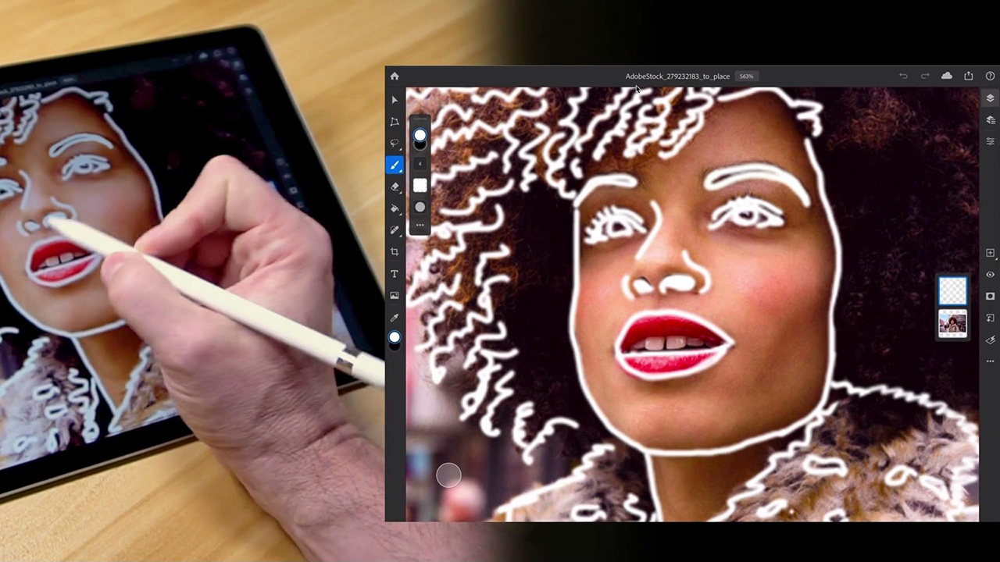

# Adobe [!DNL Stock] Tutorials

Kreative stehen unter Druck, schnell ansprechende visuelle Inhalte bereitzustellen. Über Adobe Stock können Kreativteams auf über 300 Millionen lizenzfreie Bilder, Videos, Audiodateien, Vorlagen, Illustrationen und 3D-Stockmedien zugreifen, die sie täglich in ihren Creative Cloud-Programmen verwenden. Unbegrenzter Zugriff auf Adobe Stock Standard-Stockmedien mit der Creative Cloud Pro-Edition. Entdecke die neuesten Sammlungen auf stock.adobe.com. Wählen Sie ein Bild aus, um ein Tutorial anzuzeigen.

<table>
<tr>
   <td>
      
      

      <a href="stunning-digital-assets.md"><strong>Beeindruckende digitale Assets (PDF)</strong></a>
      

      <em>In diesem praktischen Tutorial erfährst du, wie du Adobe Stock mit Creative Cloud Libraries integrierst, um konsistente und professionelle Designergebnisse für Druck und Leinwand zu erzielen</em>
       
  </td>
  <td>
      
      

      <a href="searchstock.md"><strong>Adobe suchen [!DNL Stock] Lizenzierungsverlauf</strong></a>
      

      <em>Erfahren Sie, wie Sie die Adobe Ihres Unternehmens schnell durchsuchen können [!DNL Stock] Lizenzierungsverlauf im Creative Cloud für Unternehmen</em>
       
  </td>
  <td>
      
      

      <a href="handdrawn.md"><strong>Handgezeichnete Skizze einer Adobe hinzufügen. [!DNL Stock] images</strong></a>
      

      <em>Optimiert euer Kreativ-Marketing mit innovativen Techniken, die euren Fotos mit Photoshop für iPad mehr Tiefe und Dimension verleihen.</em>
       
  </td>
  <td>
   
    

   <a href="flairtypography.md"><strong>Typografie mit Masken und Animationen gestalten.</strong></a>
    

    <em>Text mithilfe von Elementen aus Adobe zum Leben erwecken. [!DNL Stock] und Animationsstile aus After Effects</em>
     
  </td>
</tr>
<tr>
  <td>
      
      

      <a href="animatevector.md"><strong>Eine Adobe animieren. [!DNL Stock] Vektorgrafik in Photoshop</strong></a>
      

      <em>Newsletter-Grafiken mit editierbaren Vektorgrafiken animieren. Adobe [!DNL Stock]</em>
       
  </td>
 <td>
      
      

      <a href="annualreport.md"><strong>Den Jahresbericht mit einem Video beginnen, das mit Adobe erstellt wurde [!DNL Stock] und Spark Video</strong></a>
      

      <em>Mit Adobe einen Geschäftsbericht erstellen. [!DNL Stock] und Spark Video</em>
       
  </td>
  <td>
      
      

      <a href="customanimations.md"><strong>Mit Adobe eigene Animationen gestalten. [!DNL Stock]</strong></a>
      

      <em>Adobe verwenden [!DNL Stock] Bilder, Strukturen, Muster zu benutzerdefinierten Animationen in Photoshop</em>
       
  </td>
  <td>
      
      

      <a href="changecolors.md"><strong>Ändern von Adoben [!DNL Stock] Farben des Bilds, die zu Ihrer Story passen</strong></a>
      

      <em>Ein Foto in Adobe suchen. [!DNL Stock] und passen Sie dann die Farbe in Adobe Photoshop an Ihre Anforderungen an</em>
       
  </td>
</tr>
<tr>
 <td>
      
      

      <a href="collage.md"><strong>Mit Adobe eine 3D-Collage für ein Poster erstellen. [!DNL Stock] images</strong></a>
      

      <em>Gestalte in Adobe Illustrator eine Collage, die einen auffälligen 3D-Effekt aus Bildern in Adobe bietet. [!DNL Stock]</em>
       
  </td>
  <td>
      
      

      <a href="boldlabel.md"><strong>Mit Adobe ein Etikett erstellen. [!DNL Stock] Vorlagen und Photoshop-Smartobjekte</strong></a>
      

      <em>Gestalte und visualisiere deine Designs mit realistischen Verpackungsvorlagen von Adobe [!DNL Stock]</em>
       
  </td>
  <td>
      
      

      <a href="infographic.md"><strong>Infografik zu Unternehmensrichtlinien mit Adobe erstellen [!DNL Stock]</strong></a>
      

      <em>Verschiedene Elemente aus einer Adobe kombinieren. [!DNL Stock] Richtlinien in Form von Infografiken kommunizieren</em>
       
  </td>
 <td>
      
      

      <a href="featurecomparison.md"><strong>Erstellen einer Vergleichsansicht von Produktmerkmalen mithilfe der Adobe [!DNL Stock]</strong></a>
      

      <em>Erstellt eine Grafik, in der Preisoptionen für Produkte verglichen werden. So erhaltet ihr potenzielle Kunden auf einen Blick die Informationen, die sie benötigen.</em>
       
  </td>
</tr>
<tr>
   <td>
      
      

      <a href="surrealcomposite.md"><strong>Mit Adobe eine Komposition mit surrealem Touch erstellen. [!DNL Stock]</strong></a>
      

      <em>Gestalte ein redaktionelles Bild mit einer Kombination aus mehreren Bildern, Farbe, Bewegung und Maskierungseffekten.</em>
       
  </td>
   <td>
      
      

      <a href="surrealpattern.md"><strong>Mit Adobe ein semi-surreales Muster erstellen. [!DNL Stock]</strong></a>
      

      <em>Nahtlose Muster auf Basis von surrealen Bildern aus Adobe erstellen. [!DNL Stock]</em>
       
  </td>
   <td>
      
      

      <a href="productconfigurator.md"><strong>Einen interaktiven Rechner mit Adobe erstellen. [!DNL Stock]</strong></a>
      

      <em>Nutze die Möglichkeiten von Interaktivität, Animation und editierbarem Bildmaterial aus Adobe [!DNL Stock] Finanzinformationen visuell darstellen</em>
       
  </td>
  <td>
      
      

      <a href="interactivetourismphoto.md"><strong>Mit Adobe ein interaktives Tourismusfoto erstellen [!DNL Stock] und XD</strong></a>
      

      <em>Schnelles Erstellen eines interaktiven Fotos innerhalb Ihres Website-Prototyps mit Adobe [!DNL Stock] &amp; XD</em>
       
  </td>
</tr>
<tr>
 <td>
      
      

      <a href="animationemail.md"><strong>Animationen für E-Mails mit Adobe erstellen [!DNL Stock] und Photoshop</strong></a>
      

      <em>Emails mit Stopp-Action-Animation und Adobe versehen. [!DNL Stock] und Photoshop</em>
       
  </td>
  <td>
      
      

      <a href="brandgradients.md"><strong>Mit Farbverläufen und Adoben markenkonformes Bildmaterial erstellen. [!DNL Stock] Elemente</strong></a>
      

      <em>Durch die Kombination von Farben und Verläufen in eurer Werbekampagne könnt ihr Markenkonsistenz in Form von unterschiedlichen Bildern erreichen.</em>
       
   </td>
  <td>
      
      

      <a href="webgraphics.md"><strong>Adoben zu Webgrafiken kombinieren. [!DNL Stock] Bilder mit CSS</strong></a>
      

      <em>Durch die Kombination von Farben und Verläufen in eurer Werbekampagne könnt ihr Markenkonsistenz in Form von unterschiedlichen Bildern erreichen.</em>
       
  </td>
  <td>
      
      

      <a href="moodboard.md"><strong>Mit Adobe in wenigen Schritten Moodboards erstellen. [!DNL Stock]</strong></a>
      

      <em>Erstelle ein Moodboard, um Kollegen/Kunden Informationen, Ideen, Visuals und Farbpaletten für dein Projekt vorzustellen.</em>
       
  </td>
</tr>
<tr>
   <td>
      
      

      <a href="realisticcomposite.md"><strong>Realistische Foto-Composites mit Adobe erstellen. [!DNL Stock] images</strong></a>
      

      <em>Zwei großartige Adoben kombinieren. [!DNL Stock] Social-Media-Posts mit Personen gestalten</em>
       
  </td>
   <td>
   
    

   <a href="loadingscreen.md"><strong>Mit Adobe einen animierten Lade-Screen erstellen. [!DNL Stock] und XD</strong></a>
    

    <em>Vektorgrafiken aus Adobe anpassen [!DNL Stock] einen animierten Lade-Screen für eine Mobile App erstellen.</em>
     
  </td>
  <td>
   
    

   <a href="presentationtemplate.md"><strong>Anpassen einer Adobe [!DNL Stock] Professionelle, aber dennoch ansprechende Präsentationsvorlage</strong></a>
    

    <em>Gestalte mit Bildern und Templates von Adobe in Minuten eine professionelle Präsentation. [!DNL Stock] und einige leicht zu bedienende Spezialeffekte</em>
     
  </td>
   <td>
   
    

   <a href="customizecolors.md"><strong>Anpassen der Farben in einer Adobe [!DNL Stock] Vektorillustration</strong></a>
    

    <em>Verfeinere deine Projekte mit professionellen Illustrationen. Finde den perfekten Vektor in Adobe [!DNL Stock], und passen Sie dann die Farben mit Adobe Illustrator an die Palette Ihres Projekts an</em>
     
  </td>
</tr>
<tr>
   <td>
      
      

      <a href="assets/AddMotiontoStillImageswithAdobeStockandPhotoshop.pdf"><strong>Mit Adobe Dynamik in Standbilder bringen. [!DNL Stock] und Photoshop (PDF)</strong></a>
      

      <em>Begeistere dein Publikum auf jedem Bildschirm durch die Einbindung von Video in ein Standbild.</em>
       
   </td>
   <td>
   
    

   <a href="assets/CreateacompositewithPhotoshopontheiPadandAdobeStockimages.pdf" target="_blank"><strong>Erstellen einer Komposition mit Photoshop auf dem iPad und in der Adobe [!DNL Stock] images (PDF)</strong></a>
    

    <em>Lerne, wie du mit der Power von Photoshop auf deinem iPad eine deiner bevorzugten Adobe Creative Cloud-Anwendungen ganz neu verwenden kannst</em>
     
  </td>
   <td>
   
    

   <a href="assets/CreateaUniqueEditorialGraphicwithAfterEffectsandAdobeStock.pdf" target="_blank"><strong>Eine Adobe animieren. [!DNL Stock] Vektorgrafik in Photoshop (PDF)</strong></a>
    

    <em>After Effects mit Adobe kombinieren. [!DNL Stock]können Sie schnell beeindruckende Spezialeffekte erstellen, die Ihnen helfen, eine Geschichte visuell zu erzählen</em>
     
  </td>
   <td>
      
      

      <a href="assets/CreateUniqueGraphicsbyCombiningAdobeStockImages.pdf" target="_blank"><strong>Adoben kombinieren. [!DNL Stock] images (PDF)</strong></a>
      

      <em>Kombiniere zwei verschiedene Bilder zu einer völlig neuen Szene für deine Design-Projekte. Adobe [!DNL Stock] und Adobe Photoshop.</em>
       
   </td>
</tr>
<tr>
  <td>
      
      

      <a href="assets/CreatingaHalloweenCinemagraphwithPhotoshopCCandAdobeStock.pdf" target="_blank"><strong>Mit Photoshop CC und Adobe ein Halloween-Cinemagramm erstellen. [!DNL Stock] (PDF)</strong></a>
      

      <em>Mit Adobe Photoshop ein Cinemagramm erstellen.</em>
       
  </td>
   <td>
      
      

      <a href="assets/PutyourDatainMotionwithAdobeStockandPremierePro.pdf" target="_blank"><strong>Daten mit Adobe animieren. [!DNL Stock] und Premiere Pro (PDF)</strong></a>
      

      <em>Erwecke deine Daten zum Leben, um mit Adobe eine überzeugendere Story zu erzählen. [!DNL Stock] und Adobe Premiere Pro</em>
       
  </td>
   <td>
      
      

      <a href="assets/RecolorAdobeStockVectorArtworkwithAdobeIllustratortoGetExactlytheLookYouWant.pdf" target="_blank"><strong>Adobe neu färben [!DNL Stock] Vektorgrafiken mit Adobe Illustrator für den gewünschten Look (PDF)</strong></a>
      

      <em>Adobe [!DNL Stock] findest du leicht einzigartige Vektorgrafiken. Mit Adobe Illustrator kannst du sie schnell an deine Vorstellungen anpassen.</em>
       
   </td>
   <td>
      
      

      <a href="assets/ShowOffyourDesignWorkintheRealWorldwithAdobeStockandPhotoshop.pdf" target="_blank"><strong>Mit Adobe Kreativelemente in der echten Welt präsentieren. [!DNL Stock] und Photoshop (PDF)</strong></a>
      

      <em>Führe die folgenden Schritte aus, um deine Arbeit in einer realistischen Adobe zu präsentieren [!DNL Stock] Vorlage mit Adobe Photoshop</em>
       
  </td>
 </tr> 
 <tr>
   <td>
      
      

      <a href="assets/UncoveramazingdetailsinAdobeStockimageswithLightroomformobile.pdf" target="_blank"><strong>Faszinierende Details in Adobe entdecken. [!DNL Stock] images with Lightroom for mobile (PDF)</strong></a>
      

      <em>Entdecke die Power von Lightroom auf deinem Smartphone oder Tablet.</em>
       
  </td>
  <td>
      
      

      <a href="assets/VisualizePosterDesignsintheRealWorldwithAdobeStockandPhotoshop.pdf" target="_blank"><strong>Poster-Designs in der realen Welt visualisieren - mit Adobe [!DNL Stock] und Photoshop (PDF)</strong></a>
      

      <em>Präsentiere deine Designs in einer realen Umgebung, um ein besseres Gefühl für den Look der Elemente zu bekommen.</em>
       
  </td>
  <td>
    
    

     
  </td>
</tr>
</table>
