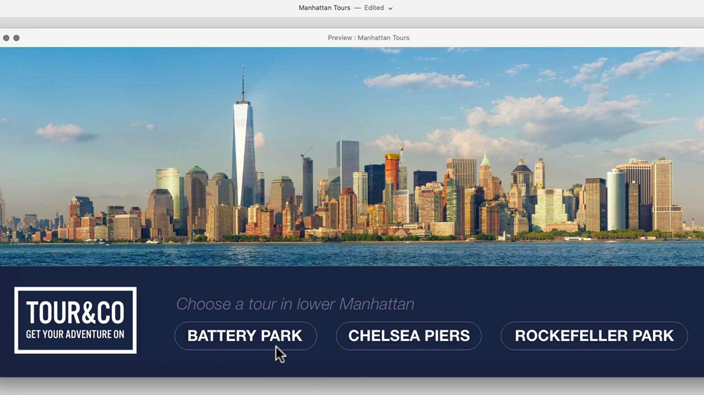
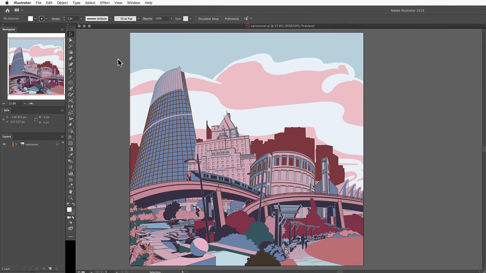

# Tutorials zur Adobe [!DNL Stock]

!

Kreative sind unter Druck, schnell neue, optisch ansprechende Inhalte bereitzustellen, die Aufmerksamkeit erfassen und erwecken. Mit der Adobe [!DNL Stock] für Unternehmen erhalten Kreativteams Zugriff auf über 200 Millionen Bilder, Videos, Vorlagen, Illustrationen, Audiodateien und 3D-Elemente - alles aus der Adobe heraus, die sie täglich verwenden.

## Klicken Sie hier, um eine Adobe [!DNL Stock]-Tutorial anzuzeigen

<table>
<tr>
   <td>
      
      

      <a href="searchstock.md"><strong>Lizenzverlauf der Adobe [!DNL Stock] durchsuchen</strong></a>
      

      <em>Hier erfahren Sie, wie Sie schnell den Lizenzverlauf Ihrer Adobe [!DNL Stock] im Creative Cloud für Unternehmen durchsuchen</em>
       
  </td>
  <td>
      
      

      <a href="handdrawn.md"><strong>Adobe [!DNL Stock]-Bilder mit einer handgezeichneten Ästhetik versehen</strong></a>
      

      <em>Mit Photoshop für iPad können Sie Ihr kreatives Marketing mit einzigartigen Techniken optimieren, die Ihren Bildern Tiefe und Dimension verleihen.</em>
       
  </td>
  <td>
   
    

   <a href="flairtypography.md"><strong>Typografie mit Masken und Animationen gestalten</strong></a>
    

    <em>Mit Elementen aus der Adobe [!DNL Stock] und Animationstilen aus After Effects</em>
     
  </td>
</tr>
<tr>
   <td>
      
      

      <a href="animatevector.md"><strong>Animieren einer Adobe [!DNL Stock]-Vektorgrafik in Photoshop</strong></a>
      

      <em>Animationen mit editierbaren Vektorgrafiken für die Adobe in Newsletter-Grafiken einbinden [!DNL Stock]</em>
       
  </td>
   <td>
      
      

      <a href="annualreport.md"><strong>Beginnen Sie Ihren Geschäftsbericht mit einem Video, das mit der Adobe [!DNL Stock] und Spark Video erstellt wurde.</strong></a>
      

      <em>Mit Adobe [!DNL Stock] und Spark Video einen Geschäftsbericht erstellen</em>
       
  </td>
  <td>
      
      

      <a href="customanimations.md"><strong>Mit benutzerdefinierten Animationen von Adobe [!DNL Stock] kreativ zum Leben erwecken</strong></a>
      

      <em>Adobe [!DNL Stock]-Bilder, Texturen, Muster für benutzerdefinierte Animationen in Photoshop verwenden</em>
       
  </td>
</tr>
<tr>
   <td>
      
      

      <a href="changecolors.md"><strong>Farben eines Adobe [!DNL Stock]-Bilds an Ihre Textstory anpassen</strong></a>
      

      <em>Finden Sie ein einzigartiges Foto in der Adobe [!DNL Stock] und passen Sie die Farbe in Adobe Photoshop an Ihre Anforderungen an.</em>
       
  </td>
  <td>
      
      

      <a href="collage.md"><strong>3D-Collagen für ein Poster mit Adobe [!DNL Stock] erstellen</strong></a>
      

      <em>Collage in Adobe Illustrator entwerfen, mit einem auffallenden 3D-Effekt aus Bildern in der Adobe [!DNL Stock]</em>
       
  </td>
  <td>
      
      

      <a href="boldlabel.md"><strong>Fettformatierte Beschriftung mit Vorlagen für Adobe [!DNL Stock] und Photoshop-Smartobjekten erstellen</strong></a>
      

      <em>Designen und visualisieren Sie Ihre benutzerdefinierten Designs mit realistischen Verpackungsvorlagen aus der Adobe [!DNL Stock]</em>
       
  </td>
</tr>
<tr>
   <td>
      
      

      <a href="infographic.md"><strong>Mit Adobe [!DNL Stock] Firmenrichtlinien Infografik erstellen</strong></a>
      

      <em>Kombinieren Sie verschiedene Elemente aus Adobe [!DNL Stock], um Richtlinien in Form visuell ansprechender Infografiken zu kommunizieren</em>
       
  </td>
 <td>
      
      

      <a href="featurecomparison.md"><strong>Produktfunktionsvergleichstabelle mit Adobe [!DNL Stock] erstellen</strong></a>
      

      <em>Erstellen Sie eine Grafik, die die Preispläne vergleicht, um potenziellen Kunden auf einen Blick die Informationen zu geben, die sie benötigen</em>
       
  </td>
  <td>
      
      

      <a href="surrealcomposite.md"><strong>Mit Adobe [!DNL Stock] eine halbsurreale Komposition erstellen</strong></a>
      

      <em>Erstellen Sie ein unvergessliches Editorial-Bild, indem Sie mehrere Bilder mit Farb-, Bewegungs- und Maskierungseffekten kombinieren</em>
       
  </td>
</tr>
<tr>
   <td>
      
      

      <a href="surrealpattern.md"><strong>Halbsurreales Muster mit Adobe [!DNL Stock] erstellen</strong></a>
      

      <em>Erstellen Sie ein nahtloses Muster, das auf surrealen Bildern aus Adobe [!DNL Stock] basiert</em>
       
  </td>
   <td>
      
      

      <a href="productconfigurator.md"><strong>Interaktiven Produktkonfigurator mit Adobe [!DNL Stock] erstellen</strong></a>
      

      <em>Nutzen Sie die Kraft von Interaktivität, Animation und bearbeitbaren Grafiken aus der Adobe [!DNL Stock], um Finanzinformationen visuell darzustellen</em>
       
  </td>
  <td>
      
      

      <a href="interactivetourismphoto.md"><strong>Interaktives Tourismusfoto mit Adobe [!DNL Stock] und XD erstellen</strong></a>
      

      <em>Mit Adobe [!DNL Stock] und XD schnell ein interaktives Foto innerhalb Ihres Website-Prototyps erstellen</em>
       
  </td>
</tr>
<tr>
   <td>
      
      

      <a href="animationemail.md"><strong>E-Mail-Animationen mit Adobe [!DNL Stock] und Photoshop erstellen</strong></a>
      

      <em>Empowerment von E-Mails mit Stopp-Action-Animation mit Adobe [!DNL Stock] und Photoshop</em>
       
  </td>
 <td>
      
      

      <a href="brandgradients.md"><strong>Erstellen von konsistenten Markenbildern mit schönen Verläufen und Adoben [!DNL Stock]-Stockmedien</strong></a>
      

      <em>Mit der Kombination von Farben und Verläufen in Ihrer Werbekampagne eine Marke mit unterschiedlichen Bildern schaffen</em>
       
   </td>
  <td>
      
      

      <a href="webgraphics.md"><strong>Erstellen Sie ansprechende Webgrafiken, indem Sie Adobe [!DNL Stock]-Bilder mit CSS kombinieren</strong></a>
      

      <em>Mit der Kombination von Farben und Verläufen in Ihrer Werbekampagne eine Marke mit unterschiedlichen Bildern schaffen</em>
       
  </td>
</tr>
<tr>
   <td>
      
      

      <a href="moodboard.md"><strong>Mit Adobe [!DNL Stock] in kürzester Zeit beeindruckende Moodboards erstellen</strong></a>
      

      <em>Erstellen Sie ein Projekt-Stimmung-Dashboard, um Informationen, Ideen, Grafiken und Farbpaletten an Teams/Kunden weiterzugeben</em>
       
  </td>
  <td>
      
      

      <a href="realisticcomposite.md"><strong>Bildkompositionen mit Adobe [!DNL Stock] erstellen</strong></a>
      

      <em>Zwei großartige Adobe [!DNL Stock]-Fotos zusammenführen, um Menschen in Ihre Social Media-Media-Beiträge zu integrieren</em>
       
  </td>
   <td>
   
    

   <a href="loadingscreen.md"><strong>Anpassen einer Ladebildschirmanimation mit Adobe [!DNL Stock] und XD</strong></a>
    

    <em>Anpassen von Vektorgrafiken aus Adobe [!DNL Stock], um eine Animation für einen abkühlenden Ladebildschirm für eine App zu erstellen</em>
     
  </td>
</tr>
<tr>
   <td>
   
    

   <a href="presentationtemplate.md"><strong>Passen Sie eine Adobe [!DNL Stock]-Präsentationsvorlage so an, dass sie professionell und dennoch auffallend aussieht.</strong></a>
    

    <em>Mit Bildern und Vorlagen aus der Adobe [!DNL Stock] und einigen einfachen Spezialeffekten innerhalb weniger Minuten eine ansprechende Präsentation erstellen</em>
     
  </td>
   <td>
   
    

   <a href="customizecolors.md"><strong>Farben in einer Adobe [!DNL Stock]-Vektorgrafik anpassen</strong></a>
    

    <em>Mit einer ansprechenden Illustration verleihen Sie jedem Projekt eine schöne Optik. Finden Sie den perfekten Vektor in Adobe [!DNL Stock], und passen Sie die Farben mithilfe von Adobe Illustrator</em> an die Palette Ihres Projekts an.
     
  </td>
   <td>
      
      

      <a href="assets/AddMotiontoStillImageswithAdobeStockandPhotoshop.pdf"><strong>Mit der Adobe [!DNL Stock] und Photoshop (PDF) Bewegung zu Standbildern hinzufügen</strong></a>
      

      <em>Publikum auf jedem Bildschirm durch Video in ein Standbild beeindrucken</em>
       
   </td>
</tr>
<tr>
   <td>
   
    

   <a href="assets/CreateacompositewithPhotoshopontheiPadandAdobeStockimages.pdf"><strong>Bildkomposition mit Photoshop auf dem iPad und der Adobe erstellen [!DNL Stock] (PDF)</strong></a>
    

    <em>Erfahren Sie, wie Sie mit Photoshop auf Ihrem iPad eine Ihrer bevorzugten Adobe Creative Cloud-Apps ganz neu verwenden können</em>
     
  </td>
   <td>
   
    

   <a href="assets/CreateaUniqueEditorialGraphicwithAfterEffectsandAdobeStock.pdf"><strong>Animieren einer Adobe [!DNL Stock]-Vektorgrafik in Photoshop (PDF)</strong></a>
    

    <em>Durch die Kombination von After Effects und Adobe [!DNL Stock] können Sie schnell atemberaubende Spezialeffekte erzeugen, die Ihnen dabei helfen, eine Geschichte visuell zu erzählen</em>
     
  </td>
   <td>
      
      

      <a href="assets/CreateUniqueGraphicsbyCombiningAdobeStockImages.pdf"><strong>Erstellen Sie einzigartige Grafiken, indem Sie Adobe [!DNL Stock]-Bilder kombinieren (PDF)</strong></a>
      

      <em>Kombinieren Sie zwei verschiedene Bilder zu einer völlig neuen Szene für Ihre Designprojekte. Adobe [!DNL Stock] und Adobe Photoshop machen es einfach</em>
       
   </td>
</tr>
<tr>
   <td>
      
      

      <a href="assets/CreatingaHalloweenCinemagraphwithPhotoshopCCandAdobeStock.pdf"><strong>Erstellen eines Halloween-Kinos mit Photoshop CC und Adobe [!DNL Stock] (PDF)</strong></a>
      

      <em>Mit Adobe Photoshop Videos, Illustrationen und Fotos zu einem Kinemagraph erstellen</em>
       
  </td>
   <td>
      
      

      <a href="assets/PutyourDatainMotionwithAdobeStockandPremierePro.pdf"><strong>Daten mit Adobe [!DNL Stock] und Premiere Pro (PDF) in Bewegung setzen</strong></a>
      

      <em>Lassen Sie Ihre Daten zum Leben erwecken und erzählen Sie mit der Adobe [!DNL Stock] und Adobe Premiere Pro eine überzeugendere Geschichte.</em>
       
  </td>
   <td>
      
      

      <a href="assets/RecolorAdobeStockVectorArtworkwithAdobeIllustratortoGetExactlytheLookYouWant.pdf"><strong>Adobe [!DNL Stock]-Vektorgrafiken mit Adobe Illustrator neu färben, um das gewünschte Aussehen zu erhalten (PDF)</strong></a>
      

      <em>Adobe [!DNL Stock] macht es einfach, einzigartige Vektorgrafiken zu finden, und Adobe Illustrator ermöglicht es Ihnen, diese schnell an Ihre kreative Vision anzupassen</em>
       
   </td>
 </tr> 
 <tr>
   <td>
      
      

      <a href="assets/ShowOffyourDesignWorkintheRealWorldwithAdobeStockandPhotoshop.pdf"><strong>Mit Adobe [!DNL Stock] und Photoshop (PDF) Ihre Designarbeiten in der realen Welt präsentieren</strong></a>
      

      <em>Führen Sie folgende Schritte aus, um Ihre Arbeit in einer realitätsnahen [!DNL Stock]-Vorlage mit Adobe Photoshop zu präsentieren</em>
       
  </td>
   <td>
      
      

      <a href="assets/UncoveramazingdetailsinAdobeStockimageswithLightroomformobile.pdf"><strong>Erfahren Sie mehr über die Adobe [!DNL Stock] mit Lightroom for mobile (PDF)</strong></a>
      

      <em>Entdecken Sie die Leistungsfähigkeit von Lightroom auf Ihrem Mobilgerät, um das Beste aus Ihren Bildern herauszuholen</em>
       
  </td>
   <td>
      
      

      <a href="assets/VisualizePosterDesignsintheRealWorldwithAdobeStockandPhotoshop.pdf"><strong>Mit Adobe [!DNL Stock] und Photoshop (PDF) Poster-Designs in der realen Welt visualisieren</strong></a>
      

      <em>Präsentieren Sie Ihre Designs in Echtzeit-Umgebungen, um einen besseren Eindruck davon zu erhalten, wie sie in der Welt aussehen</em>
       
  </td>
</tr>
</table>
