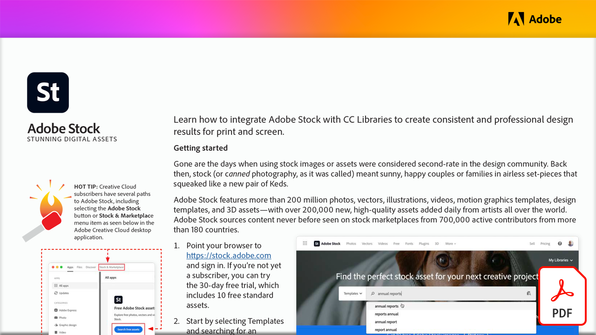

# Beeindruckende digitale Assets

Erfahre in diesem How-to, wie du Adobe Stock mit CC Libraries integrierst, um konsistente und professionelle Designergebnisse für Print und Screen zu erzielen.

Wählen Sie die Abbildung unten, um dieses PDF-Tutorial anzuzeigen oder herunterzuladen.

[{width="680"}](assets/Stunning-Digital-Assets.pdf){target="blank"}

>[!NOTE]
>
>Adobe Stock-Elemente, die in CC Libraries gespeichert sind, können nahtlos zu Microsoft PowerPoint und Word hinzugefügt werden. Anweisungen zum Herunterladen und Installieren des Adobe Creative Cloud-Add-Ins finden Sie [hier](https://helpx.adobe.com/de/creative-cloud/help/libraries-addin-microsoft-office.html) oder in der Microsoft App Store. Das Verfahren ist für beide Apps einfach, insbesondere für diejenigen, die Erfahrung mit der Verwendung von Adobe Stock in Illustrator, InDesign oder Photoshop haben. Weitere Informationen finden Sie unter [Adobe Stock-Plug-ins in Microsoft Office 365 durchsuchen](https://helpx.adobe.com/de/stock/help/microsoft-office-plug-ins.html).
