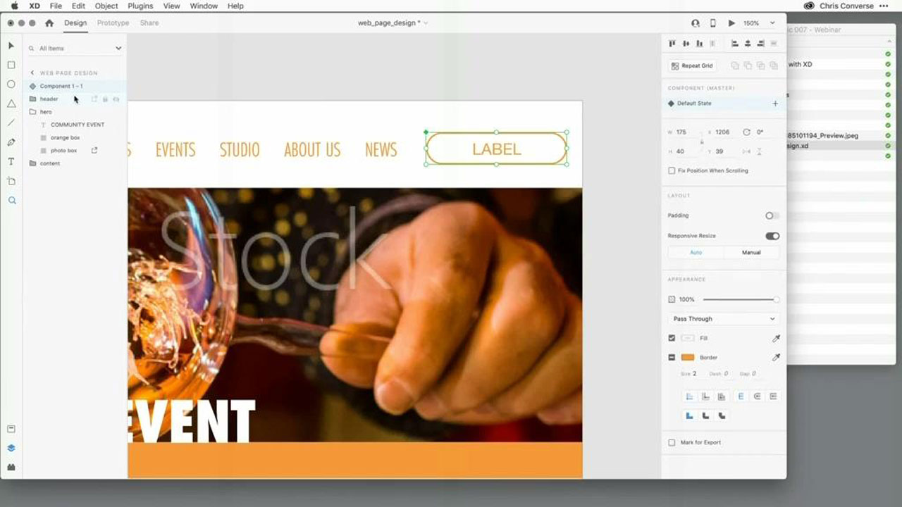
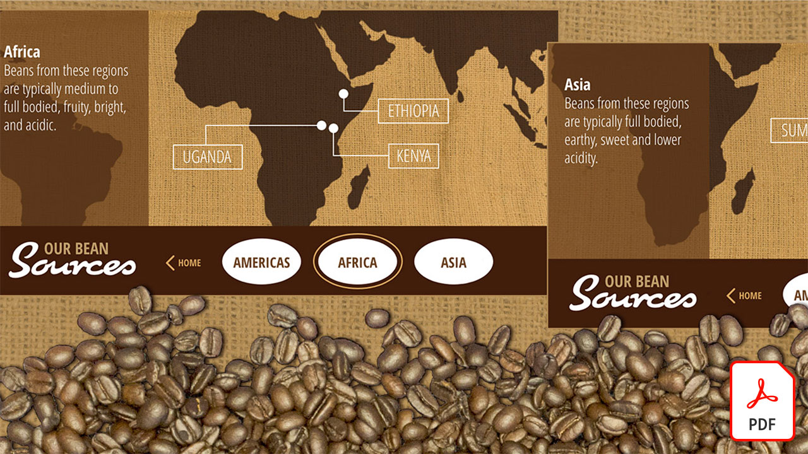
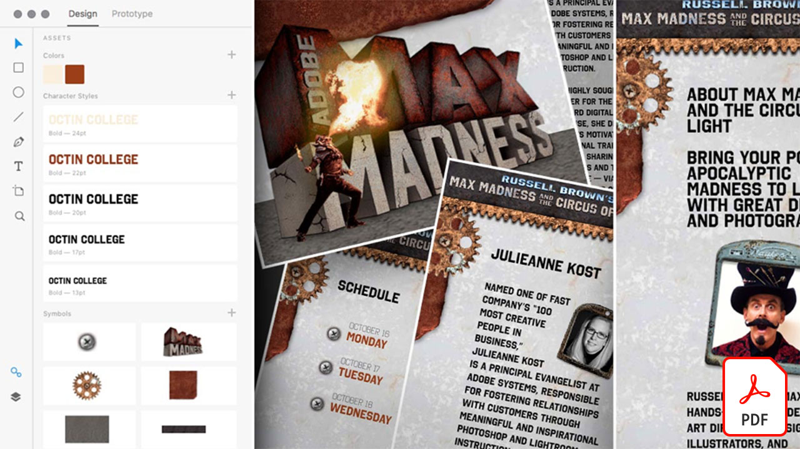

# Tutorials zu Adobe XD

Adobe XD ist ein Tool für UX-Design und Prototyping für Websites, Apps, Voice UI oder Spiele. Wählen Sie ein Bild aus, um ein Tutorial anzuzeigen.

<table>
<tr>
 <td>
   
    

   <a href="components.md"><strong>Machen Sie sich mit [!UICONTROL Components] in Adobe XD vertraut</strong></a>
    

    <em>Erfahren Sie, wie Sie mit [!UICONTROL Components] eine beispiellose Flexibilität bei der Anwendung von Geschwindigkeit und Konsistenz in Ihrem Design-Workflow erhalten</em>
     
  </td>
  <td>
   
    

   <a href="assets/ControlMultipleXDArtboardswithNestedSymbols.pdf" target="_blank"><strong>Mehrere XD Zeichenflächen mit verschachtelten Symbolen steuern (PDF)</strong></a>
    

    <em>Symbole bieten eine hervorragende Möglichkeit, wiederverwendbare Grafiken und Text zu erstellen, die mehrfach auf Zeichenflächen in Ihrem Projekt angewendet werden können</em>
     
  </td>
  <td>
   
    

   <a href="assets/CreateaZoomableeCommercePhotowithXDandAdobeStock.pdf" target="_blank"><strong>E-Commerce-Fotos mit XD und Adobe zoomen. [!DNL Stock] (PDF)</strong></a>
    

    <em>Durch die Kombination von Fotos in hoher Auflösung mit der Auto-Animate-Funktion von Adobe XD können Sie ansprechendere Erlebnisse für Ihre Website gestalten</em>
     
  </td>
  <td>
   
    

   <a href="assets/CreatingaRotatingProductInterfaceforECommercewithAdobeXD.pdf" target="_blank"><strong>Erstellen einer rotierenden Produktoberfläche für E-Commerce mit Adobe XD (PDF)</strong></a>
    

    <em>Designe eine Oberfläche, die eine rotierende Ansicht deines Produkts bietet. Anschließend kannst du dein Design in einen interaktiven Prototyp verwandeln, der genau zeigt, wie das Erlebnis im Web oder auf dem Smartphone oder Tablet funktioniert</em>
     
  </td>
</tr>
<tr>
  <td>
   
    

   <a href="assets/DesignandPrototypeanInteractiveQuizwithXD.pdf" target="_blank"><strong>Erstellen von Design und Prototyping eines interaktiven Quiz mit XD (PDF)</strong></a>
    

    <em>Entwerfen des Feedbacks, auf das ein Benutzer während eines Projekts stößt</em>
     
  </td>
  <td>
   
    

   <a href="assets/DesignInteractiveProjectswithMicroAnimationsinXD.pdf" target="_blank"><strong>Interaktive Projekte mit Micro Animations in XD entwerfen (PDF)</strong></a>
    

    <em>Mit Adobe XD interaktive, animierte Prototypen für Designs erstellen.</em>
     
  </td>
  <td>
   
    

   <a href="assets/JumpstartyourXDProjectfromaPhotoshopFile.pdf" target="_blank"><strong>Schnelleinstieg in ein XD-Projekt aus einer Photoshop-Datei (PSD) (PDF)</strong></a>
    

    <em>Adobe XD bietet interaktive Designtools, die mit Ihrem Workflow zusammenarbeiten und Ihnen dabei helfen, Ihre Ideen umzusetzen</em>
     
  </td>
  <td>
   
    

   <a href="assets/MobileWebExperienceswithXD.pdf" target="_blank"><strong>Gestalten einer mobilen Web-Erfahrung mit XD (PDF)</strong></a>
    

    <em>Wirf einen Blick hinter die Kulissen des Designprozesses für die mobile Web-Galerie Russell Brown MAX Madness mit Adobe XD</em>
     
  </td>
</tr>
<tr>
  <td>
   
    

   <a href="assets/PrototypeaMobileWebExperiencewithAdobeXD.pdf" target="_blank"><strong>Erstellen von Prototypen für mobile Web-Erlebnisse mit Adobe XD (PDF)</strong></a>
    

    <em>Experience Design erfordert Strategie, Design und funktionales Prototyping - und Adobe XD bietet euch alles, was ihr braucht.</em>
     
  </td>
  <td>
   
    

   <a href="assets/PrototypeaMobileWebExperiencewithAdobeXD.pdf" target="_blank"><strong>Das Wiederholungsraster in XD mit externen Texten und Grafiken aufladen (PDF)</strong></a>
    

    <em>Das Wiederholungsraster mit externem Text und Grafiken kombinieren.</em>
     
  </td>
  <td>
   
    

   <a href="assets/BehindtheScenesofMAXMadnesswithAdobeXD.pdf" target="_blank"><strong>Hinter den Kulissen des MAX Madness mit Adobe XD (PDF)</strong></a>
    

    <em>Die Bereitstellung eines optimierten mobilen Web-Erlebnisses kann bei Ihren Benutzern großen Anklang finden.</em>
     
  </td>
  <td>
    
    

     
  </td>
</tr>
</table>
